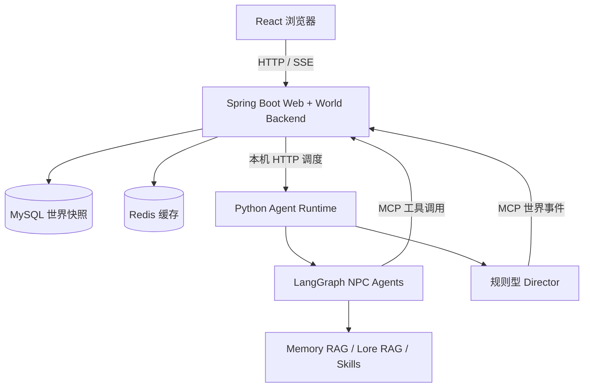
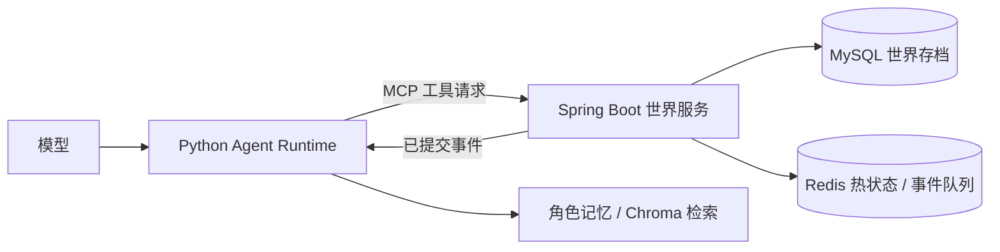
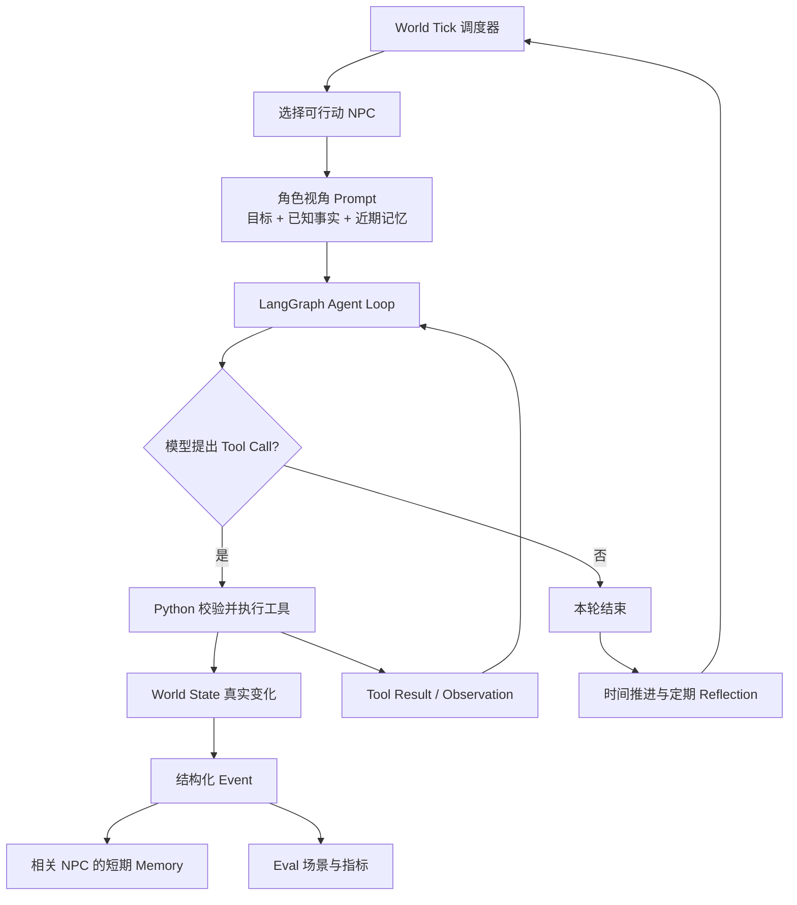

# NovelWorld V3

NovelWorld 是一个用于学习 Agent 工程的动态叙事世界引擎。三个 NPC 各自拥有目标、已知事实、短期记忆和关系；他们轮流行动，经由工具改变同一个世界。V1.5 在 V1 闭环上加入角色独立的长期记忆、世界设定检索和世界存档。

## V3：Skills、Director 与实时 Web 观测台

V3 在 V2 的 Java 世界服务上增加三层：



- **按需加载的职业 Skill**：`skills/` 保存调查、交涉、交易、隐瞒和休整指导；`skills/router.py` 每次只给当前 NPC 加载一份。Skill 是模型的行动指导，不是 Python 或 Java 的执行权限。
- **Director（导演）**：`agent/director.py` 检测连续无行动、角色参与不足和长期缺少交谈冲突；有冷却时间。它只请求 Java 生成一条可调查的环境事件，不能替 NPC 移动、说话或改变关系。事件只进入现场角色的记忆。
- **实时 Web UI**：浏览器只访问 Spring Boot 的页面、控制 API 和 SSE。Spring Boot 从自己的世界存档提供状态，向本机 Python Agent Runtime 下发 Tick 指令；Python 通过 MCP 请求 Java 执行行动。

V3 正常运行需要先启动 MySQL、Redis，再启动 Java 服务。然后在项目根目录安装 Python 依赖、构建界面并启动内部 Agent Runtime：

```powershell
.venv\Scripts\python -m pip install -r requirements.txt
cd web
npm install
npm run build
cd ..
.venv\Scripts\python -m uvicorn web_api:app --host 127.0.0.1 --port 8001
```

在浏览器打开 `http://127.0.0.1:8080`。开发界面可在 `web/` 运行 `npm run dev`，访问 `http://127.0.0.1:5173`；Vite 将 `/api` 转发到 Spring Boot 的 8080 端口。Python 的 8001 端口仅供 Java 内部控制，必须只监听本机并只启动一个 Uvicorn worker。Java 从 `web/dist` 提供构建后的静态文件；若工作目录不同，可用 `NOVELWORLD_WEB_DIST` 指向该目录。可在启动 Java 前设置 `NOVELWORLD_WEB_PASSWORD`（及可选 `NOVELWORLD_WEB_USER`，默认 `author`）启用浏览器 Basic Auth；未设置时仅适合本机可信使用。MCP 和 Python 内部端口仍应只监听本机。

同一 `world_id` 同时只运行一个 Python Agent Runtime；不要让 Web Runtime 和 `run_world.py --v2` 同时推进同一个世界。Java 保存权威世界状态，Python 会在重启时按事件 ID 补写缺失记忆，且只向事件发生时记录的知情者补写。

**无需模型费用的固定验收**：运行 `.venv\Scripts\python demo_v3.py`。它在新世界中运行 3 个无行动 Tick，Director 通过真实 MCP 添加可调查线索；演示确认只有现场角色获得对应记忆。它不会调用 LLM。真实 Web 的“下一 Tick”“运行 10/20 Tick”会使用 `llm_client.py` 中现有模型配置，单 Tick 最多 6 次模型请求；Director 和页面查看本身不调用模型。实际费用取决于模型输出和服务商计价。

手动检查顺序：打开页面应看到 3 名 NPC 和初始时间；点击“下一 Tick”后时间推进 5 分钟，时间线出现执行过的工具事件或无行动叙述；切换角色应只显示该角色自己的记忆；连续运行后“暂停”应在当前 Tick 完成后生效。模型选择的具体 Tool Call 不固定，以事件时间线和 Java 存档中的状态变化为准。

**可编辑开局**：页面底部“开局工坊”从 Spring Boot 读取默认模板。作者可以修改角色人设、目标、独立知识与秘密、关系、物品、地点、时间、初始线索及带可见范围的世界设定；右侧先预览，再创建。模板草稿保存在当前浏览器，世界快照保存在 Java 的 MySQL。创建会生成新的世界 ID，不覆盖旧世界；在“已保存的世界”中点击“切换到此世界”后，观测台和 Python Runtime 才转向它。创建与切换均要求当前世界已暂停。旧存档缺少独立世界设定字段时会沿用原默认设定；新世界只检索自己存档中的设定。编辑、预览、创建和切换不调用模型；点击运行或下一 Tick 才可能产生模型 API 费用。

**自主事件调度**：Web Runtime 开局依次给 NPC 一次基于目标的行动机会；之后只唤醒新事件发生时的知情者，新事件优先于尚未执行的开局目标，每 Tick 最多运行一名 NPC，连锁反应深度最多 3 层。等待和无待处理事件只推进时间，不生成叙述事件，也不调用 NPC 模型。事件游标与待唤醒队列随世界存档保存，重启后继续处理；Java 的 `get_world_events` MCP 工具和 `/api/world-events?after=0` 接口按游标读取事件，SSE 同时推送带 ID 的 `world-event`。页面“向世界投放线索”由 Java 校验地点与内容并记录发生时的知情者，下一 Tick 才由相关 NPC 自行反应。Director 规则触发且冷却结束时会使用现有模型提出一条环境线索；模型请求失败时改用固定线索。该请求可能产生额外 API 费用。扩展动作中的攻击、用药、逃跑、跟随与场景互动由 Java 按确定性规则结算；药物需名称含“药”，跟随需目击目标最近一次离开。旧存档缺少生命值和状态时按 100 / normal 读取。

完整人工验收顺序见 [自主世界完整验收流程](docs/NovelWorld_自主世界完整验收流程.md)。

角色行动会真实改变体力：移动消耗 5 点、调查 3 点、对话或交付物品 2 点、修改关系 1 点。`rest_character` 休息一轮恢复 20 点，上限 100；体力不足的行动会被拒绝，不产生事件或扣体力。角色轮到 Tick 时若体力为 0，Python 调度器自动调用休息工具，不请求模型；其他体力较低时模型可以主动选择休息。模型只选择工具，体力数值由 Python 本地工具或 Java 世界服务修改。

## V2：Java 世界服务 + MCP

V2 模式使用 Spring Boot 4 / Spring AI 2 的 Streamable HTTP MCP Server。Python 仍负责模型请求、Agent Loop、角色视角、检索和记忆摘要；**Java 校验并执行角色行动，MySQL 保存世界快照，Redis 缓存热状态并接收事件队列**。Python 从 MCP 读取已提交事件后更新角色记忆，再同步记忆和 Tick 调度进度。世界事件与业务状态不由模型文本直接修改。



本机需要 Java 17、Maven、Docker Compose 和 Python 3.11+。本仓库的 Java 服务默认只监听 `127.0.0.1:8080`，Docker 将项目 MySQL/Redis 分别映射到本机 `3307`/`6380`，以避开已有服务。启动步骤：

```powershell
docker compose up -d
docker compose ps # mysql、redis 应显示 running/healthy
$env:JAVA_HOME='C:\Program Files\Java\jdk-17.0.2' # 按本机实际安装路径调整
$env:Path="$env:JAVA_HOME\bin;$env:Path"
mvn -version # 必须显示 Java 17
mvn -f .\world-service\pom.xml '-Dmaven.test.skip=true' 'org.springframework.boot:spring-boot-maven-plugin:4.1.1:run'
```

若 Maven 最后只显示 `Process terminated with exit code: 1`，向前查看第一条 `Caused by`。`Access denied for user 'novelworld'` 通常表示连接到了已有 MySQL，或项目数据卷中的账号密码与当前配置不同；先用 `docker compose ps` 确认项目容器运行，不要删除数据卷。若本机 `3307`/`6380` 也已占用，可调整 `compose.yaml` 的宿主机端口，并通过 `NOVELWORLD_JDBC_URL` / `NOVELWORLD_REDIS_PORT` 指向新端口。

另开终端，在项目根目录安装 Python 依赖并运行：

```powershell
.venv\Scripts\python -m pip install -r requirements.txt
.venv\Scripts\python demo_v2.py
.venv\Scripts\python run_world.py --v2
```

`demo_v2.py` 使用新世界 ID，通过真实 MCP 连接验证移动、无权交付被拒绝、事件记忆和存档读取；不调用模型，不产生 API 费用。`run_world.py --v2` 使用原有世界存档的 ID：服务端若已有该世界，以 MySQL 中的状态为准；若没有，首次导入本地 `data/world.json`。运行 `next` 或 `run 10` 会调用当前 `llm_client.py` 配置的真实模型，产生 API 费用。停止服务不删除 MySQL 数据；下次启动仍可恢复世界。`run_world.py` 不带 `--v2` 时继续使用 V1.5 的本地工具和存档。

服务提供 `create_world`、`get_world`、`execute_world_tool`、`advance_world_time`、`save_agent_state`、`introduce_world_event` 六个 MCP 工具。`execute_world_tool` 支持查询时间/角色、调查、交谈、移动、交付物品、更新关系和休息。Java 每次成功行动只追加一条事件，失败请求不写状态；存档的 revision 防止并发覆盖。MySQL 当前保存完整 JSON 快照，Redis 用作可重建的热缓存及事件队列；这是 V2 的最小可运行存储设计，尚未把各实体拆为独立关系表。MCP 接口供可信的本机 Python Runtime 使用，没有远程用户认证；部署到其他机器前需要加认证与访问控制。

Java 验证：`mvn -f world-service/pom.xml test`。Python 验证：`.venv\Scripts\python -m unittest discover -s tests -q`。在本机 Docker 守护进程不可用时，可以用 Maven 的测试类路径及 H2 内存库启动服务验证 MCP 链路；这种验证不覆盖 MySQL/Redis 的实际部署行为。

想按文件和调用链理解实现，请阅读 [V1.5 架构详解](docs/NovelWorld_V1.5架构详解.md)。

## V1.5：记忆、设定和存档

- 近期记忆保留 5 条，溢出的亲历事件进入该角色自己的情节档案。每条记录保留来源事件 ID、时间和重要性。每 3 Tick 的反思只处理新增经历；反思不会直接改变世界状态。
- Python 从成功执行的 `inspect` 事件建立该角色的最新调查事实；同一对象的新观察会取代旧事实。其他角色的调查不会自动成为本人的知识。关系的当前数值仍以 `Character.relationships` 为准。
- Chroma 的 `npc_memories` 和 `world_lore` 是分开的本地索引。检索先按角色或设定可见范围过滤，再限制条数与字符数；Prompt 中分别显示历史经历和世界设定。这里使用无需下载模型的中文字符片段哈希向量，能匹配相近字词，但同义词召回能力有限；不会调用 Embedding API。
- `data/world.json` 同时保存世界 ID、角色状态、事件、记忆、世界设定和 Tick 调度位置。Chroma 索引位于 `data/chroma/<world_id>`，可由该世界的存档重建；`lore/world_lore.json` 仅为旧存档提供默认设定。`data/` 已被 Git 忽略。启动 `main.py` 或 `run_world.py` 时会继续现有存档；首次运行会创建存档。要开启完全独立的世界，可在 Python 中调用 `world.persistence.start_new_world()`，并保存到新的路径。
- 模型只决定回复和工具请求；Python 负责权限过滤、工具执行、事实写入与存档。检索到的文字本身不会生成世界事件。

无需 API 的固定对照：

```powershell
.venv\Scripts\python -m eval.v15
.venv\Scripts\python demo_v15.py
```

第一条命令输出旧线索在近期窗口与长期检索中的召回情况、其他角色的可见性、Prompt 长度和本机耗时。第二条命令让固定模型替身通过真实 Agent Graph、工具与 Chroma 检索运行 20 Tick。两者均无模型 API 费用；耗时是本机单次测量，不能代表线上模型性能。完整 V1.5 实施说明见 `docs/NovelWorld_V1.5升级实施计划.md`。

## V1 架构



- **Agent Loop（智能体循环）**：模型依据角色视角决定是否调用工具；LangGraph 将工具结果作为 Observation（观察结果）送回模型，最多进行 5 轮工具调用。每个 Tick 最多成功执行一次行动；只读查询和遭规则拒绝的请求可以继续得到观察结果。`agent/graph.py` 保存这一次行动的流程状态。
- **World State（世界状态）**：`world/state.py` 保存时间、角色和事件。`tools/world_tools.py` 的 Python 函数负责校验地点、行动者、物品归属和交谈条件，随后才修改状态。客栈的登记簿、后门、柴房门锁可以通过 `inspect` 指定 `object_name` 调查；同一角色重复调查未变化的描述会收到明确错误，不会重复生成事件。模型文本本身不会修改世界。
- **Memory（记忆）**：工具生成结构化事件；`world/events.py` 判定谁能感知，`memory/event_summary.py` 为相关 NPC 生成角色视角摘要，`memory/short_term.py` 保存近期条目，`memory/reflection.py` 定期生成简单反思。它们不会把所有事件广播给每个角色。
- **Eval（评测）**：`eval/scenarios.py` 定义 9 个固定场景，`eval/metrics.py` 统计知识泄漏、目标一致性、非法行动和重复行动。目标一致性需要人工标注；知识泄漏只检测禁止事实的原文出现，不能证明所有隐含泄漏都被发现。评测结果随模型输出变化，README 不预设分数。

## 安装与运行

建议使用 Python 3.11 或更新版本，在项目目录建立虚拟环境后安装依赖：

```powershell
python -m venv .venv
.venv\Scripts\python -m pip install -r requirements.txt
```

实时模型运行使用阿里云百炼兼容接口。将自己的 `DASHSCOPE_API_KEY` 放入未提交的 `.env` 文件；当前模型配置见 `llm_client.py`。以下命令会发起真实 API 请求，产生费用：

```powershell
.venv\Scripts\python main.py
.venv\Scripts\python run_world.py
.venv\Scripts\python -m eval.runner --scenario lin_follows_inn_clue
```

`main.py` 是单角色对话。`run_world.py` 输入 `next`、`run 10`、`pause` 或 `quit` 来控制多角色时间线。评测命令的场景 ID 请以 `python -m eval.runner --help` 列表为准；`--all` 运行全部 9 个场景。单次 World Tick 的 Agent Loop 最多请求模型 6 次，20 Tick 最多 120 次请求；实际次数和费用取决于模型行动与服务商计价。评测脚本每个场景最多 6 次请求。

## 固定 20 Tick Demo

```powershell
.venv\Scripts\python demo_v1.py
```

`demo_v1.py` 从固定初始状态开始，为 20 轮提供预设的模型工具选择，随后通过**现有 LangGraph Agent Loop 和 Python 工具**执行。它会打印 Tool Call、事件时间线、行动原因、重要记忆以及最终世界状态。可观察的关键变化包括：时间从 08:00 推进到 09:40；苏晚的账本经 `give_item` 交给林默；角色关系值改变。演示结束后恢复调用者的世界状态，方便重复运行。

此演示不调用 API，因此没有模型费用，也不能作为模型自主决策质量的证据。要观察真实模型的选择，请运行 `run_world.py`；要评估真实模型，请运行 `eval.runner`。

角色对话中的“请过目”只是一句说法，不是已查看的世界事实。角色若声称自己看过登记簿等具体对象，程序会核对本人的调查事件。当前校验覆盖常见的第一人称已查看表述；自由文本仍可能有其他表述方式，后续版本需要更结构化的事实声明。

## 最小验证

```powershell
.venv\Scripts\python -m unittest discover -s tests -q
.venv\Scripts\python demo_v1.py
```

世界设定文件由作者手工维护。自动从自由文本抽取事实、跨措辞语义检索和并发写入冲突处理不在当前 V1.5 范围。
