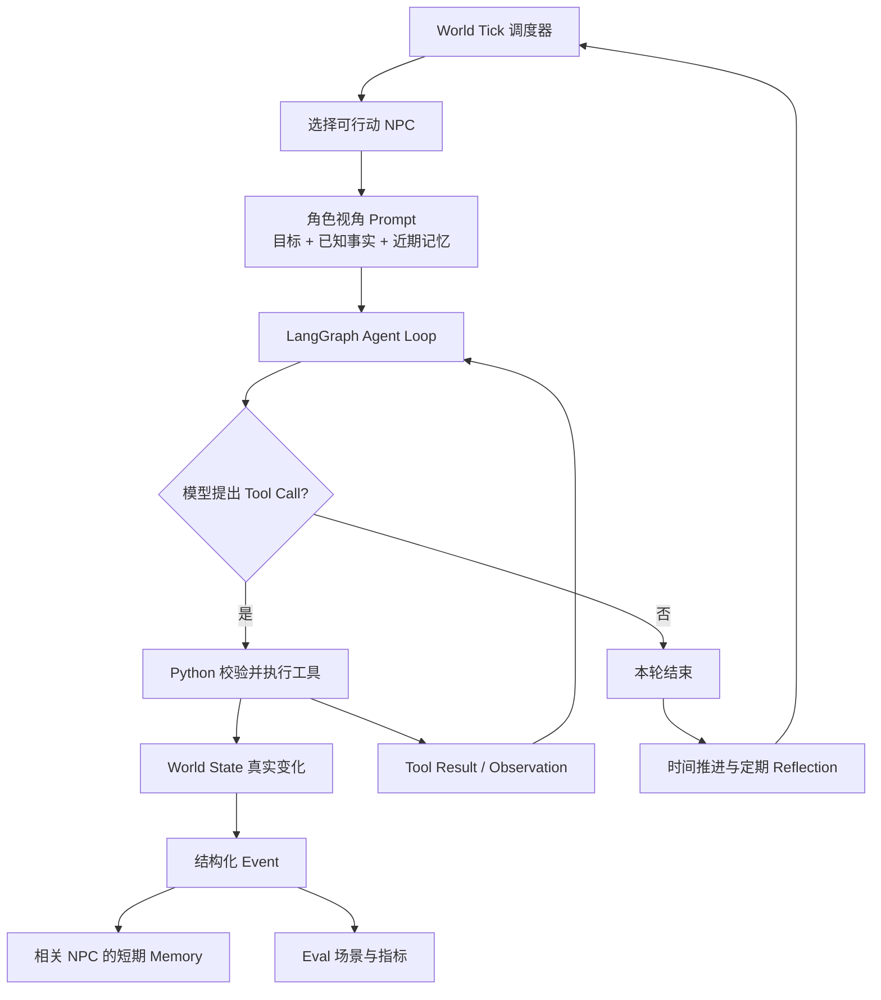

# NovelWorld V1

NovelWorld 是一个用于学习 Agent 工程的动态叙事世界引擎。三个 NPC 各自拥有目标、已知事实、短期记忆和关系；他们轮流行动，经由工具改变同一个世界。V1 重点是让行动、规则、事件与记忆形成可检查的闭环，而非让模型只用文字声称世界发生了变化。

## V1 架构



- **Agent Loop（智能体循环）**：模型依据角色视角决定是否调用工具；LangGraph 将工具结果作为 Observation（观察结果）送回模型，最多进行 5 轮工具调用。`agent/graph.py` 保存这一次行动的流程状态。
- **World State（世界状态）**：`world/state.py` 保存时间、角色和事件。`tools/world_tools.py` 的 Python 函数负责校验地点、行动者、物品归属和交谈条件，随后才修改状态。模型文本本身不会修改世界。
- **Memory（记忆）**：工具生成结构化事件；`world/events.py` 判定谁能感知，`memory/event_summary.py` 为相关 NPC 生成角色视角摘要，`memory/short_term.py` 保存近期条目，`memory/reflection.py` 定期生成简单反思。它们不会把所有事件广播给每个角色。
- **Eval（评测）**：`eval/scenarios.py` 定义 9 个固定场景，`eval/metrics.py` 统计知识泄漏、目标一致性、非法行动和重复行动。目标一致性需要人工标注；知识泄漏只检测禁止事实的原文出现，不能证明所有隐含泄漏都被发现。评测结果随模型输出变化，README 不预设分数。

## 安装与运行

建议使用 Python 3.11 或更新版本，在项目目录建立虚拟环境后安装依赖：

```powershell
python -m venv .venv
.venv\Scripts\python -m pip install -r requirements.txt
```

实时模型运行使用阿里云百炼兼容接口。将自己的 `DASHSCOPE_API_KEY` 放入未提交的 `.env` 文件；当前模型配置见 `llm_client.py`。以下命令会发起真实 API 请求，产生费用：

```powershell
.venv\Scripts\python main.py
.venv\Scripts\python run_world.py
.venv\Scripts\python -m eval.runner --scenario lin_follows_inn_clue
```

`main.py` 是单角色对话。`run_world.py` 输入 `next`、`run 10`、`pause` 或 `quit` 来控制多角色时间线。评测命令的场景 ID 请以 `python -m eval.runner --help` 列表为准；`--all` 运行全部 9 个场景。单次 World Tick 的 Agent Loop 最多请求模型 6 次，20 Tick 最多 120 次请求；实际次数和费用取决于模型行动与服务商计价。评测脚本每个场景最多 6 次请求。

## 固定 20 Tick Demo

```powershell
.venv\Scripts\python demo_v1.py
```

`demo_v1.py` 从固定初始状态开始，为 20 轮提供预设的模型工具选择，随后通过**现有 LangGraph Agent Loop 和 Python 工具**执行。它会打印 Tool Call、事件时间线、行动原因、重要记忆以及最终世界状态。可观察的关键变化包括：时间从 08:00 推进到 09:40；苏晚的账本经 `give_item` 交给林默；角色关系值改变。演示结束后恢复调用者的世界状态，方便重复运行。

此演示不调用 API，因此没有模型费用，也不能作为模型自主决策质量的证据。要观察真实模型的选择，请运行 `run_world.py`；要评估真实模型，请运行 `eval.runner`。

## 最小验证

```powershell
.venv\Scripts\python -m unittest discover -s tests -q
.venv\Scripts\python demo_v1.py
```

V1 保持内存中的世界状态，没有持久化存档。长期记忆检索、MCP、数据库和 Web UI 属于后续版本。
