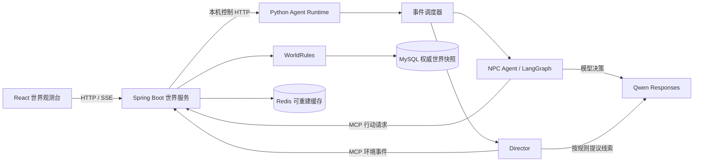

# NovelWorld

NovelWorld 是一个自主叙事世界原型：NPC 根据自己的目标、知识与记忆行动；人通过网页观察，并可偶尔向世界投放线索。模型提出行动，Java 世界规则校验并结算，成功后才产生事件和状态变化。

想系统掌握架构与面试讲法，阅读[项目整体说明与面试掌握手册](docs/NovelWorld_项目整体说明.md)。逐步操作见[自主世界完整验收流程](docs/NovelWorld_自主世界完整验收流程.md)。

## 当前架构


```mermaid
flowchart LR
  UI[React 世界观测台] -->|HTTP / SSE| J[Spring Boot 世界服务]
  J -->|本机控制 HTTP| P[Python Agent Runtime]
  P --> S[事件调度器]
  S --> N[NPC Agent / LangGraph]
  S --> D[Director]
  N -->|模型决策| L[Qwen Responses]
  D -->|按规则提议线索| L
  N -->|MCP 行动请求| J
  D -->|MCP 环境事件| J
  J --> R[WorldRules]
  R --> M[(MySQL 权威世界快照)]
  J --> C[(Redis 可重建缓存)]
```

- **NPC** 只能依据自己的设定、记忆、可见世界设定和已感知事件决定行动，也可等待。
- **Scheduler** 在新世界开局给每名 NPC 一次行动机会，之后只唤醒新事件的知情者；每 Tick 最多一名 NPC，连锁反应最多三层。空队列或等待不调用 NPC 模型、不产生行动事件。
- **Director** 先由规则判断是否需要新线索，触发后才请求模型提出环境内容；不替 NPC 决定行为。
- **WorldRules** 校验行动者、位置、体力、物品和状态，按确定性规则结算移动、调查、交谈、交付、休息、攻击、用药、逃跑、跟随与互动。
- **Spring Boot** 是网页唯一入口；MySQL 保存权威世界快照、事件和调度进度，Redis 只作可重建快照缓存。Python 通过 MCP 提交行动，不直接写权威业务状态。

## 本机启动

需要 Docker Desktop、JDK 17、Maven、Python 3.11+ 和 Node.js。模型密钥放在未提交的 `.env` 中，使用 `DASHSCOPE_API_KEY`；模型配置见 `llm_client.py`。在项目根目录运行：

```powershell
docker compose up -d
docker compose ps
python -m venv .venv
.\.venv\Scripts\python.exe -m pip install -r requirements.txt
cd web
npm install
npm run build
cd ..
```

在第一个终端确保 Maven 使用 Java 17，并启动世界服务。按本机安装位置调整 `JAVA_HOME`：

```powershell
$env:JAVA_HOME = 'C:\Program Files\Java\jdk-17.0.2'
$env:Path = "$env:JAVA_HOME\bin;$env:Path"
mvn -version
mvn -f .\world-service\pom.xml '-Dmaven.test.skip=true' 'org.springframework.boot:spring-boot-maven-plugin:4.1.1:run'
```

另开终端，在项目根目录启动唯一的内部 Agent Runtime：

```powershell
.\.venv\Scripts\python.exe -m uvicorn web_api:app --host 127.0.0.1 --port 8001
```

浏览器打开 `http://127.0.0.1:8080`。页面只访问 Spring Boot 的 8080 端口；8001 只供 Java 本机控制。Docker 默认将项目 MySQL / Redis 映射到本机 `3307` / `6380`。若网页显示 `Service Unavailable`，先检查 Python 8001 是否仍在运行。

## 使用方式

1. 在“开局工坊”编辑默认 JSON 模板并预览。可设置时间、地点、场景线索、NPC 人设、目标、秘密、已知事实、关系、体力和物品。模板草稿保存在当前浏览器；正式创建会由 Java 校验并生成新的世界 ID，不覆盖旧世界。创建和切换前需暂停。
2. 切换到新世界后，点“下一 Tick”或“运行 10/20 Tick”。开局角色先获得行动机会；其后由已提交事件唤醒知情者。每 Tick 世界时间前进 5 分钟。
3. 从时间线和角色视角观察结果。作者可在指定地点投放可调查线索；Java 记录事件发生时的知情者，下个 Tick 由相关角色自行决定反应。
4. 需要保留现有世界时，先暂停再关闭服务。MySQL 数据卷保存世界；`data/world.json` 是 Python 本地恢复副本，`data/chroma/` 是可重建检索索引。不要删除 `data/` 或 Docker 数据卷来“清理项目”。

创建、预览、切换、查询、投放线索和自动测试不请求模型。NPC 获得行动机会时可能多次请求模型；Director 规则触发时可能有额外请求，费用由服务商按实际用量计算。

## 代码入口与验证

| 路径 | 作用 |
| --- | --- |
| `web/src/main.jsx`、`web/src/WorldSetup.jsx` | 页面、时间线、开局工坊 |
| `world-service/src/main/java/org/novelworld/world/` | 网页 API、MCP、模板、规则与 MySQL 存档 |
| `web_api.py` | Java 背后的本机 Agent Runtime 控制入口 |
| `agent/session.py`、`agent/tick.py`、`agent/graph.py` | 会话、事件调度与 NPC 决策循环 |
| `agent/director.py`、`agent/perception.py` | 剧情触发与角色观察 |
| `tools/remote_world.py`、`tools/world_tools.py` | MCP 客户端与模型工具路由 |
| `world/`、`memory/`、`retrieval/`、`lore/` | Python 世界投影、事件、记忆与设定检索 |

不调用模型的验证命令：

```powershell
.\.venv\Scripts\python.exe -m unittest discover -s tests -q
mvn -f .\world-service\pom.xml test
cd web
npm run build
```

Java 测试需使用 JDK 17。当前项目以小规模世界的完整闭环为目标；Director 长期规划、复杂感知传播、海量 NPC 与高并发存储仍是后续演进方向。
