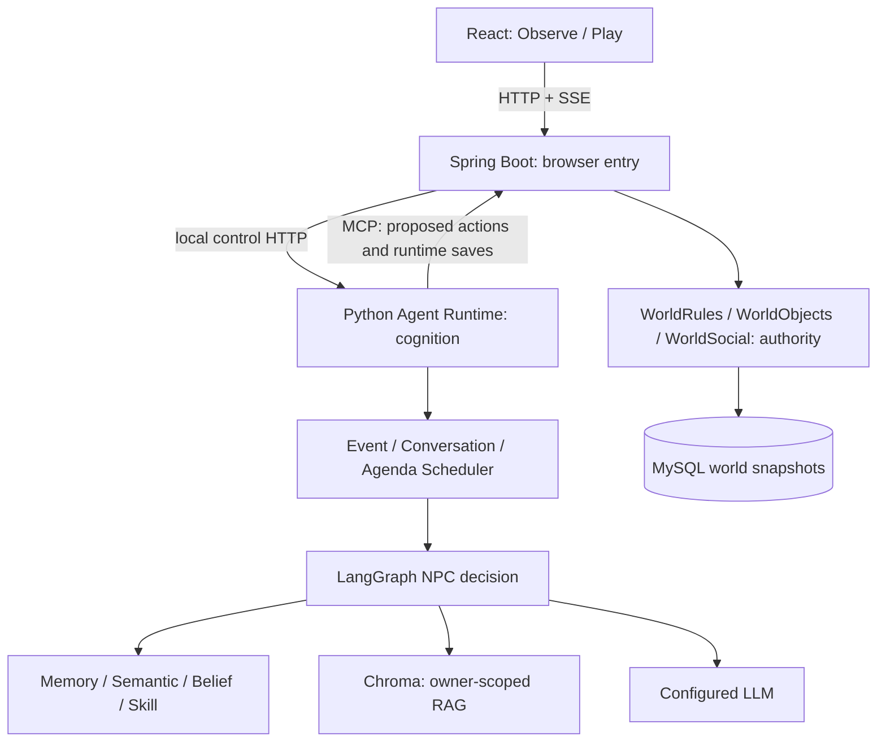
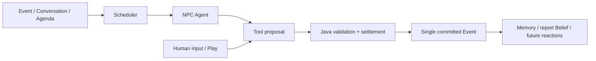

# NovelWorld

一个持久 AI 角色世界引擎：NPC 基于目标、记忆与主观说法自主行动、交流；人类玩家进入同一个世界，所有真实行动由 Java 确定性规则校验并结算。

[3–5 分钟演示指南](docs/NovelWorld_V4_Demo.md) · [最终架构与实际验收结果](docs/NovelWorld_V4_Final_Evaluation.md) · [简历与面试介绍](docs/Resume_Project_Description.md)

## Why this project

单个聊天机器人容易把“说发生了”当成“真的发生了”。NovelWorld 分开模型意图、角色知识、程序调度和真实世界规则，探索小规模小说/RPG 世界的持续运行闭环，不追求海量 NPC 或复杂游戏画面。

## Core Features

- Event Reaction / Conversation / Agenda 驱动自主机会，Director 可关闭；每 Tick 最多一个成功世界行动。
- 双人 Conversation 独立轮次、消息上限和超时；玩家轮次等待人类输入。
- 角色视角 Memory/RAG、直接观察 Semantic 与未验证 Belief 分开，按 perceived_by 隔离。
- 通用对象 inspect/take/put/give/use/interact，位置、持有、容器与所有权分开。
- give/attack 的确定性社交影响随原行动原子提交；模型不能直接改关系。
- 单世界单 Player；Observe 调试视角与过滤后的 Play 视角；React + SSE。
- 多世界 MySQL JSON snapshot、重启恢复、可重建 Chroma 索引。

## Architecture


```mermaid
flowchart TD
  UI[React: Observe / Play] -->|HTTP + SSE| J[Spring Boot: browser entry]
  J -->|local control HTTP| P[Python Agent Runtime: cognition]
  P --> S[Event / Conversation / Agenda Scheduler]
  S --> G[LangGraph NPC decision]
  G --> C[Memory / Semantic / Belief / Skill]
  G --> R[Chroma: owner-scoped RAG]
  G --> L[Configured LLM]
  P -->|MCP: proposed actions and runtime saves| J
  J --> W[WorldRules / WorldObjects / WorldSocial: authority]
  W --> DB[(MySQL world snapshots)]
```

Java 是 World Truth 和规则权威。Python 的业务字段是 Java 镜像；认知、记忆、会话与调度通过内部 save_agent_state 保存到同一世界快照，不能覆盖物品、位置或关系。Chroma 只是检索索引，不是第二套权威数据库。FastAPI 的 8001 是本机内部控制入口，浏览器只访问 Spring Boot 8080。

## How NPC autonomy works

优先级为 Event Reaction → Conversation → Due Agenda → 一次 bootstrap → Idle。Agenda 按固定冷却给角色重新思考的机会，不是 Tool sequence；模型可以修订 active_goal、intention、粗粒度 plan，不能写 Agenda/busy 或声称真实行动完成。Skill 是按角色/目标加载的无状态 Markdown 专业经验，不推荐精确参数、不执行或续排行动。


```mermaid
flowchart LR
  E[Event / Conversation / Agenda] --> S[Scheduler]
  S --> A[NPC Agent]
  A --> T[Tool proposal]
  H[Human input / Play] --> T
  T --> V[Java validation + settlement]
  V --> EV[Single committed Event]
  EV --> M[Memory / report Belief / future reactions]
```

## World Truth vs Agent Knowledge

inspect 建立本人直接观察，仍可能随时间过时。talk 只证明某人说过这句话；接收者得到带来源的 reported belief，不自动写 verified fact，也不改变世界真相。不同说法可以并存。私有对话、隐藏物件、关闭容器内容和他人记忆不因全局世界存档而进入 NPC Prompt。关系值是简化社交倾向，不是客观心理或可信度。

## Player Mode

Play 接受 inspect/take/put/give/use/interact/move/talk/rest，以及受限 attack API。身份由服务器注入，不能替 NPC 行动；成功 Player action 占用一个 Tick，NPC 在后续 Tick 自主回应。UI 提供对话、移动及对象操作，尚未提供战斗控件。Observe 可以查看关系与 NPC 调试信息，Play 只展示玩家可见信息。

## Tech Stack

Java 17 / Spring Boot / Spring AI MCP / MySQL；Python 3.11+ / LangGraph / 内部 FastAPI / Chroma；React / Vite / SSE。当前生成模型配置为 `qwen3.8-max`，向量模型为 `qwen3.7-text-embedding`、1024 维，见 llm_client.py 与 retrieval/embedding.py。没有 Redis。

## Quick Start

需要 JDK 17、Maven、Python、Node.js 和 Docker Desktop。在仓库根目录用 PowerShell 执行：

```powershell
docker compose up -d
docker compose ps
python -m venv .venv
.\.venv\Scripts\python.exe -m pip install -r requirements.txt
npm.cmd --prefix web install
npm.cmd --prefix web run build
```

Compose 只启动 MySQL 8.4，映射本机 3307；不会启动 Java/Python。Java 默认连接配置见 world-service/src/main/resources/application.properties，可通过 NOVELWORLD_JDBC_URL、NOVELWORLD_DB_USER、NOVELWORLD_DB_PASSWORD 覆盖。确保 `mvn -version` 使用 Java 17。

第一终端启动 Java并保持运行：

```powershell
mvn -f world-service/pom.xml spring-boot:run
```

第二终端在根目录设置 `DASHSCOPE_API_KEY`（或放在未提交的 .env），然后启动 Python：

```powershell
$env:NOVELWORLD_DIRECTOR = 'off'  # 演示自主调度；省略则默认开启
.\.venv\Scripts\python.exe -m uvicorn web_api:app --host 127.0.0.1 --port 8001
```

打开 http://127.0.0.1:8080。首次初始化 Chroma 及新文档/查询可能调用付费向量接口；NPC 决策可能多次调用生成模型，Director 开启时可产生额外模型请求。没有密钥时正常在线 Runtime 不能完成索引初始化；离线测试和下方 Eval 不需要密钥。

首页无法打开：检查 Java、8080 和 web/dist。世界/玩家状态不可用：检查 Python、8001、模型配置与数据库。行动被拒绝：阅读规则提示；运行或切换冲突时先暂停再确认当前世界。已提交后出现 warning 时不要盲目重发行动。Chroma 空索引可由当前快照重建，但重新嵌入可能收费。

MySQL 数据卷是持久世界；data/world.json 是本地恢复副本，data/chroma 是可重建索引。不要删除存档或数据卷来处理普通启动错误。演示应创建新世界，避免改动已有世界。

## Evaluation

不请求模型的命令：

```powershell
.\.venv\Scripts\python.exe -m unittest discover -s tests -q
mvn -f world-service/pom.xml test
npm.cmd --prefix web run build
.\.venv\Scripts\python.exe -m eval.long_run --ticks 1000 --boundaries
```

先运行 Java tests：Eval 复用其 classpath，并用临时 H2、真实 WorldRules/WorldObjects/WorldSocial/WorldStore 与生产 Python Scheduler/RemoteWorld 验证。只有决策是 scripted，不影响正式 Runtime。输出 eval/results/latest.json（Git 忽略），含 60/200/1000 Tick 检查点、调度/公平性/有界状态/重复统计及真正 Java 进程重启。全部现有回归进一步覆盖 Conversation、单行动、Chroma owner 隔离、失败与旧快照。详情和实际数字见最终验收文档；不把结构验证称为 AI 剧情质量评分。

## Known Limitations

小规模单机原型、每世界单 Player、双人会话上限 12 条/超时 8 Tick、简化同地点可见性和固定 Agenda 冷却。严格高优先级持续事件可能推迟低优先级角色；scripted 公平性结果不是任意模型输入下的无饥饿证明。Event/episodic 历史允许增长，快照和索引扫描成本随之增加。action、时钟、Agent save 是分开的调用，没有跨语言 exactly-once 或网络幂等保证。H2 验收不代表生产 MySQL 压测，模型叙事质量需人工观察。

## V4 Scope Frozen

V4 功能范围冻结。未实现也不自动开展 economy、factions、crafting、complex emotion、multiplayer、general physics、weather、Quest、knowledge graph、Planner 或 Redis。未来方向仅作为讨论项，不自动建立 Phase 9。
