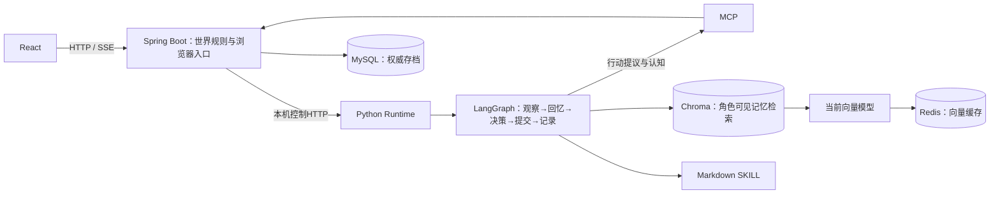

# NovelWorld · AI 社会沙盒

一个可以从上帝视角阅读的小型 AI 社会。四位镇民在四个地点自主工作、休息、发出邀请、持续交谈，并根据经历修订计划和关系印象。作者可以旁观，也可以作为旅人进入同一个世界。

这次重构以群像生活为中心：撤下体力、生命、战斗、生产交易、Director 和旧对象持有系统。活动具有持续时间，邀请需要对方自主回应，交流产生带来源的记忆。界面把真实事件与角色表达的简短动机并列展示。

## 架构


```mermaid
flowchart LR
  React -->|HTTP / SSE| Java[Spring Boot：世界规则与浏览器入口]
  Java -->|本机控制HTTP| Python[Python Runtime]
  Python --> Graph[LangGraph：观察→回忆→决策→提交→记录]
  Graph -->|行动提议与认知| MCP[MCP]
  MCP --> Java
  Java --> MySQL[(MySQL：权威存档)]
  Graph --> Chroma[(Chroma：角色可见记忆检索)]
  Graph --> Skill[Markdown SKILL]
  Chroma --> Embed[当前向量模型]
  Embed --> Redis[(Redis：向量缓存)]
```

Java + Spring Boot + Python + LangGraph + React + MySQL + Redis + Chroma + MCP + SSE + SKILL 都有实际职责。浏览器只访问 Spring Boot，8001 的 FastAPI 仅是本机控制入口。Python 不再保存第二份世界状态，只在 `data/runtime.json` 保存当前世界 ID。

## 启动

需要 JDK 17、Maven、Python 3.11+、Node.js 与 Docker Desktop。在仓库根目录执行：

```powershell
docker compose up -d
.\.venv\Scripts\python.exe -m pip install -r requirements.txt
npm.cmd --prefix web install
npm.cmd --prefix web run build
```

没有 Python 虚拟环境时先执行 `python -m venv .venv`。MySQL 使用本机 3307；Redis 使用 6380（避免占用已有的6379）。两者均只映射本机地址。

终端一：

```powershell
mvn.cmd -f world-service/pom.xml spring-boot:run
```

终端二：配置现有 `DASHSCOPE_API_KEY` 后启动（也可使用未提交的 `.env`）：

```powershell
.\.venv\Scripts\python.exe -m uvicorn web_api:app --host 127.0.0.1 --port 8001
```

打开 [小镇](http://127.0.0.1:8080)。启动不会自动运行角色或请求付费模型；首次启动由 Java 创建独立的默认世界。恢复时以 MySQL 为准。若当前世界指针损坏或数据库不可用，启动报错，不偷偷创建替代存档。

“走过5分钟”推进所有活动，然后让至多两名可行动 NPC 决策；“生活一小时”运行12轮。持续活动期间通常不请求模型，收到邀请时可以提前考虑。暂停在当前轮次结束后生效。玩家操作要求自动运行已暂停；操作完成后可继续运行，让 NPC 自主回应。

## 模型与费用

生成模型仍为 `qwen3.8-flash`，向量模型仍为 `qwen3.7-text-embedding` / 1024维。本轮没有擅自更换模型。每名角色每次机会通常一次生成调用；格式或规则失败最多改选一次，仍失败则停止运行并显示原因。没有 Director 或额外全知旁白模型。

记忆与设定检索会请求向量接口。Redis按模型、维度、文本摘要缓存向量7天，Chroma仅重新索引变化内容。Redis故障会退化为直接请求接口，因此不会阻止世界运行，但可能增加费用。

可配置 `NOVELWORLD_REDIS_URL`、`NOVELWORLD_MCP_URL`、`NOVELWORLD_JDBC_URL`、`NOVELWORLD_DB_USER`、`NOVELWORLD_DB_PASSWORD`。默认只用于单机小规模演示，不代表生产部署或多人并发能力。

## 事实与认知

- 活动开始、结束、中断，位置改变，邀请、接受、拒绝与发言，均由 Java 校验并提交。
- “整理资料”等活动完成只证明完成一段过程，没有虚构库存、收入、任务完成或他人配合。
- 角色只看到附近人的公开状态、自己的邀请与会话，以及本人感知过的事件。
- 听到的消息标记为 reported；直接经历标记为 observation；reflection 是引用真实经历的主观反思。
- 日程、动机和关系印象属于角色认知。计划中的见面不是已经获得别人同意的共同约定。
- 一次轮次把实际行动和本人认知一起写入 MySQL。`revision` 防止覆盖并发更新，最近120条轮次ID用于短期防重；不宣称无限期 exactly-once。

## 代码阅读与演示

[架构与面试调用链](docs/architecture.md) · [演示与验收](docs/demo.md)

从 `web_api.py` → `agent/tick.py` → `agent/graph.py` → `tools/remote_world.py` → Java `WorldMcpTools.commitTurn` → `WorldRules.apply` 阅读主链路。与新架构不兼容的旧测试、Eval、模块与版本文档已经撤下，不保留两套运行方式。

## 存档边界

新版快照 `version=3`。旧数据库世界和 `data/world.json` 不会被自动删除或覆盖，旧世界可在“世界与开局”导出原始 JSON，但不能继续运行。新的活动、会话和认知结构与旧版不同，本轮没有编写含糊的自动迁移。当前新版世界可以暂停、切换并重启恢复。

MySQL 数据卷是存档；`data/chroma` 是可重建索引；`data/runtime.json` 是世界指针。不要删除数据卷处理普通启动错误。

## 已知限制

小规模单机、单玩家、文本地点移动、双人会话，每段最多12条消息，45分钟无回应会结束。活动目录是规则声明，不支持模型发明新活动或物理效果。记忆与事件历史随运行增长。人物自主性和叙事质量依赖真实模型，离线检查只能证明执行链路与规则边界，不能证明故事一定有趣。

参考 [AI Town](https://github.com/a16z-infra/ai-town/blob/main/ARCHITECTURE.md) 的世界/Agent分层与持续交流，以及 [Generative Agents](https://arxiv.org/abs/2304.03442) 的记忆、规划和反思；这是更小的独立实现。
