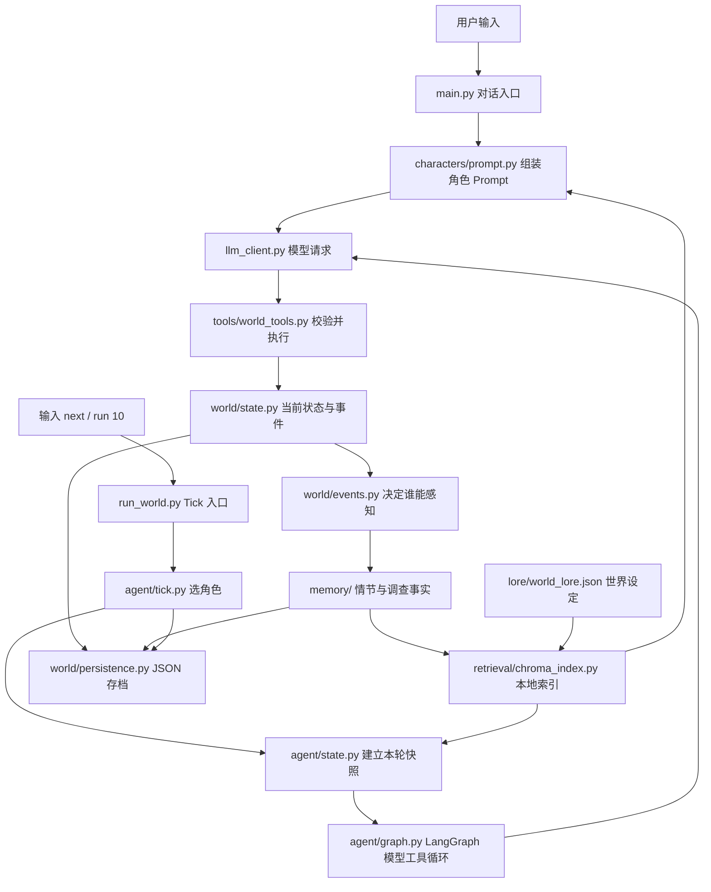

# NovelWorld V1.5 架构详解

> 依据 2026-09-23 工作区中的实际代码编写。本文讲的是已经实现的行为；`docs/NovelWorld_V1.5升级实施计划.md` 讲实施目标。V1.5 代码仍在工作区，尚待作者手动对话验收后提交。

## 1. 先用一句话理解项目

NovelWorld 是一个**由 Python 保存和修改事实、由大模型提议行动**的小型叙事世界。三个角色共处一个世界，却各有自己的目标、秘密、近期记忆和长期记忆。模型可以提出 `inspect`、`talk` 等 Tool Call（工具调用），Python 检查规则、执行行动、记录事件，再把工具结果交给模型。

请先记住这五种东西的区别：

| 东西 | 放在哪里 | 回答什么问题 | 能否直接改变世界 |
| --- | --- | --- | --- |
| 当前世界状态 | `WORLD_STATE`、`Character` | 现在几点、角色在哪里、谁持有什么、关系值是多少 | 只能由 Python 工具修改 |
| 结构化事件 | `WORLD_STATE["events"]` | 实际发生过什么，何时何地、谁参与 | 事件本身是行动记录；写入时同步更新相关记忆 |
| 角色记忆 | 每个 `Character.memory`、`semantic_memory` | 这个角色经历、观察或归纳了什么 | 不能直接修改当前状态 |
| 世界设定 | `lore/world_lore.json` | 地理、势力、规则等相对稳定的背景 | 不能直接修改当前状态 |
| Chroma 索引 | `data/chroma/<world_id>/` | 在允许看的旧资料里快速找哪些内容相关 | 不能直接修改当前状态；可重建 |

例如，“苏晚说她把账本交给林默”只是文字；只有 `give_item` 工具成功执行，`Character.items` 才改变，并产生 `give_item` 事件。模型读到一段旧记忆，也不等于又发生了一次事件。

## 2. 总览图：两条入口，共用同一个世界



上图中的箭头是数据或调用方向，不表示每次都会改状态。`main.py` 和 `run_world.py` 都会在启动时加载同一默认存档 `data/world.json`，并按 `world_id` 打开 Chroma。`main.py` 是一次用户对话；`run_world.py` 是角色自主行动，每个 Tick 最多成功执行一个非只读行动。

### 2.1 一次 World Tick 的完整顺序

1. `WorldTickScheduler.choose_next_character()` 按固定顺序找体力大于 0 的角色。
2. `create_initial_agent_state()` 复制该角色近期记忆，以“目标 + 地点”为查询，分别取回个人旧经历和允许看的世界设定。这些是**本轮开始时的快照**。
3. `build_model_prompt()` 组装角色身份、目标、近期经历、旧记忆、世界设定、当前状态和行动约束。
4. `llm_client.request_npc_graph_response()` 请求模型。模型可以返回文字，也可以返回工具名称及 JSON 参数。
5. `agent/graph.py` 解析 Tool Call；`tools/world_tools.py` 校验行动者、地点、物品等条件并执行。失败返回“工具错误”，成功才改变状态。
6. 成功的工具通过 `record_event()` 追加事件，按角色感知范围写入各自记忆。`inspect` 还更新行动者自己的最新调查事实。
7. 工具结果回到模型；模型给出本轮最终文字。若没有真实工具事件，调度器生成一条 `narration` 事件供时间线记录，它不会成为已验证调查事实。
8. 世界时间推进 5 分钟；每 3 个 Tick，反思处理尚未反思的经历。
9. `WorldSession` 保存世界与调度进度，并同步 Chroma 索引。即使决策中途抛异常，已经发生的事件也会尝试保存。

模型负责**选择和解释**；Python 负责**规则、事实、权限、持久化**。这也是 Agent 工程中 Reason → Act → Observe（思考、行动、观察）循环的最小实现。

## 3. 目录与每个文件的职责

下面按调用层次列出项目文件。`__init__.py` 是 Python 包标记，目前没有业务逻辑。

### 3.1 根目录与入口

| 文件 | 职责 | 核心入口或内容 | V1.5 变化 |
| --- | --- | --- | --- |
| `main.py` | 用户选择角色并连续对话 | `choose_character()`、`build_prompt()`、`main()` | 启动时恢复存档与 Chroma；对话后保存和同步索引 |
| `run_world.py` | 多角色 Tick 命令行、暂停、连续执行 | `make_graph_decide_action()`、`WorldSession`、`main()` | 恢复 Tick 顺序，每 Tick 保存，同步索引 |
| `llm_client.py` | 现有 Qwen Responses API 封装 | `request_npc_graph_response()`、`chat_with_tools()` | 模型配置未换；V1.5 检索由调用前的 Python 完成 |
| `demo_v1.py` | 固定 20 Tick 的离线演示，共用真实 Graph 和工具 | `DEMO_ACTIONS`、`run_demo()` | 增加可选的索引工厂 |
| `demo_v15.py` | 给固定 20 Tick 演示接上本地 Chroma | 脚本入口 | 新增；无模型 API 请求 |
| `requirements.txt` | Python 依赖 | `openai`、`python-dotenv`、`langgraph`、`chromadb==1.5.9` | 固定 Chroma 版本 |
| `.gitignore` | 不提交本机环境和存档 | `.env`、`.venv/`、`data/` | 新增 `data/` |
| `README.md` | 安装、运行、版本能力简介 | 命令与边界 | 补充 V1.5 |
| `AGENTS.md` | 作者与 Codex 的长期协作约定 | 教学节奏、安全、提交要求 | 本轮未改动 |

`main.py` 使用 `chat_with_tools()` 自己管理一轮用户对话；`run_world.py` 使用 LangGraph 管理一个角色的自主行动。这两条模型循环目前**不完全相同**：Tick 有“每轮最多一个成功行动”的限制，直接对话仍沿用 V1 的最多 5 轮工具循环。两者最终调用同一组 Python 工具。

### 3.2 `characters/`：角色是谁、模型能看到什么

| 文件 | 作用 | 关键代码 |
| --- | --- | --- |
| `characters/model.py` | `Character` 数据类，包含身份、目标、地点、体力、秘密、已知事实、关系、物品，以及两个角色私有记忆容器 | `memory: ShortTermMemory`；`semantic_memory: SemanticMemory` |
| `characters/presets.py` | 林默、苏晚、赵无极的初始设定 | `CHARACTERS` 字典 |
| `characters/prompt.py` | 把允许该角色看到的信息组装成对话 Prompt 或行动 Prompt | `_build_character_context()`、`build_character_prompt()`、`build_action_prompt()` |
| `characters/__init__.py` | 包标记 | 无业务逻辑 |

`Character` 的 `relationships` 存**当前关系数值**，而一次次关系变化仍在事件与情节记忆中。这样不会再建一份容易与当前数值冲突的“关系现状记忆”。`secrets` 只会进入该角色自己的 Prompt；另一个角色不会因为两者在同一个 `WORLD_STATE` 中，就自动读到秘密。权限边界由 Python 组 Prompt 和检索时控制。

`prompt.py` 先写固定角色资料和最多 5 条近期记忆，再单独写“检索到的旧记忆与调查事实”及“世界设定”。对话查询使用用户输入；自主行动查询使用目标和当前位置。索引参数为空时走本地字符重叠检索，主要供离线测试和不创建 Chroma 的调用方使用。

### 3.3 `world/`：当前事实、事件、存档

| 文件 | 作用 | 关键代码 |
| --- | --- | --- |
| `world/state.py` | 进程内唯一当前世界对象，记录时间、地点、角色、可调查对象和事件 | `WORLD_STATE`、`advance_world_time()`、`record_event()` |
| `world/events.py` | 结构化 `Event` 格式；确定一次事件可被谁感知 | `Event`、`recipients_for_event()` |
| `world/persistence.py` | 将整个世界和调度进度序列化到 JSON；恢复对象；新建隔离世界 | `save_world()`、`load_world()`、`start_new_world()` |
| `world/__init__.py` | 包标记 | 无业务逻辑 |

`WORLD_STATE` 的重要键是 `world_id`、`time`、`characters`、`locations`、`inspectables`、`inspectable_objects`、`events`。`world_id` 是一个世界的唯一标识，用于把不同世界的索引目录隔开。`INITIAL_WORLD_STATE` 是启动时的深拷贝，供显式新建世界使用。

每个 `Event` 包含 `id`、`type`、`actor`、`target`、`location`、`payload`、`timestamp` 和可读的 `description`。其中 `id` 是连接“世界事件 → 某角色记忆 → 最新调查事实”的来源标识。它也用于判断旧观察是否已被新观察取代。**事件 ID 不是检索相似度，也不是剧情编号。**

`record_event()` 的核心步骤可以简化成：

```python
event = {"id": uuid4().hex, "type": event_type, "actor": actor, ...}
WORLD_STATE["events"].append(event)
for name in recipients_for_event(event, WORLD_STATE["characters"]):
    character.memory.add(
        summarize_event(event, name),
        source_event_id=event["id"],
        entry_id=f"{event['id']}:{name}",
        ...,
    )
    if event_type == "inspect" and name == actor:
        character.semantic_memory.learn_inspection(...)
```

`recipients_for_event()` 当前采用简单规则：行动者总能记得；`talk` 和 `give_item` 的目标也能记得；`move` 到达地的其他在场角色能看见；调查与关系更新默认只写行动者。它不读取其他人的私有资料来编故事。

`save_world()` 把当前状态、事件、所有角色的近期与归档记忆、语义事实、反思游标以及调度器的 `next_index` / `tick_count` 放进**同一个** `data/world.json`。先写 `world.json.tmp`，再替换正式文件，减少写一半留下坏 JSON 的风险。`load_world()` 先解析、重建各个数据类，再原位更新 `WORLD_STATE`。**JSON 是恢复依据；Chroma 是可重建的检索索引。**

### 3.4 `tools/`：改变世界的唯一常规入口

| 文件 | 作用 | 核心函数 |
| --- | --- | --- |
| `tools/world_tools.py` | 提供工具 schema、Python 实现和执行分发；校验行动者 | `inspect`、`talk`、`update_relationship`、`move_character`、`give_item`、`execute_tool` |
| `tools/__init__.py` | 包标记 | 无业务逻辑 |

现有工具逐一做什么：

| 工具 | 关键校验 | 成功后的真实变化 |
| --- | --- | --- |
| `get_world_time` | 无参数 | 只读世界时间 |
| `get_character` | 角色必须存在 | 只读有限状态，不返回秘密与私有知识 |
| `inspect` | 调查对象须在当前位置；同一角色、同一对象的最新观察没有变化时拒绝重复调查 | 生成 `inspect` 事件；行动者新增记忆和最新调查事实 |
| `talk` | 双方存在、不同人、同地点，消息非空；不能虚称自己已查过未调查对象 | 生成对话事件；双方获得各自视角记忆 |
| `update_relationship` | 目标存在、不是自己、变化量为整数 | 更新行动者对目标的关系值并生成事件 |
| `move_character` | 角色和目标地点存在 | 更新位置并生成事件；目的地在场角色也能感知 |
| `give_item` | 物品确实由交付者持有；双方同地点 | 修改双方物品清单并生成事件 |

`TOOL_SCHEMAS` 是发给模型的**说明书**，不执行 Python。`TOOL_FUNCTIONS` 将名字映射到 Python 函数。`execute_tool(name, arguments, acting_character=...)` 检查模型传来的“行动者”参数是否等于当前 NPC，再调用真正的函数。因此模型即使写 `{"character":"其他人"}`，也不能直接替其他角色行动。`NPC_ACTION_TOOL_SCHEMAS` 只把允许 NPC 使用的工具暴露给模型。

`unverified_inspection_claim()` 额外检查常见的“我已看过登记簿”文字。如果该角色的事件记录中没有对应 `inspect`，就拒绝某些对话声明或改写本轮回复。这是针对已知表达方式的规则，不能把任意自然语言都证明为真或假。

### 3.5 `memory/`：近期、长期、事实、反思

| 文件 | 作用 | 关键结构或函数 | V1.5 变化 |
| --- | --- | --- | --- |
| `memory/episodic.py` | 一条经历的元数据与长期档案 | `MemoryEntry`、`EpisodicArchive` | 新增 |
| `memory/short_term.py` | 每个角色最近 5 条经历；超出时归档 | `ShortTermMemory.add()` | 不再直接丢掉第 6 条之前的经历；保存反思游标 |
| `memory/event_summary.py` | 把同一个事件写成不同观察者的第一人称摘要，附重要性和标签 | `summarize_event()`、`event_memory_metadata()` | 与事件来源 ID 一起使用 |
| `memory/semantic.py` | 角色自己调查得到的最新、已验证观察 | `SemanticFact`、`learn_inspection()` | 新增 |
| `memory/reflection.py` | 每 3 Tick 从未处理经历中挑重点，生成一条反思记忆 | `reflect_on_new_memories()` | 按游标处理含归档在内的全部新经历，保留来源 ID |
| `memory/retrieval.py` | 不使用 Chroma 时的角色私有旧记忆检索与过时过滤 | `eligible_archived_entries()`、`retrieve_character_memory()` | 新增 |
| `memory/__init__.py` | 包标记 | 无业务逻辑 | 无 |

`MemoryEntry` 的字段是 `content`、`importance`（1–5）、`actors`、`tags`、自身稳定 `id`、`source_event_id`、`timestamp`、`derived_event_ids`。`source_event_id` 表示“这段经历来自哪个真实事件”；反思的 `derived_event_ids` 表示“这段解释基于哪些经历”。同一世界事件进入不同角色记忆时，记忆 ID 用 `<事件ID>:<角色名>`，既可关联来源，也不会把两个角色的条目当成一条。

近期窗口的核心代码非常直接：

```python
self.entries.append(MemoryEntry(...))
if len(self.entries) > self.max_items:
    self.archive.add(self.entries.pop(0))
```

因此 `recent_entries()` 至多 5 条，而 `all_entries()` 可以看到该角色的归档加近期经历。**归档仍属于这个角色**，不会自动传播给另外两人。

`SemanticMemory` 目前只处理成功执行的 `inspect`：以 `(location, object_name)` 为键保留最新一条 `SemanticFact`。新观察到来时，把旧事实的 `source_event_id` 加进 `superseded_event_ids`，并沿用事实 ID 更新内容。`recent_memory_texts()`、`eligible_archived_entries()` 都会过滤被取代的旧观察及引用它的反思，避免“新证据已经出现，Prompt 还把旧结论当当前事实”。它不会从模型的自由文本回答自动抽取事实。

反思算法目前是**确定性的 Python 规则**，不是另一次模型调用：从 `reflection_cursor` 之后的全部经历中排除反思自身、纯叙述和已被新调查取代的事件，按重要性和新近次序选前两条，写成“我近期最该留意的是：……”。然后推进游标。它会**新增一条解释性记忆**，不会生成世界事件，也不会改变地点、物品或关系。

本地备用检索 `retrieve_character_memory()` 只接收一个 `Character`，在该角色的归档经历和当前语义事实中找候选。按字符二元片段重叠、重要性和顺序排序，最多返回 3 项、600 字；已在近期窗口出现的调查事实不重复返回。这是**检索退路**，真实 CLI 会优先使用 Chroma。

### 3.6 `lore/` 与 `retrieval/`：两类资料、两个检索通道

| 文件 | 作用 | 关键代码 |
| --- | --- | --- |
| `lore/world_lore.json` | 人工编写的背景资料：地理、势力、历史、规则，以及仅林默可见的县衙内部规范 | 每项有 `id`、`category`、`audience`、`text` |
| `lore/catalog.py` | 读入并检查重复 ID；根据 `audience` 控制可见范围；提供无 Chroma 备用检索 | `load_lore()`、`visible_lore()`、`retrieve_lore()` |
| `retrieval/text.py` | 把文字转成可重复的字符二元片段，以及 384 维本地向量 | `bigrams()`、`text_vector()` |
| `retrieval/chroma_index.py` | 维护每个世界自己的 Chroma 文件夹、两个集合、同步与查询 | `ChromaIndex` |
| 两个目录下的 `__init__.py` | 包标记 | 无业务逻辑 |

这里的 World Lore（世界设定）不同于 Semantic Memory（角色经调查确认的事实）。前者由作者编写，通常跨角色存在，但仍按 `audience` 控制；后者有具体角色、具体来源事件。不能把 NPC 私有秘密放进公共 Lore。当前资料共 7 条，6 条公开、1 条只给林默。

`text_vector()` 不调用嵌入模型。它清理标点、取相邻两个字符的片段，再用稳定哈希映射到 384 个数值槽并归一化。Chroma 保存并比较这些向量。这样可以在本地、无 API 费用地验证完整检索流程；**相似字词有效，换一种说法的同义词不一定能找回**。这不是语义理解模型。

`ChromaIndex` 使用 `PersistentClient(path=data/chroma/<world_id>)`，创建两个集合：`npc_memories` 和 `world_lore`。前者的元数据含 `owner`、类别、重要性、顺序和来源事件 ID；后者含类别及 `audience`。每次同步用稳定 ID 执行 `upsert`，并删除当前事实源中已不存在的条目。因此重复同步不会不断生成重复记录，已过时的调查观察也会被移除。索引可从 JSON 存档中的角色记忆和人工 Lore 重新建出。

角色记忆查询的关键约束是：

```python
response = self.memories.query(
    query_embeddings=[text_vector(query)],
    where={"owner": character.name},
    ...,
)
```

先用 `owner` 限制候选，再对查询结果合并 Chroma 相似度、重要性和新近程度，去掉仍在近期窗口里的同源事实，最多返回 3 项、600 字。Lore 查询使用 `audience == public` 或 `audience == 当前角色名`，最多 2 项、350 字。返回文本会带“历史经历”“已核实调查”“世界设定”标签，让读 Prompt 的人知道来源。

### 3.7 `agent/`：自主行动的状态机

| 文件 | 作用 | 关键代码 |
| --- | --- | --- |
| `agent/state.py` | 定义一轮 Agent Loop 的状态，并在开始时取近期、长期与 Lore 快照 | `AgentState`、`ToolCall`、`ToolResult`、`create_initial_agent_state()` |
| `agent/graph.py` | LangGraph 的模型节点、工具节点和分支；限制工具轮数与每 Tick 行动数 | `build_agent_loop_graph()`、`execute_pending_tools()` |
| `agent/tick.py` | 在三人之间轮流选人、推进时间、定期反思，并保存可恢复的调度位置 | `WorldTickScheduler` |
| `agent/__init__.py` | 包标记 | 无业务逻辑 |

`AgentState` 中，`memories` 是近期快照，`retrieved_context` 是该角色的旧记忆与调查事实，`lore_context` 是允许读取的世界设定；`observations` 是本轮工具结果；`conversation` 是发给模型的请求与结果链；`step` 计数工具轮次；`final_answer` 是本轮结束文字。这些字段属于**一次 Agent 执行过程**，不是 `WORLD_STATE` 里的永久世界事实。

LangGraph 的节点关系为 `START → model_decision → (execute_pending_tools → model_decision)* → END`。模型最多得到 5 轮工具机会；第 5 轮以后请求一次不带工具的总结，所以最坏可达 6 次模型请求。`execute_pending_tools()` 用 `READ_ONLY_TOOLS` 区分查询与行动：本 Tick 一旦已有一个成功的非只读工具，后续行动返回错误；只读查询、失败的工具调用不算成功行动。模型的最终解释仍只是解释，实际结果以工具与事件为准。

`WorldTickScheduler` 每 Tick 只选一个体力大于 0 的角色；成功完成后时间加 5 分钟，每 3 Tick 对每个角色各自的新增经历执行反思。`snapshot()` 与 `restore()` 保存/恢复 `next_index`、`tick_count`，避免重启后总从林默重新开始。

### 3.8 `eval/`、`tests/` 与文档

| 文件 | 作用 |
| --- | --- |
| `eval/scenarios.py` | 定义 V1 的 9 个固定场景及预期、禁见事实等 |
| `eval/metrics.py` | 非法行动、知识泄漏、目标一致性和重复请求的统计；其中目标一致性需要人工标注 |
| `eval/runner.py` | 用真实模型跑单个或全部 V1 场景；有 API 费用 |
| `eval/v15.py` | V1.5 离线对照：只看最近 5 条与使用 Chroma 时，能否找回旧线索、是否越权、Prompt 多长、本机耗时；无模型费用 |
| `eval/__init__.py` | 包标记 |
| `tests/test_agent_state.py`、`test_agent_graph.py`、`test_tick.py`、`test_run_world.py` | Agent 状态、工具循环、调度与命令行会话 |
| `tests/test_characters.py`、`test_character_prompt.py`、`test_main.py` | 角色资料、Prompt 和对话入口 |
| `tests/test_world_tools.py`、`test_short_term_memory.py`、`test_reflection.py` | 工具规则、近期记忆和反思 |
| `tests/test_semantic_retrieval.py`、`test_v15_storage.py` | V1.5 事实更新、检索权限、Lore、存档恢复、Chroma 重建与隔离 |
| `tests/test_llm_client.py` | 模型客户端接口；使用替身，不需要真实 API |
| `tests/test_eval_scenarios.py`、`test_eval_metrics.py`、`test_eval_runner.py` | 固定场景与评测逻辑 |
| `tests/test_demo_v1.py` | 20 Tick 固定演示断言 |
| `tests/__init__.py` | 包标记 |
| `docs/NovelWorld_两周学习计划_V1及升级路线.html` | 学习计划的唯一来源 |
| `docs/NovelWorld_V1.5升级实施计划.md` | V1.5 的实施切片、验收标准和技术选择 |
| 本文件 | 现有实现的详细架构说明 |

## 4. 三个完整例子：把调用链连起来

### 4.1 苏晚调查客栈后门

1. 模型看到苏晚位于客栈，以及那里可调查“后门”，提出 `inspect(character="苏晚", object_name="后门")`。
2. `execute_tool()` 确认调用者是苏晚；`inspect()` 确认她在客栈且后门可调查。
3. `inspect()` 从 `WORLD_STATE["inspectable_objects"]` 取回**预先定义**的观察文字，并调用 `record_event("inspect", ...)`。
4. 事件进入全局时间线。感知规则只把这次调查写进苏晚记忆；`learn_inspection()` 保存她自己的最新后门观察，来源是该事件 ID。
5. 模型收到 Python 返回的 Tool Result，才能用它描述刚刚查到的内容。下一次再查同一对象且描述未变化，会被拒绝，不会重复写事件。
6. 对话或 Tick 结束时保存 JSON，并同步她的 Chroma 索引；未来这条观察离开最近 5 条后仍可通过长期检索找回。

### 4.2 多次经历后，旧线索怎样被找回

假设林默先记下一条“客栈后门的铜扣线索”，之后又有 30 条经历。近期窗口只剩最后 5 条，旧线索已进他的 `EpisodicArchive`。当目标或用户问题包含“客栈后门铜扣”时，`ChromaIndex.retrieve_memory(林默, 查询)` 只查 `owner=林默` 的历史集合。它把相关旧记忆重新放进本轮 Prompt；不会把原来的 30 多条全部塞进去，也不会交给苏晚。

这就是本项目的 RAG（Retrieval-Augmented Generation，检索增强生成）最小形式：**先检索少量允许看到的上下文，再让模型基于上下文生成回复或行动**。它没有让模型直接读整个存档。

### 4.3 重启为什么能继续而不会“记得另一个世界”

`data/world.json` 保存同一个 `world_id` 和完整角色状态。重启时先 `load_world()`，再用该 ID 打开 `data/chroma/<world_id>`，并从 JSON 与 Lore 同步索引。如果删掉 Chroma 目录，索引仍可重建。显式调用 `start_new_world()` 会分配新 ID；新世界打开另一目录，因此不会从旧世界的 Chroma 里检索角色私有经历。

## 5. V1 到 V1.5 究竟改变了什么

| 问题 | V1 | V1.5 |
| --- | --- | --- |
| 旧经历 | 超过最近 5 条后丢失 | 移入每个角色自己的情节档案，可检索 |
| 记忆来源 | 有文字、重要性和标签 | 加稳定记忆 ID、来源事件 ID、时间、反思派生来源 |
| 调查事实 | 主要是近期事件文字 | `SemanticMemory` 保存该角色亲自调查的最新事实，替换过时观察 |
| 反思 | 依赖近期窗口，可能漏掉被挤出的经历 | 用游标处理全部新增经历，避免漏处理和重复处理 |
| 世界背景 | 角色预设与 Prompt 中的固定资料 | 独立 Lore 文件、公开范围与独立检索通道 |
| 检索 | 没有长期索引 | 角色记忆和 Lore 分开索引；权限过滤、排序、条数与字符上限 |
| 持久化 | 重启进程即丢失世界变化 | JSON 保存世界、事件、所有记忆和调度位置；Chroma 本地保存索引 |
| 验收 | V1 场景评测与固定 20 Tick | 增加离线旧线索对照、隔离/恢复测试和带 Chroma 的 20 Tick 演示 |

### V1.5 没有实现的东西

- 没有从自由文本自动抽取可信事实；稳定事实只从成功执行的 `inspect` 事件产生。
- 没有使用付费 Embedding API、中文语义模型或同义词理解。当前哈希向量主要捕捉字词重合。
- 没有把 Chroma 当作当前状态数据库。索引和 JSON 不一致时，以 JSON 中的状态、事件、记忆以及人工 Lore 为来源重建索引。
- 没有跨进程同时写入同一存档的并发控制；当前设计面向单机、单个正在运行的世界会话。
- 不保证模型一定做出符合剧情的决定；规则校验和 Eval 分别处理“能不能做”与“做得好不好”。

## 6. 如何自己验证这些说法

在项目根目录运行：

```powershell
.venv\Scripts\python -m unittest discover -s tests -q
.venv\Scripts\python -m eval.v15
.venv\Scripts\python demo_v15.py
```

2026-09-23 的工作区结果：101 项测试通过；离线对照中，近期窗口找不到旧铜扣线索，Chroma 能找回，另一个角色不能取回；固定 20 Tick 演示结束时间为 09:40，生成 20 个工具事件，Chroma 有 34 条角色历史/事实记录和 7 条 Lore 记录。以上命令都不调用模型 API。

真实对话用 `python main.py`，真实自主 Tick 用 `python run_world.py`；两者会调用 `llm_client.py` 当前配置的模型，产生按服务商计价的费用。一次 Tick 的 Agent Loop 最多 6 次模型请求。先用离线命令理解调用链，再观察真实模型输出，会更容易区分“模型建议”与“Python 实际执行”。

## 7. 核心代码逐段读：从输入到事实

以下代码摘取实际实现中的关键语句，省略类型声明和打印逻辑。建议打开对应源码，在旁边对照阅读。

### 7.1 Agent 开始前，为什么要建立状态快照

`agent/state.py` 的 `create_initial_agent_state()` 做的不是行动，而是准备一次行动所需的输入：

```python
active_goal = goal or character.goals[0]
query = f"{active_goal} {character.location}"
return {
    "npc_id": character.name,
    "goal": active_goal,
    "memories": recent_memory_texts(character),
    "retrieved_context": index.retrieve_memory(character, query),
    "lore_context": index.retrieve_lore(character.name, query),
    "observations": [],
    "step": 0,
    ...,
}
```

真实代码在 `index is None` 时有无 Chroma 的备用路径。这里要特别分清：`memories`、`retrieved_context`、`lore_context` 是**给本轮模型看的文字快照**；`Character` 及 `WORLD_STATE` 才是当前对象。模型看到了旧资料，不会自动把它写成一条新事件。

### 7.2 模型提出工具后，哪一行真正执行世界变化

`agent/graph.py` 中，模型返回 `function_call` 后，Graph 先将其解析为 `pending_tool_calls`。工具节点检查本 Tick 是否已有成功行动，再解析 JSON：

```python
arguments = json.loads(call["arguments"])
output = execute_tool(
    call["name"], arguments, acting_character=state["npc_id"]
)
```

`execute_tool()` 才会走到 `tools/world_tools.py` 中的具体 Python 函数。`output` 是工具执行后的结果，随后写入 `observations` 与 `conversation`，模型下一次请求才能看到。`call_id` 把模型的工具请求与这次工具结果对应起来。这个过程是 Tool Call → Tool Result，而不是模型自己声称“已经执行”。

### 7.3 调查如何同时生成事件、情节记忆和语义事实

`tools/world_tools.py` 的 `inspect()` 先从当前地点的结构化对象表取观察文字，再检查有没有相同的最新调查。如果可以调查，调用 `record_event("inspect", ...)`。`world/state.py` 中：

```python
WORLD_STATE["events"].append(event)
for character_name in recipients_for_event(event, WORLD_STATE["characters"]):
    character = WORLD_STATE["characters"][character_name]
    character.memory.add(
        summarize_event(event, character_name),
        source_event_id=event["id"],
        timestamp=event["timestamp"],
        entry_id=f"{event['id']}:{character_name}",
        ...,
    )
    if event_type == "inspect" and character_name == actor:
        character.semantic_memory.learn_inspection(...)
```

所以一条事实有三个不同视角：`Event` 是世界发生记录；`MemoryEntry` 是角色的第一人称经历；`SemanticFact` 是该角色对某调查对象的最新已核实观察。它们用来源事件 ID 连接，但用途不同。一次 `talk` 只产生双方对话经历，不会自动创造已核实调查事实。

### 7.4 反思游标解决的具体问题

没有游标时，角色每 3 Tick 都可能反思同一批最近 5 条；另一种风险是重要经历刚离开窗口，就再也处理不到。`memory/reflection.py` 使用：

```python
entries = memory.all_entries()
new_experiences = [
    entry for entry in entries[memory.reflection_cursor:]
    if "reflection" not in entry.tags and "narration" not in entry.tags
]
# 排序，选最多两条，添加一条带 derived_event_ids 的反思记忆。
memory.reflection_cursor = len(memory.all_entries())
```

真实代码还排除已被新调查取代的来源事件。`all_entries()` 包括归档和近期，因此不会因近期窗口移动而遗漏；游标推进后，下次只看更晚加入的经历。`derived_event_ids` 让系统在来源观察过时时，也能过滤基于它的旧反思。

### 7.5 为什么 Chroma 不是事实数据库

`retrieval/chroma_index.py` 的 `sync_character()` 先从 `Character.memory` 和 `Character.semantic_memory` 算出**当前应存在**的文档，再用稳定 ID 对 Chroma `upsert`，删除不应存在的旧文档。检索执行：

```python
self.memories.query(
    query_embeddings=[text_vector(query)],
    where={"owner": character.name},
    include=["documents", "metadatas", "distances"],
    ...,
)
```

`where` 在查询候选时限定归属；Python 随后按距离、重要性和顺序再排序，并限制返回长度。即使 Chroma 目录丢了，只要 `data/world.json` 和 Lore 文件还在，`sync_world()` 可重建索引。反过来，单独留下旧 Chroma 文件不能可靠恢复当前人物位置、关系或世界事件。

### 7.6 为什么存档要包括调度进度

`world/persistence.py` 保存的不只是人物和事件，还包括：

```python
"scheduler": scheduler_state or {"next_index": 0, "tick_count": 0}
```

`agent/tick.py` 用这两个值决定下一个轮到谁、何时触发每 3 Tick 的反思。如果只恢复人物状态却把调度器重新设为 0，就会改变角色行动顺序，反思也可能提前或延后。`run_world.py` 启动时拿到 `load_world()` 返回的调度字典，并传给 `WorldSession` 恢复；每 Tick 结束将新的调度字典和世界一起保存。

### 7.7 对话入口与自主 Tick 入口的关键差别

`main.py` 的结构是“用户说一句 → 根据当前角色构建 Prompt → `chat_with_tools()` → 保存”；用户可选角色，模型直接回答用户。`run_world.py` 的结构是“调度器选角色 → `create_initial_agent_state()` → LangGraph 自动决定行动 → 时间前进、反思 → 保存”。对话本身不会把世界时间加 5 分钟；只有 Tick 调度器会推进时间。两条入口共用相同的 `WORLD_STATE`、工具、事件、角色记忆和 `data/world.json`，但不应把对话轮数误认为 Tick 数。
