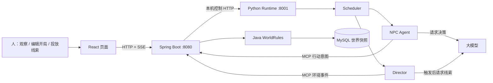

# NovelWorld：跟着代码理解项目

> 适合有编程基础、刚接触这个项目和 Agent 工程的读者。本文以当前仓库的 Web 自主世界版本为准。建议打开编辑器，按章节顺序点开文件，边读边回答每节末尾的问题。代码位置以函数名为准，避免行号随修改失效。

## 先说清楚：你在读什么

NovelWorld 不是一个让人持续扮演主角的游戏。人设置开局、观看时间线，偶尔给世界投放线索；NPC 依据自己的目标、知识和记忆决定行动。**模型提出意图，程序执行工具，Java 规则判断意图是否成立。**只有规则结算成功，世界状态和事件日志才会改变。

先记住五个角色，不急着理解框架细节：

| 名称 | 用一句话理解 | 主要代码 |
| --- | --- | --- |
| NPC Agent | “以这个角色的身份，我现在想做什么？” | [`agent/graph.py`](../agent/graph.py)、[`characters/prompt.py`](../characters/prompt.py) |
| Director | “世界是不是需要一条新线索？” | [`agent/director.py`](../agent/director.py) |
| World Agent 的当前实现 | “这个行动在世界规则下实际发生什么？” | [`WorldRules.java`](../world-service/src/main/java/org/novelworld/world/WorldRules.java)、[`WorldMcpTools.java`](../world-service/src/main/java/org/novelworld/world/WorldMcpTools.java) |
| Scheduler（调度器） | “这一次轮到谁回应？” | [`agent/tick.py`](../agent/tick.py) |
| 观察者 | 看故事，编辑开局，偶尔投放环境线索 | [`web/src/main.jsx`](../web/src/main.jsx)、[`web/src/WorldSetup.jsx`](../web/src/WorldSetup.jsx) |

这里的 World Agent **不是另一个自由发挥的语言模型**。它主要由 Java 中的确定性规则、事件生成和存储代码实现。

### 阅读方式

每节按“打开文件 → 找函数 → 用例子走一遍 → 回答问题”进行。第一次读不用逐行理解语法。先找到**输入、输出、状态由谁修改**。标为“可动手”的步骤可以只看代码和运行自动测试；真正点击“下一 Tick”可能调用模型 API 并产生费用。



**读图练习**：如果 NPC 想移动，箭头会从 NPC 经过 MCP 回到 Java。模型不会直接连接 MySQL；浏览器不会直接调用 Python。

## 第 1 站：先看一个世界由什么组成

打开 [`default-world-template.json`](../world-service/src/main/resources/default-world-template.json) 和 [`characters/model.py`](../characters/model.py)。不要从 `main.jsx` 开始读：先认识数据，后面才看得懂“谁修改了什么”。

在默认模板里找：

- `time`：世界时间。
- `locations`：合法地点列表；`inspectables` 是地点描述，`inspectable_objects` 是可调查对象。
- `characters`：以角色名称为键。每个角色有身份、性格、目标、地点、体力、物品、关系。
- `known_facts`：这个角色开局知道什么；`secrets`：这个角色自己的秘密。
- `lore`：世界设定；`audience` 为 `public` 或某个角色名，决定哪些角色可以检索到它。

例如默认开局里，林默知道案卷提到晚风客栈；苏晚知道案发夜后门有人出现。**世界里同时存在这两条设定，不代表每个 NPC 都知道两条。**`Character` 是 Python 运行时的角色对象，除了模板字段，还持有 `memory`（近期与归档经历）和 `semantic_memory`（亲自调查得到的当前事实）。

接着打开 [`WorldTemplateService.java`](../world-service/src/main/java/org/novelworld/world/WorldTemplateService.java)，按顺序找 `validate` 和 `createWorld`：

1. `validate` 检查时间格式、地点引用、角色名称与键是否一致、关系对象、物品重复归属，以及世界设定可见者等。
2. `createWorld` 生成新 `world_id`，复制模板中的开局条件，创建空事件列表和初始调度状态。
3. 角色 `hp` 在这里设为 100、`status` 设为 `normal`；当前模板直接编辑的是 `energy`，不要把三者混为一谈。
4. `store.insert` 保存的是**一个新世界**。修改模板并创建第二个世界，不应覆盖第一个世界。

**自己回答**：模板中的秘密和 `lore.audience` 有什么区别？创建世界时为什么不能直接沿用模板里写的 `world_id`？

<details><summary>核对答案</summary>

`secrets` 属于某个角色自身的设定；`lore.audience` 控制某条世界设定在检索时对谁可见。由服务端生成新的 ID，才能保证每次开局是独立世界，避免覆盖旧存档。

</details>

## 第 2 站：一次“下一 Tick”从网页走到哪里

打开 [`web/src/main.jsx`](../web/src/main.jsx)，先只找三个位置：`new EventSource('/api/events')`、`command('/api/control/next')`、`send('/api/world-events', ...)`。分别是**看更新、推动世界、投放线索**。页面还有开局工坊，代码在 [`web/src/WorldSetup.jsx`](../web/src/WorldSetup.jsx)。

再打开 [`WorldWebController.java`](../world-service/src/main/java/org/novelworld/world/WorldWebController.java)：

- `next()` 接受网页的下一 Tick 请求，再让 `AgentRuntimeClient` 通知 Python。
- `world()` 从 Java 存档读取当前世界，`publicWorld()` 只组织页面需要的摘要字段与最近 80 条事件。
- `events()` 建立 SSE（服务器发送事件）连接；世界状态变化时向页面发送名为 `state` 的更新。SSE 用于**显示**，不是世界规则的执行器。
- `characterView()` 给页面展示某个角色的目标、已知事实和记忆。当前页面允许观察者切换查看不同角色；这是作者视角，不是对不同登录用户的访问控制。

然后看 [`AgentRuntimeClient.java`](../world-service/src/main/java/org/novelworld/world/AgentRuntimeClient.java) 的 `control`，以及 [`web_api.py`](../web_api.py) 的 `/internal/control/next`、`WorldController.start`：Java 发本机 HTTP 控制指令，Python 在工作线程里执行 Tick。浏览器只访问 Java 的 8080 端口，Python 的 8001 是内部服务。

把流程在纸上写一遍：

```text
点击“下一 Tick”
→ React POST /api/control/next
→ WorldWebController.next()
→ AgentRuntimeClient.control("next", ...)
→ Python /internal/control/next
→ WorldController.start(1, 0)
→ WorldSession.next_tick()
```

注意 HTTP 返回 `202 Accepted` 只表示**已接受调度**。模型、工具与存档在后台继续执行。页面随后通过 SSE 看到新状态。

**自己回答**：页面出现 `Service Unavailable` 时，为何先看 Python Runtime 是否仍在运行？

<details><summary>核对答案</summary>

Java 查询当前激活世界时会经 `AgentRuntimeClient.status()` 获取 Python 的运行状态和世界 ID。Python 不可达时，Java 会返回服务不可用；这不等于浏览器直接连接了 Python。

</details>

## 第 3 站：Scheduler 怎样决定“轮到谁”

打开 [`agent/session.py`](../agent/session.py)，看 `WorldSession.next_tick()`：它调用调度器，随后保存调度状态、角色记忆和本地恢复副本。这里**没有替角色做决定**，只负责一次 Tick 的组织与收尾。

接着读 [`agent/tick.py`](../agent/tick.py) 的三个方法：

1. `__init__`：新世界开局，把每个 NPC 各放入一次 `_pending` 队列，让他们有机会根据目标开始行动。
2. `_collect_events`：从 `_event_cursor` 之后取新事件，用 `recipients_for_event` 找知情者，再加入队列。行动发起者不因为自己的事件立即再获得一个回应轮次。
3. `run_tick`：同步 Java 的新事件，取队首**最多一名** NPC；失去行动能力则跳过，体力为 0 则自动休息，否则交给 NPC Agent 决策；最后请求 Java 推进时间 5 分钟，检查 Director，再收集新事件。

`_pending` 是等待行动的角色队列，`_event_cursor` 是已经处理到事件列表的哪个位置。它们与 `tick_count` 一起保存，重启后继续使用。`MAX_REACTION_DEPTH = 3` 限制事件引起的连锁唤醒深度。

**重要边界**：队列为空时，不会调用 NPC 模型，但 Tick 仍会推进时间；Director 若满足触发规则，仍可能单独调用模型。角色等待不产生行动事件，因此不会因为“等待”反复唤醒其他角色。

**自己回答**：开局是固定轮询吗？玩家投放一封信后，会把全世界 NPC 都塞进队列吗？

<details><summary>核对答案</summary>

开局每人有一次初始机会；此后由新事件唤醒知情者。投放事件由 Java 记录当时的 `perceived_by`，调度器只唤醒名单中的角色。当前实现是小型世界的事件队列，不是大规模分布式调度平台。

</details>

## 第 4 站：NPC 进入模型前究竟看到了什么

按以下顺序打开：[`agent/state.py`](../agent/state.py) 的 `create_initial_agent_state` → [`agent/perception.py`](../agent/perception.py) 的 `observe` → [`characters/prompt.py`](../characters/prompt.py) 的 `build_action_prompt`。

`create_initial_agent_state` 为**本轮的这一名角色**准备目标、近期记忆、检索出的旧记忆与世界设定、现场观察，以及空的工具结果。`observe` 只列同地点角色和自己曾感知的最近事件。`build_action_prompt` 把该角色的人设、秘密、已知事实、物品、关系、状态等写入模型输入。

这解释了“知识边界”的主要实现：**不要把完整世界快照塞进 Prompt**。苏晚的秘密存在服务端世界快照中；构造林默的 Prompt 时读取的是林默自己的 `Character`。检索同样按记忆所有者与 `lore.audience` 过滤，见 [`retrieval/chroma_index.py`](../retrieval/chroma_index.py) 的 `retrieve_memory`、`retrieve_lore`。

读到 Chroma 时先不要被 RAG 吓住。RAG（检索增强生成）的核心动作很简单：**先从已有材料中挑出与当前目标有关的少量文字，再放进这次模型输入**。这个项目用 [`retrieval/embedding.py`](../retrieval/embedding.py) 调用独立的 `qwen3.7-text-embedding` 向量模型，把向量放入 Chroma；新增文档和新查询会产生向量调用。Chroma 是可重建的检索索引，权威存档仍在 Java/MySQL。

目前接入调查与保护隐瞒两个 Skill。`skills/investigation/workflow.py` 根据捕快自己的已知事实、调查记录和已提交事件计算下一步，包括核查异常痕迹、找回线索、核对现场、询问在场人和追踪地点；保护隐瞒流程只对显式标记的可藏匿对象提出建议。`skills/router.py` 把当前阶段和建议工具加入 Prompt，模型可以选择其他合法行动。`agent/tick.py` 仅在 Java 已提交事件证实本阶段完成后续排角色；失败工具不会改变进度。藏匿和找回均由 Java 规则结算，旧世界没有可藏匿标记时维持原有行为。Skill **不直接改变世界**，其相对无 Skill 的模型效果尚需付费对照评估。

**自己回答**：为什么“模型不会看到苏晚的秘密”和“模型绝不可能猜到苏晚的秘密”不是同一句话？

<details><summary>核对答案</summary>

系统控制送进 Prompt 的明确信息；模型仍可能从公开线索推断，也可能在自由文本里编造。当前实现提供输入隔离与行动规则校验，但不能证明所有自然语言输出都没有隐含信息泄漏。

</details>

## 第 5 站：模型说“我要移动”，世界会立刻改变吗

打开 [`agent/graph.py`](../agent/graph.py)，从 `build_agent_loop_graph` 的三条边读起：

```text
START → model_decision
model_decision → 有工具请求 ? execute_pending_tools : END
execute_pending_tools → model_decision
```

这就是 Agent Loop（智能体循环）：模型根据当前信息做决定；若请求工具，程序执行并把结果作为新观察再交给模型。`DEFAULT_MAX_TOOL_ROUNDS = 5` 防止无限循环；一次 Tick 最多成功执行一个行动。

再看 [`llm_client.py`](../llm_client.py) 的 `request_npc_graph_response` 与 [`tools/world_tools.py`](../tools/world_tools.py) 的 `NPC_ACTION_TOOL_SCHEMAS`、`execute_tool`：

1. Python 把工具说明书（schema）交给模型。模型输出类似 `move_character` 加 JSON 参数的 **tool call（工具调用请求）**。
2. `execute_pending_tools` 解析参数并调用 `execute_tool`。Python 先检查工具名、行动者是否等于本轮 NPC；`wait` 只返回“等待”，不写世界事件。
3. 其他动作交给 [`tools/remote_world.py`](../tools/remote_world.py) 的 `RemoteWorld.execute`，通过 MCP（模型上下文协议）请求 Java 的 `execute_world_tool`。
4. Java 成功结算后返回工具结果。Python 才把它放回模型对话，让模型基于**真实结果**结束本轮。若 Java 拒绝行动，错误会回到 Agent，世界状态不应因此改变。

请特别区分四层：**模型选工具 → Python 执行工具路由 → Java 校验并结算 → MySQL 保存结果**。模型说“我已经到客栈了”只是一句话；只有 `move_character` 成功才算移动。

当前工具包括交谈、移动、调查、物品交付、关系变化、休息、等待，以及通过 `world_action` 提出的攻击、使用物品、逃跑、跟随、互动。`world_action` 是统一入口，实际规则在 Java 中分支处理。

**自己回答**：为什么 Python 已检查“不能替其他角色行动”，Java 还要再检查一次？

<details><summary>核对答案</summary>

Python 检查有助于尽早给模型可读错误；Java 持有权威世界状态，不能相信调用方一定经过了 Python 检查。最终约束必须在修改状态的边界上执行。

</details>

## 第 6 站：Java 怎样把意图变成事件

依次打开 [`WorldMcpTools.java`](../world-service/src/main/java/org/novelworld/world/WorldMcpTools.java) 的 `executeWorldTool`、[`WorldRules.java`](../world-service/src/main/java/org/novelworld/world/WorldRules.java) 的 `apply`、[`WorldStore.java`](../world-service/src/main/java/org/novelworld/world/WorldStore.java) 的 `update`。

用“林默想把物品交给苏晚”作脑内演练：

```text
Python 请求 execute_world_tool(name="give_item", actingCharacter="林默", ...)
→ WorldMcpTools 检查 giver 是否为林默，读出当前世界
→ WorldRules 检查两人是否同地点、林默是否持有物品、是否有体力
→ 成功后变更双方物品列表、扣除行动体力、追加 give_item 事件
→ WorldStore.update 写入 MySQL
→ 返回成功结果和新事件给 Python
```

对照 `WorldRules.apply` 的 `give_item` 分支看每个条件。再看 `move_character` 分支：目标必须在 `locations` 中。看 `world_action` 的 `attack`、`use_item` 等分支，理解这不是让模型自行编伤害数值。当前规则是确定性的，不是一套完整的战斗模拟。

`WorldStore` 把完整快照存进 MySQL 的 `world_saves` 表，读取时直接查询 MySQL；`revision` 用于检测并发更新冲突。`data/world.json` 是 Python 的本地恢复副本，不是网页模式下行动规则的权威来源。

**自己回答**：如果模型提出“瞬移到不存在的王宫宝库”，失败应出现在哪层？

<details><summary>核对答案</summary>

Java 的 `WorldRules` 会检查地点是否在合法 `locations` 中并拒绝；Python 把错误返回 Agent。模型输出不能通过改一句叙述绕过规则。

</details>

## 第 7 站：事件为何是系统的中轴

打开 [`world/events.py`](../world/events.py) 的 `Event` 与 `recipients_for_event`，再回看 `WorldRules` 的 `perceivedBy`。事件记录 `type`、`actor`、`target`、`location`、`payload`、`timestamp`、`description`，以及最重要的 `perceived_by`：**事件发生时能感知它的角色名单**。

举例：人把一封信投放在客栈；苏晚当时在客栈，林默在县衙。Java 提交 `intervention` 事件并记录苏晚为知情者。Python 下一 Tick 读取新事件，调度器只把苏晚放入待唤醒队列。即使林默后来走到客栈，也不会自动“补看见”过去的投放事件；他可以通过后续调查或交谈获得线索。

`world/state.py` 的 `remember_event` 根据知情名单给角色写记忆；`reconcile_event_memories` 在重启时根据已提交事件补写缺失记忆。记忆条目用事件 ID 与角色名组合，避免同一事件被重复记入。`memory/short_term.py` 保留近期经历并归档旧经历；`memory/semantic.py` 保留某角色亲自调查对象得到的最新事实；`memory/reflection.py` 定期对已有经历生成简短反思。

**自己回答**：为什么不能只根据角色“现在的位置”决定他是否知道旧事件？

<details><summary>核对答案</summary>

位置会变。如果重启时用当前地点重新计算旧事件知情者，就可能把过去没在场的角色加入记忆，造成知识泄漏。`perceived_by` 固定了事件发生当时的可见范围。

</details>

## 第 8 站：Director 和人怎样影响故事

打开 [`agent/director.py`](../agent/director.py) 的 `choose_event` 与 `maybe_inject`。`choose_event` 先用规则判断冷却期、近期事件和角色参与情况；**没触发就不调用 Director 模型**。触发后，模型只提议一条可调查的环境线索；失败时可用固定文案。Java 的 `introduceNarrativeEvent` 校验类别、地点、内容，把线索变成可调查对象和事件。Director 不直接命令 NPC 说话或移动。

人为干预从 [`web/src/main.jsx`](../web/src/main.jsx) 的 `injectEvent` 发往 `POST /api/world-events`，由 [`WorldInterventionController.java`](../world-service/src/main/java/org/novelworld/world/WorldInterventionController.java) 转给 `WorldMcpTools.injectWorldEvent`。人指定**线索的地点、名称与内容**；Java 校验、记下知情者并保存。后续相关 NPC 是否调查这条线索，仍由 NPC Agent 决定。

编辑开局则是另一条链：[`web/src/WorldSetup.jsx`](../web/src/WorldSetup.jsx) → [`WorldSetupController.java`](../world-service/src/main/java/org/novelworld/world/WorldSetupController.java) → `WorldTemplateService.createWorld`。浏览器“保存模板”存在当前浏览器的 `localStorage`；正式世界存入 MySQL。创建新世界不会自动切换，也不会重写旧世界。创建和切换须在当前世界暂停后进行。

**自己回答**：改开局模板和运行中投放线索的时机、作用有何区别？

<details><summary>核对答案</summary>

模板决定**新世界开始前**的初始条件；投放线索给**已运行世界**增加一个经规则处理的环境事件。旧世界不会因为以后编辑了模板而重新初始化。

</details>

## 第 9 站：重启后为什么还能接着走

再读 [`world/persistence.py`](../world/persistence.py) 的 `snapshot_world`、`restore_snapshot`、`save_world`，以及 [`tools/remote_world.py`](../tools/remote_world.py) 的 `open`、`sync_events`、`save_agent_state`。

- Java/MySQL 保存世界业务状态、事件及 Python 同步回来的记忆和调度进度。
- Python 启动时优先读取 Java 已有世界；首次启动且该 ID 尚不存在时，才可能导入本地恢复快照。
- 每次 Tick 之后，Python 把角色记忆和调度进度交回 Java 保存，同时写 `data/world.json` 本地恢复副本。
- 调度器记住事件游标，重启时只处理新事件；记忆用事件来源 ID 去重。

这里“持久化”不等于系统已具备完整的分布式事务。现在是面向本机、小规模世界的实现。理解它时问三个问题：**哪个副本是权威的？失败发生在提交前还是提交后？重试会不会重复行动？**

## 现在动手：两条不花模型费用的阅读练习

### 练习 A：跟踪一个非法行动

从 [`tests/test_current_runtime.py`](../tests/test_current_runtime.py) 找 `execute_tool` 相关测试；再在 [`WorldRulesTest.java`](../world-service/src/test/java/org/novelworld/world/WorldRulesTest.java) 找地点、体力或物品规则测试。写下调用路径和错误来源。运行测试本身不调用大模型：

```powershell
.\.venv\Scripts\python.exe -m unittest discover -s tests -q
```

Java 测试需要 Maven 使用 JDK 17：

```powershell
mvn -f .\world-service\pom.xml test
```

预期是 Python 与 Java 测试通过；本次文档编写前的基线分别为 **27 项**与 **15 项**。测试数量以后可能变化，重点看失败位置和规则是否仍符合预期。

### 练习 B：只读地跟踪事件

如果本机服务已按 [`README.md`](../README.md) 启动，浏览器打开 `http://127.0.0.1:8080`。先看角色位置和时间线，再在 PowerShell 读取当前世界及事件：

```powershell
Invoke-RestMethod 'http://127.0.0.1:8080/api/world'
Invoke-RestMethod 'http://127.0.0.1:8080/api/world-events?after=0'
```

这些读取不调用模型。想观察 NPC 真正行动，再点击“下一 Tick”；这可能调用现有 Qwen 模型并产生 API 费用。若投放线索，投放请求本身不调用模型，但下一 Tick 的 NPC 或 Director 可能调用模型。不要在共享或重要的世界上用测试线索做练习；可先创建独立新世界。

## 能自己讲出来，就算完成第一遍

闭上文档，试着用自己的话回答：

1. 一个 Tick 从按钮到存档经过哪些文件？哪个步骤可能调用模型？
2. 模型选中 `move_character` 后，谁校验地点？谁保存新位置？
3. 事件 `perceived_by` 为什么必须在发生时记录？
4. NPC 等待和队列为空时分别发生什么？Director 是否仍可能运行？
5. MySQL、`data/world.json`、Chroma 各自是什么角色？
6. 为什么不能说“当前项目已经保证 NPC 绝不泄漏秘密”？

可以用一句话串起全项目：**人设置或影响环境；调度器根据事件唤醒角色；模型提出角色意图；Java 规则结算并保存；新事件再影响相关角色。**

第二遍建议对照 [`NovelWorld_项目整体说明.md`](NovelWorld_项目整体说明.md) 练习面试讲法，对照 [`NovelWorld_自主世界完整验收流程.md`](NovelWorld_自主世界完整验收流程.md) 做端到端验收。本文负责帮你读懂代码，不要求背诵框架术语。
