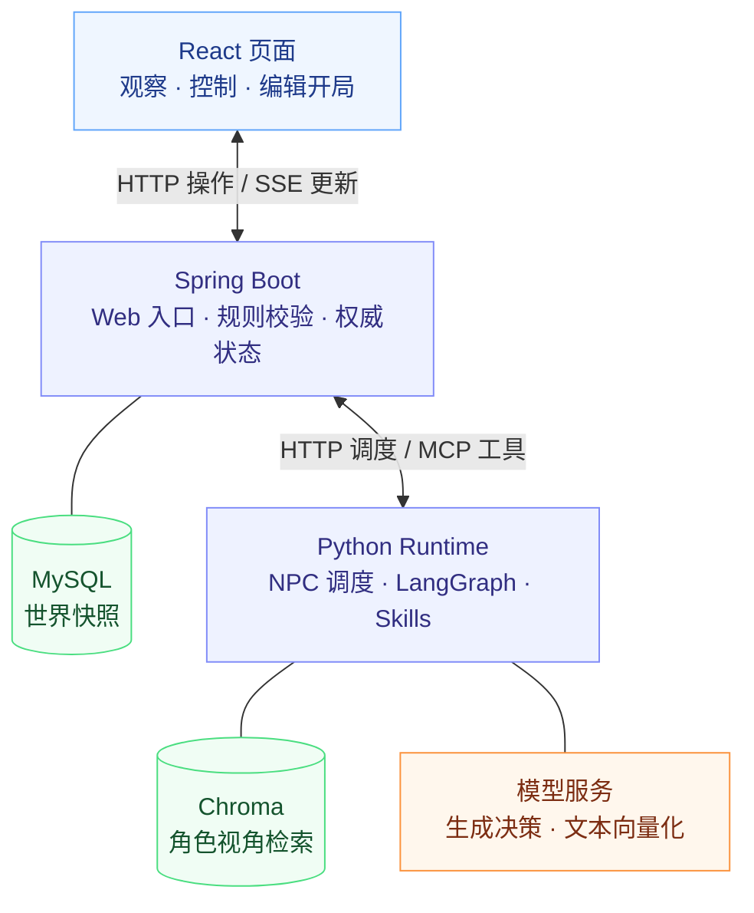
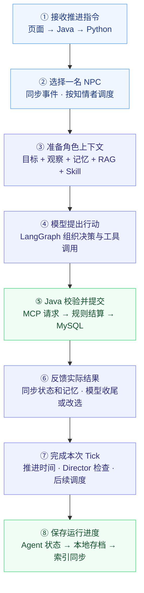

> **历史归档：V3 学习资料，非当前 V4 架构说明。** 文内 Skill 续排、藏匿/找回等旧描述仅用于历史学习。当前实现请阅读 [README](../README.md)、[最终验收](NovelWorld_V4_Final_Evaluation.md) 和 [简历文案](Resume_Project_Description.md)。

# NovelWorld 面试备战文档

> 核对日期：2026-09-26。依据当前代码、简历和测试源码整理。适用于 Java 后端 / AI 应用开发实习。本文是复习资料，不是已完成的优化清单。
>
> 本次只核对代码和测试源码，没有运行测试、启动世界或调用模型；测试章节描述已有用例覆盖的意图，不代表本次执行通过。下面的口述稿请结合自己的实际开发经历使用，不要虚构个人贡献、故障经历或性能数据。

## 1. 先练会这段项目介绍

### 60～90 秒口述稿

NovelWorld 是我做的一个面向小说和 RPG 的小型持久叙事世界。用户主要观察时间线、设置开局、推进时间，偶尔投放环境线索；NPC 根据各自的目标、知识和记忆选择行动。

架构上，浏览器只访问 Spring Boot。Python 用 LangGraph 组织角色决策，并通过 MCP 请求 Java 的世界工具。Java 负责检查位置、体力、物品归属等规则，结算行动、记录事件并保存世界快照。这样模型说“完成了某件事”，并不代表世界真的发生了变化。

我重点处理了两个问题：一是角色不能知道整个世界的秘密，所以记忆检索和事件传播都按角色视角限制；二是调查等任务需要跨多个 Tick 推进，所以根据已提交事件确认步骤完成，再安排后续行动。MySQL 的世界快照更新还使用版本号检查写入冲突。

目前是单机、小规模角色的实现，每个 Tick 调度一名 NPC。我做了规则、知识隔离和工作流的测试用例，但还没有完整的真实模型效果评测和生产规模压测。

### 介绍时的取舍

- Java 岗：重点讲规则校验、快照存储、乐观锁、线程与失败处理；Agent 背景点到为止。
- AI 应用岗：重点讲模型—工具循环、角色视角 RAG、Skill 续排、效果如何验证。
- 第一轮不要逐个介绍所有文件或工具。先说用途、架构、两个难点和边界。
- “个人项目”不等于可以声称每行都独立手写。被问到 AI 辅助开发时如实说明，并展示自己能解释、验证和修改关键代码。

## 2. 必须能画出的架构与调用链

### 整个项目的运行流程架构图

把“组件怎么连接”和“一次行动怎么执行”分开看。总览图只保留 6 个核心组件，具体函数与异常分支放在后面的文字中。

#### 图一：整体架构



**读图只记三件事：** 浏览器只访问 Java；Python 决定尝试什么行动，Java 校验并结算；MySQL 保存世界，Chroma 提供角色可见信息的检索索引。模型服务框概括生成模型与独立向量模型，不表示二者是同一个模型。

#### 图二：一次 NPC 行动的主流程

从上到下讲即可。此图展示角色可正常行动时的主路径，不展开休息、异常和空闲 Tick。



**面试讲解稿：** 用户推进 Tick 后，Java 通知 Python 调度一个角色。Python 准备这个角色能看到的上下文，由模型提出行动，再通过 MCP 交给 Java 校验和保存。实际结果回传给模型与运行时，之后处理世界时间、Director 和后续调度，最后保存进度。页面通过独立的 SSE 路径观察变化。

**图中省略的细节：**

- 第⑤步校验失败不会提交行动，第⑥步可反馈模型改选；工具循环有上限，为保持图简洁未画回折箭头。
- Director 仅在规则触发时提议线索，写入世界仍须经过 Java；Skill 仅在对应已提交步骤成功且有下一步时续排。
- SSE 在 Java 中每秒检查状态，有变化再推送，不需要等待整个 Tick 完成。
- 第⑧步是顺序保存，并非一个跨存储事务；异常时 finally 也会尝试保存，但不保证保存成功。

### 四种职责不能混淆

| 组件 | 决定什么 | 不应声称 |
| --- | --- | --- |
| Python Scheduler（调度器） | 本次由谁获得行动机会 | 模型自由决定所有角色执行顺序 |
| NPC 模型 | 基于上下文选择尝试什么工具和参数 | 模型文字直接修改世界 |
| Java WorldRules | 行动是否合法、消耗和后果是什么 | World Agent 是独立大模型 |
| WorldStore | 保存快照、检查版本冲突 | 整个 Tick 是一个原子事务 |
| Director | 规则触发后请求模型提议环境线索 | 一个完全自主、任意操纵角色的导演模型 |

### 点击一次“下一 Tick”的实际链路

```text
React POST /api/control/next
→ WorldWebController.next()
→ AgentRuntimeClient.control()
→ Python /internal/control/next
→ WorldController.start(1, 0)，启动工作线程
→ WorldSession.next_tick()
→ WorldTickScheduler.run_tick()：同步事件、选择一名角色
→ create_initial_agent_state()：准备目标、记忆、检索和现场观察
→ graph.invoke()：模型选择工具 → 执行工具 → 返回结果给模型
→ tools.world_tools.execute_tool()
→ RemoteWorld.execute()，MCP 调用 execute_world_tool
→ WorldMcpTools.executeWorldTool()
→ store.load() → rules.apply() → store.update()
→ Python 刷新业务状态、补充角色记忆
→ 推进世界时间、Director 检查、收集事件、安排后续步骤
→ 保存 Agent 状态、本地存档、同步 Chroma 索引
→ 浏览器通过 SSE 获取更新
```

控制接口的 202 表示接受了后台任务，不表示整个 Tick 已经成功。一次 Tick 可能包含多次模型请求、多个存储步骤；不能等同于一次模型调用。

### 阅读入口

| 顺序 | 文件与关键函数 | 读完必须能回答 |
| --- | --- | --- |
| 1 | [WorldWebController.java](C:/Users/13112/OneDrive/Desktop/novelworld/world-service/src/main/java/org/novelworld/world/WorldWebController.java)：next、events | 请求如何进入？页面如何看到结果？ |
| 2 | [web_api.py](C:/Users/13112/OneDrive/Desktop/novelworld/web_api.py)：WorldController.start、activate_world | 如何避免重复启动？是否同时运行多个世界？ |
| 3 | [agent/session.py](C:/Users/13112/OneDrive/Desktop/novelworld/agent/session.py)：next_tick | Tick 结束保存什么？finally 有什么局限？ |
| 4 | [agent/tick.py](C:/Users/13112/OneDrive/Desktop/novelworld/agent/tick.py)：run_tick、_collect_events | 谁被调度？何时续排？ |
| 5 | [agent/state.py](C:/Users/13112/OneDrive/Desktop/novelworld/agent/state.py)、[agent/graph.py](C:/Users/13112/OneDrive/Desktop/novelworld/agent/graph.py) | 模型获得哪些上下文？工具循环何时结束？ |
| 6 | [tools/remote_world.py](C:/Users/13112/OneDrive/Desktop/novelworld/tools/remote_world.py)：execute、_refresh_business_state | MCP 如何调用 Java？本地状态如何同步？ |
| 7 | [WorldMcpTools.java](C:/Users/13112/OneDrive/Desktop/novelworld/world-service/src/main/java/org/novelworld/world/WorldMcpTools.java)、[WorldRules.java](C:/Users/13112/OneDrive/Desktop/novelworld/world-service/src/main/java/org/novelworld/world/WorldRules.java) | 谁检查身份、体力、位置？何时持久化？ |
| 8 | [WorldStore.java](C:/Users/13112/OneDrive/Desktop/novelworld/world-service/src/main/java/org/novelworld/world/WorldStore.java)：update | 如何拒绝旧快照覆盖？ |

## 3. 高频追问：架构与 Agent

### Q1：为什么 Java 和 Python 分开？全部用一种语言行不行？

**口述：** 可以。当前分工是 Java 管理确定性的规则、存储和 Web 接口，Python 使用 Agent 与向量检索生态。这让模型决策和权威状态有明确边界，但也增加了跨进程通信、同步与排错成本。

**深挖准备：** 这不是“Java 天生更安全”或“Python 不能做后端”。小型项目全用一种语言也合理。说明这是当前项目的架构选择，不要杜撰性能对比。

### Q2：这真的是多 Agent 吗？是不是只有一个大模型？

**口述：** 多 Agent 指多个角色有各自身份、目标、知识和记忆，不要求每个角色使用不同模型。当前复用模型服务和同一个图结构，每次为选中的 NPC 创建独立的本轮状态，串行执行。

**代码：** session.py 的 make_graph_decide_action；state.py 的 create_initial_agent_state。

**进一步追问：** 角色独立的是上下文和持久记忆，不是独立进程或独立训练模型。当前默认采用角色目标列表第一项，不是复杂的动态目标规划器。

### Q3：LangGraph 在这里实际做了什么？不用行不行？

**口述：** 它把模型决策、工具执行和条件跳转组织成显式状态图。当前图只有两个主要节点，可以用 while 循环实现；图的价值是把状态和终止条件表达清楚。

**代码：** graph.py 的 build_agent_loop_graph：
model_decision → 有工具请求则 execute_pending_tools → 回到 model_decision；没有工具请求则结束。

**必须理解：** AgentState 保存本轮对话、工具请求、结果和检索上下文。当前没有使用 LangGraph 持久化检查点来恢复图中间执行位置；跨 Tick 状态由项目自己的快照保存。

### Q4：Function Calling 和 MCP 有什么区别？

**口述：** 工具调用让模型返回工具名和参数；MCP 是运行时与工具服务通信的协议。在项目中，模型提出行动，Python 解析参数，再通过 MCP 调用 Java。

**代码：** graph.py 的 _extract_tool_calls；remote_world.py 的 _call；Java 的 @McpTool。

**深挖：** 当前使用 Streamable HTTP 传输，每次 _call 都创建会话并初始化；没有实现长期连接复用。MCP 不负责判断物品能否转交，也不自动解决重试、幂等和事务，这些仍由业务层实现。

### Q5：模型不停调用工具怎么办？

**口述：** 工具执行轮数上限为 5；本轮已有成功工具结果后就不再允许新的行动。相同工具名和相同参数文本已经失败时，本轮拦截重复调用，并把失败信息反馈给模型。

**边界：** 这是本轮控制，参数文本比较也不是语义去重；不能称为跨请求幂等。成功工具结果和 Skill 完成是两种判定：Skill 还必须匹配已提交事件。

### Q6：如何处理模型幻觉？

**口述：** 对世界状态，用 Java 工具校验保证只有合法行动能提交；对文字，项目还针对部分“已经调查过”的说法检查工具记录。但不能保证模型的所有叙述都真实。

**深挖：** 区分“阻止非法状态变化”和“彻底消除语言幻觉”。正则或特定声明检查覆盖有限，不能当通用语义验证器。

## 4. 高频追问：RAG、记忆与知识隔离

RAG 是检索增强生成：先从外部资料中找相关内容，再加入模型上下文；Embedding 是把文本转换成用于相似性计算的向量。

### Q7：你的一次 RAG 请求具体怎么走？

**口述：** 用当前目标和所在地点组成查询，分别检索角色记忆和设定。先按角色可见范围过滤候选，再对记忆候选综合排序，最后限制返回条数和字符数，交给 Prompt。

**代码：** state.py 的 create_initial_agent_state → [chroma_index.py](C:/Users/13112/OneDrive/Desktop/novelworld/retrieval/chroma_index.py) 的 retrieve_memory / retrieve_lore → [characters/prompt.py](C:/Users/13112/OneDrive/Desktop/novelworld/characters/prompt.py)。

**当前参数：**
- 历史记忆默认最多 3 条、600 字符；设定默认最多 2 条、350 字符。
- 记忆候选召回后按 0.6 × 相似性分数 + 0.25 × 归一化重要性 + 0.15 × 相对写入顺序排序。
- 相似性分数用 1 / (1 + distance)；新近程度用写入顺序，不是时间衰减模型。
- 上述权重是启发式配置，没有实验依据证明是最优值。
- 设定没有使用同一套三因素重排；字符限制也不是完整 Prompt 的 Token 硬预算。

**追问：有 Reranker 吗？** 有手工加权重排，没有额外训练或调用专门的重排序模型。不要未经核对就把底层 distance 说成余弦相似度。

### Q8：怎么保证甲不会检索到乙的秘密？

**口述：** 世界索引按 world_id 分目录；记忆检索使用 owner 过滤；设定检索只允许 public 或当前角色的 audience。Prompt 也只组织当前角色的信息。

**深挖：** 过滤是检索请求的一部分，不能先把全局秘密给模型再要求它忘掉。Python 运行时可以持有全局数据，因此这是应用层角色视角隔离，不是多租户安全沙箱。页面作者视角也不等于 NPC 视角。

**证据：** tests/test_chroma_embedding.py、tests/test_perception.py、tests/test_current_runtime.py 中有对应场景。

### Q9：短期记忆、长期记忆、语义记忆怎么区分？

**口述：** 短期记忆保留最近经历，默认窗口 5 条；超出后进入角色自己的情节档案。语义记忆保存本人调查得到的当前事实。近期记忆直接参与上下文，历史经历和当前调查事实参与检索。

**代码：** [short_term.py](C:/Users/13112/OneDrive/Desktop/novelworld/memory/short_term.py)、[semantic.py](C:/Users/13112/OneDrive/Desktop/novelworld/memory/semantic.py)、[retrieval.py](C:/Users/13112/OneDrive/Desktop/novelworld/memory/retrieval.py)。

**追问：旧事实变了怎么办？** 通过来源事件和被替代的事件 ID 排除旧观察，也排除依赖旧观察形成的反思；索引同步移除不再有效的内容。它不是任意文本矛盾的自动推理系统。

### Q10：反思是不是又调用一次模型？

**口述：** 当前不是。每 3 个 Tick 触发规则式摘要，从新经历中选重要内容组合成反思，并记录来源和处理游标。

**代码：** [reflection.py](C:/Users/13112/OneDrive/Desktop/novelworld/memory/reflection.py) 的 reflect_on_new_memories。

**不能说：** 实现了大模型自我反思、推理能力持续进化或模型训练。

### Q11：每次都重新向量化吗？换模型怎么办？

**口述：** 同步时比较文档和元数据，只对变化项生成向量，删除失效项；查询向量有进程内 LRU 缓存。索引路径还包含模型名和维度，避免不同模型向量直接混用。

**代码：** chroma_index.py 的 _sync_collection、_query_vector；[embedding.py](C:/Users/13112/OneDrive/Desktop/novelworld/retrieval/embedding.py)。

**边界：** 同步仍需扫描、比较；元数据变化也可能触发重新向量化。当前配置为 qwen3.7-text-embedding、1024 维、每批 20 条，这只是仓库配置，面试前应再次核对。更换模型需要重建索引和评测，不是只改一个名字就能保证效果。

### Q12：怎么证明 RAG 有用？

**口述：** 现有测试验证过滤、同步和检索流程，但不能证明真实模型任务完成率提高。下一步应固定场景和模型配置，对比开启与关闭 RAG，记录任务成功、信息泄露、调用成本和延迟。

**追问：怎么做评测？** 准备有标准可见信息和预期任务结果的案例，多次运行；同时看检索是否召回所需证据、最终行动是否正确。不能只挑一段好看的故事证明有效。

## 5. 高频追问：Skill 与事件调度

### Q13：Skill 是什么？和普通 Prompt 有什么区别？

**口述：** 当前 Skill 是按角色状态选择的任务指导。程序依据可见线索和已提交事件推导当前阶段，把阶段、工具和参数建议加入 Prompt，再让模型决定是否执行。

**代码：** [skills/router.py](C:/Users/13112/OneDrive/Desktop/novelworld/skills/router.py) 的 choose_skill / skill_for；[调查 workflow](C:/Users/13112/OneDrive/Desktop/novelworld/skills/investigation/workflow.py) 的 next_step；[隐瞒 workflow](C:/Users/13112/OneDrive/Desktop/novelworld/skills/concealment/workflow.py) 的 next_step。

**边界：** 角色匹配包含角色身份、目标关键词和阈值等规则，不是通用语义规划器。Skill 不训练模型，也不绕过 Java 直接执行动作。

### Q14：如何知道某个步骤真的完成？

**口述：** completed_step 对照当前建议步骤与新提交事件，检查行动角色、事件类型和目标。无关行动成功不能算完成；只有匹配成功且重新计算后仍有下一步，才跨 Tick 续排。

**演示：** 建议去客栈 → 模型实际移动 → Java 产生对应 move 事件 → 匹配完成 → 下一 Tick 再考虑调查。模型只说“我已经到了”不算完成。

**深挖：** 没有单独不断累加的流程阶段字段，阶段主要从事实和事件推导。减少重复状态，但增加规则依赖和历史扫描成本。失败不会推进流程，但可能因其他事件获得新的行动机会。

### Q15：为什么不让所有 NPC 每轮都思考？

**口述：** 事件唤醒让行动机会与角色实际获得的信息关联。开局每个角色有一次机会，之后主要由新事件和成功步骤续排驱动，减少无关回应。

**代码：** tick.py 的 _pending、_event_cursor、_collect_events。

**进一步追问：**
- 当前一 Tick 选一名 NPC，世界时间推进 5 分钟。
- narration 和 rest 不用于这类唤醒，事件发起者不会被自己的事件再次唤醒。
- 连锁反应深度上限为 3，防止事件互相激发无限延伸。
- 上限也可能截断合理互动，是当前简化取舍；没有证明最优，也没有完整公平性保证。
- “事件驱动”是程序内队列与事件游标，不是 Kafka 或 RabbitMQ。

### Q16：为什么事件要保存 perceived_by？

**口述：** 它记录事件发生时的知情者。重启补写记忆时按这份名单传播，避免根据角色现在的位置，把旧事件泄露给后来才到场的人。

**代码：** WorldRules.perceivedBy；[world/events.py](C:/Users/13112/OneDrive/Desktop/novelworld/world/events.py) 的 recipients_for_event。

**例子：** 甲在客栈目击事件，随后离开；乙事后进入客栈。恢复时应该仍是甲知情，而不是改成乙知情。旧事件缺失名单时存在兼容推导，不应把兼容路径当作同等强的历史保证。

### Q17：Director 是怎么工作的？

**口述：** 程序先检测停滞、参与度或互动不足等条件，并检查冷却期；触发后请求模型提议线索，再由 Java 校验地点、类别和内容长度并写入事件。模型失败时有固定线索兜底。

**代码：** [director.py](C:/Users/13112/OneDrive/Desktop/novelworld/agent/director.py) 的 choose_event / maybe_inject；WorldMcpTools.introduceNarrativeEvent。

**边界：** Java 的结构和规则检查不等于完整验证新线索在文学意义上无矛盾；Director 也没有完整全局剧情规划能力。

## 6. 高频追问：Java、数据库与一致性

### Q18：权威状态在 Java，为什么 Python 还有 WORLD_STATE？

**口述：** Python 的状态用于角色上下文、记忆和调度，是运行时视图；位置、物品等业务变化由 Java 提交后再同步回来。保存 Agent 状态时只提交记忆、调度等字段，不直接覆盖角色业务字段。

**代码：** remote_world.py 的 _refresh_business_state、save_agent_state；WorldMcpTools.saveAgentState。

**深挖：** Java 内部存取也以 MySQL 快照为基础。Python 本地存档和 Chroma 增加了同步复杂度，不能说三份存储在同一事务中强一致。Chroma 是派生索引，应该能够从有效记忆和设定重建。

### Q19：为什么存整个 JSON，而不是拆很多表？

**口述：** 小型世界的结构经常调整，整份快照方便保存和恢复，也避免初期维护大量关联表。但每次更新会重写快照，事件增长后读写成本上升，按字段查询和局部并发更新也不方便。

**代码：** [schema.sql](C:/Users/13112/OneDrive/Desktop/novelworld/world-service/src/main/resources/schema.sql)：world_id 主键、snapshot LONGTEXT、revision BIGINT。

**追问：如何升级？** 先按真实查询需求拆出事件表，用世界 ID 和事件序号支持增量查询；再考虑局部状态表。当前没有独立事件表，也不是事件溯源系统。

### Q20：乐观锁怎么实现？

**口述：** 读取版本 v，提交时用 WHERE world_id = ? AND revision = v 检查版本，并将快照和版本 v+1 一起写入；影响行数不为 1 就报错。

```sql
UPDATE world_saves
SET snapshot = ?, revision = ?
WHERE world_id = ? AND revision = ?;
```

**例子：** A、B 都读到 7，A 先提交成为 8，B 用 7 更新时失败，避免覆盖 A 的修改。

**必须理解：**
- 检查与更新在一条 SQL 中完成。
- 乐观锁不是“不使用任何数据库锁”；它指应用层采用版本比较控制冲突。
- 版本属于整个世界，每次保存递增，不等于 Tick 数。
- snapshot 内也携带 revision，当前写入同时维护快照和列值。
- 影响行数为 0 也可能是记录已被删除，当前统一按更新失败处理。
- 失败时代码恢复传入 Map 的版本号，但不把 Map 中所有规则计算结果回滚；旧快照不能直接再次强行提交。

### Q21：有 synchronized 为什么还要乐观锁？

**口述：** synchronized 保护同一个 Java 对象上的线程互斥；版本条件由数据库检查，可以检测其他实例或写入路径造成的版本冲突。前提是相关写入都遵守版本协议。

**深挖：** 当前多个 synchronized 实例方法共享该 Bean 的对象锁，甚至不同世界的这些调用也会互相等待。没有实现按世界细分锁或多实例调度。不要把它说成已经验证的高并发架构。

### Q22：一个 Tick 失败会全部回滚吗？

**口述：** 不会。单次世界快照的 SQL 更新有数据库语句级原子性，但行动提交、推进时间、保存记忆和 Chroma 同步是多个步骤，不构成一个整体事务。

**代码：** session.py 的 next_tick；tick.py 的异常分支。

**当前处理：** 决策异常且尚未观察到新事件时把角色放回待执行队列；已经观察到行动事件时保留行动，报告总结失败。finally 会尝试保存状态。

**重要边界：** finally 不保证保存成功，也不能抵御进程强杀。Java 已提交但响应丢失时，Python 可能不知道行动成功，现有机制不能完整消除重放风险。

### Q23：版本号能防止重复赠送吗？

**口述：** 不能。版本号检测旧状态写入；重复请求如果重新读取最新版本，仍可能成功。跨请求去重需要稳定的 action_id 和结果记录。

**未来设计，尚未实现：** 为行动分配唯一 ID，在事务中保存行动结果和状态变化；相同 ID 重试返回已有结果。还要验证同一 ID 不允许携带不同参数。这叫幂等：同一请求重试不会重复产生业务效果。

### Q24：如何保证隐藏线索不会被直接拿走？

**口述：** Prompt 提示只是辅助，Java 会检查藏匿对象是否允许、调查者是否先检查相应痕迹等前置条件。模型绕过建议直接调用也必须过规则校验。

**证据：** WorldRulesTest.concealmentRequiresOptInAndInvestigatorMustExamineTrace；调查 Skill 测试覆盖藏匿—检查—找回链路。

**边界：** 工具发起身份还会与参数中的角色核对，但当前 MCP 是本机可信运行时边界，不应声称面向公网的不可信客户端认证已经完备。

## 7. 高频追问：Web、线程和 SSE

### Q25：为什么 SSE，不用 WebSocket？

**口述：** 页面主要接收服务器更新，控制操作走普通 HTTP 即可。SSE 是服务器到浏览器的单向事件流，适合当前需求；WebSocket 支持双向通信，但这里暂时没有强需求。

**代码：** WorldWebController.events；前端 EventSource。

**必须说明实际实现：** 当前每个 SSE 连接启动异步任务，每秒读取运行状态和快照，比较序列化结果，有变化则发送 state，空闲时发送心跳。浏览器端是推送，服务端内部仍轮询。

### Q26：SSE 断线后会丢事件吗？连接多了怎么办？

**口述：** 当前重连后可以获取当前视图，但没有用 Last-Event-ID 实现可靠的逐事件补发。当前视图只带最近一部分时间线，因此不能承诺完整事件流不丢失。

**深挖：** 每连接轮询、查询和阻塞等待带来重复成本；CompletableFuture.runAsync 未显式指定独立执行器。未来可以按世界统一生成视图、广播给连接，管理超时和连接清理，再按事件游标补发。这些不是现有实现。

### Q27：点击暂停能立刻中断模型吗？

**口述：** 当前暂停通过线程事件标志在 Tick 之间检查，也能打断 Tick 之间的等待；不会立即取消正在执行的模型请求。接口接受暂停意图和实际工作线程停下不是同一时刻。

**代码：** web_api.py 的 start / pause。RLock 是可重入锁，用于保护控制和会话操作；不能用“Python 有 GIL”替代业务并发设计。

### Q28：多世界是否同时运行？有用户权限吗？

**口述：** 当前支持独立存档和切换活动世界，运行时主要围绕一个活动 WORLD_STATE；运行期间禁止切换，不是多个世界并行执行。浏览器有可选单用户 Basic 认证，但不是完整多用户权限系统。

**代码：** WorldController.activate_world；[WebAccessFilter.java](C:/Users/13112/OneDrive/Desktop/novelworld/world-service/src/main/java/org/novelworld/world/WebAccessFilter.java)。

**深挖：** 角色知识隔离、多世界数据隔离、登录用户授权是三件不同的事。公开部署需要重新审视认证、传输和 MCP 访问边界。

## 8. 怎样回答“最难的地方”和“你怎么验证”

### 可以选择的难点一：模型描述与世界事实不一致

**口述结构：**
1. 问题：模型可能声称已经调查、移动，但没有实际执行。
2. 设计：工具调用交给 Java 校验并生成事件，流程进度匹配已提交事件。
3. 证据：无关成功行动不推进 Skill、失败后刷新建议、相同失败调用拦截等测试。
4. 代价：规则和场景维护成本增加；仍不能消除所有文本幻觉。

只有你确实经历过的调试过程才能用“我当时发现……”来讲；否则说“这项设计解决的问题是……”。

### 可以选择的难点二：重启后知识传播发生变化

**口述结构：** 如果恢复时按当前站位判断谁目击旧事件，会让后来到场者知道不应知道的内容。因此把知情者名单写在事件中，并在补写记忆时复用。测试用角色换地点后的恢复场景验证。

### 已有证据与不能推出的结论

| 测试文件 | 可讨论的验证点 | 不能推出 |
| --- | --- | --- |
| [test_current_runtime.py](C:/Users/13112/OneDrive/Desktop/novelworld/tests/test_current_runtime.py) | 工具交给 Java、失败处理、知情者唤醒、恢复、角色秘密 | 真实模型始终正确、网络故障全部解决 |
| [test_skill_routing.py](C:/Users/13112/OneDrive/Desktop/novelworld/tests/test_skill_routing.py) | 阶段推导、事件匹配、续排和恢复 | 真实模型任务完成率提高多少 |
| [test_chroma_embedding.py](C:/Users/13112/OneDrive/Desktop/novelworld/tests/test_chroma_embedding.py) | 使用替身向量验证增量同步和可见过滤 | 真实语义召回质量、最佳检索参数 |
| [test_world_switch.py](C:/Users/13112/OneDrive/Desktop/novelworld/tests/test_world_switch.py) | 世界隔离、失败恢复、运行时禁止切换 | 多世界并发运行 |
| [WorldRulesTest.java](C:/Users/13112/OneDrive/Desktop/novelworld/world-service/src/test/java/org/novelworld/world/WorldRulesTest.java) | 位置、归属、体力、藏匿与找回等规则 | 完整数据库事务、生产压测 |
| [WorldMcpToolsTest.java](C:/Users/13112/OneDrive/Desktop/novelworld/world-service/src/test/java/org/novelworld/world/WorldMcpToolsTest.java) | 工具入口和事件行为，存储使用 Mock 替身 | 真实 MySQL 并发冲突测试通过 |

### 面试前应该亲自完成的验证

- 跑相关离线测试，记录实际日期、命令、结果与环境；不要把源码里存在用例当成执行成功。
- 亲自追一遍“移动 → 调查 → 询问”的函数调用，知道输入输出。
- 演示一次非法行动被 Java 拒绝，以及一次只给知情者写入记忆。
- 如果演示真实模型，提前确认费用和可用环境；不要现场临时更换模型。
- 尚无测量时直接说“未做系统压测 / 未形成模型效果统计”，再给出你会如何测。

## 9. 基础知识复习清单：围绕代码准备

| 主题 | 必须掌握 | 用项目落地解释 |
| --- | --- | --- |
| Java 集合 | Map、List、泛型、可变对象 | 为什么当前 Map 快照灵活，但类型错误更多在运行时暴露 |
| Java 并发 | synchronized 的锁对象、线程池、阻塞 | 为什么同一 Bean 方法串行，SSE 任务不宜无限增加 |
| Spring | Controller / Component / Repository、依赖注入 | 谁接请求、谁管规则、谁读写数据库 |
| MySQL | 主键索引、条件 UPDATE、原子性、事务边界 | revision 冲突检测与整个 Tick 非原子性的区别 |
| HTTP | 202、409、请求响应、长连接 | 接受任务、拒绝重复启动、SSE 接收结果 |
| Python | 异常、finally、线程、RLock、asyncio | 保存尝试为何不等于保证恢复；MCP 同步封装如何工作 |
| Agent | 状态、工具调用、终止条件 | 为什么限制轮数，如何回传工具失败 |
| RAG | 向量、过滤、候选召回、重排、评测 | 为什么先限定可见范围，再选相关记忆 |
| 测试 | Mock、单元测试、集成测试、对照实验 | 替身验证机制，真实调用验证效果，各自证明什么 |

被追问 MVCC（多版本并发控制）、事务隔离或向量索引算法时，区分数据库/框架知识与自己的实现。当前 revision 是应用层显式字段，不等于自己实现了 MySQL 的 MVCC。不会的底层细节不要用框架名称掩盖。

## 10. 30 分钟模拟面试

| 时间 | 面试官问题 | 合格标准 |
| --- | --- | --- |
| 0～2 分钟 | 介绍项目 | 用途、架构、两项难点和边界 |
| 2～6 分钟 | 从点击 Tick 到数据库走一遍 | 能说明四种职责与异步返回 |
| 6～10 分钟 | RAG 怎么防止秘密泄露？ | 世界、owner、audience、Prompt 与应用层边界 |
| 10～14 分钟 | Skill 为什么能跨轮推进？ | 建议不是事实，已提交事件匹配才算完成 |
| 14～19 分钟 | 版本锁、事务、响应丢失怎么处理？ | 区分冲突、回滚和幂等，承认现有缺口 |
| 19～23 分钟 | SSE、线程、多世界并发怎么设计？ | 描述当前真实实现，不泛谈高并发 |
| 23～27 分钟 | 你如何证明有效？ | 指出具体测试，以及缺少的真实模型评测 |
| 27～30 分钟 | 最值得改进什么？ | 行动幂等、恢复、评测；解释为何暂不加 Redis |

练习方法：每题先用 30～60 秒回答；追问时再展开代码和例子。录音检查是否反复使用“用了某框架”而没有说明问题、输入输出和边界。

## 11. 五天准备顺序

1. **第 1 天：介绍和主链路。** 不看文档画架构，沿 Tick 入口找到 SQL，讲清四种职责。
2. **第 2 天：Java 与状态。** 读规则、工具入口、WorldStore；手推两个请求版本冲突和响应丢失。
3. **第 3 天：Agent 与 RAG。** 手写一份角色上下文组成，解释过滤、排序、记忆替换和工具循环。
4. **第 4 天：调度与 Skill。** 逐步模拟藏匿—调查痕迹—找回，解释每次续排依据；阅读对应测试。
5. **第 5 天：模拟与查漏。** 完成上面的模拟面试；只对已经理解的代码展开，记录待补基础知识。

时间不足时优先掌握第 1、2、6、8 节，再补 RAG 和 Skill 深挖。

## 12. 面试前最后一页：不能说过头

- 多 Agent ≠ 多模型训练，也 ≠ 并行执行。
- Skills = 规则选择与阶段推导下的 Prompt 指导，不是微调。
- World Agent 当前主要是 Java 规则服务，不是独立大模型。
- 有事件日志 ≠ 已实现事件溯源、消息队列或可靠事件投递。
- 有存档 ≠ 整个 Tick 原子提交，也 ≠ 崩溃后精确恢复图中间节点。
- 有 revision ≠ 请求幂等，也 ≠ 高并发能力证明。
- 角色可见过滤 ≠ 完整的多租户权限系统。
- 手工加权排序 ≠ 已训练的 Reranker；字符限制 ≠ 精确 Token 预算。
- 规则式反思 ≠ 模型自主反思或训练。
- SSE 已使用，但当前服务端仍轮询，未实现可靠断线事件补发。
- 已有测试用例 ≠ 本次已运行通过，也 ≠ 真实模型效果指标。
- Redis、行动幂等、完整恢复和效果评测属于可讨论的未来方向，当前没有实现就明确说明。

**最后自测：** 随机点开一个简历术语，能否找到具体函数，用一个例子说明它解决的问题，再说出至少一个局限？能够做到，才算准备好这项技术点。

