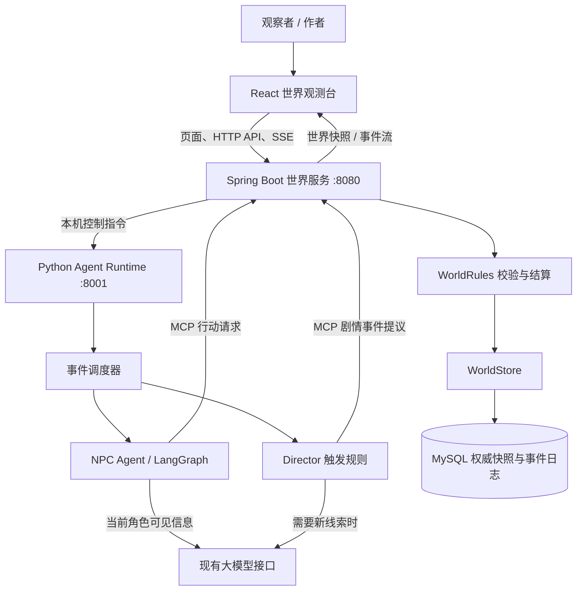
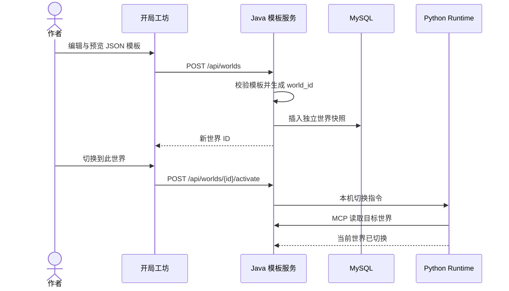
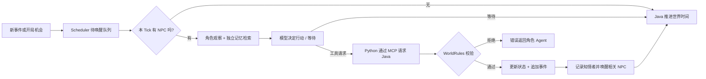

> **历史归档：V3 学习资料，非当前 V4 架构说明。** 文内 Skill 续排、藏匿/找回等旧描述仅用于历史学习。当前实现请阅读 [README](../README.md)、[最终验收](NovelWorld_V4_Final_Evaluation.md) 和 [简历文案](Resume_Project_Description.md)。

# NovelWorld 项目整体说明与面试掌握手册

> 面向需要在面试中讲清项目的作者。先建立全局模型，再按调用链读代码，最后用追问和动手题检验理解。本文描述当前仓库唯一正式的 **Web 自主世界模式**。早期演示与命令行入口已从当前工作树清理，历史版本仍可从 Git 查看。下面的回答是理解提纲，请结合自己运行过的现象用自己的话表达。

## 1. 一句话理解

NovelWorld 是一个小型动态叙事世界：AI 角色带着各自的目标、知识和记忆，在同一个世界里自行行动；人主要观察事件时间线，必要时为世界投放一条线索。传统游戏通常是“玩家扮演角色”，这里更接近“观看角色自己生活，偶尔扮演上帝”。

例如，作者在客栈放入一封信。系统记录信出现时谁在客栈；下一轮只给知情角色回应机会。角色可能调查、离开、交谈或等待。模型提出意图，世界规则决定意图能否成立，成功后才更新位置、物品、体力、生命值和事件日志。作者不能通过投放事件直接规定某个 NPC 的台词。

项目目前主要服务于学习 Agent 工程和小说、RPG 叙事原型，默认只有三名 NPC 和三个地点，不以海量角色或复杂画面为目标。

## 2. 先看全局



关键区别是 **谁能决定** 与 **谁能修改**：

| 部分 | 负责什么 | 不负责什么 |
| --- | --- | --- |
| Director | 根据停滞、参与度、冲突等规则，适时提出可调查的环境线索 | 不替 NPC 说话或指定下一步行动 |
| NPC Agent | 从自己的视角观察、检索记忆、结合目标选择行动或等待 | 不直接改世界存档，也不读取其他人的秘密 |
| World Agent 的当前实现 | Spring Boot 中的 `WorldRules`、`WorldMcpTools` 和 `WorldStore`：校验行动、结算结果、记录事件、保存状态 | 不决定角色的个人意图 |
| Scheduler | 根据开局机会和事件知情者安排谁在本 Tick 行动 | 不让全世界 NPC 每轮都请求模型 |
| Web UI | 编辑开局、看世界、单步或批量运行、暂停、投放线索 | 不成为权威世界状态，也不直接访问内部 Runtime |

这里的 **World Agent** 主要是确定性的 Java 规则与状态服务，并非一个可以随意改写规则的“大模型裁判”。这是有意保持的职责边界。

## 3. 从开局到事件：一次故事怎样运行

### 3.1 创建开局

浏览器从 Spring Boot 读取默认 JSON 模板。作者可以修改世界时间、地点、地点描述、可调查对象、角色的人设和目标、角色自己的秘密与已知事实、关系、体力、物品以及有可见范围的世界设定。预览会先检查基本格式，正式创建由 Java 再校验角色标识、关系对象、地点和物品归属等引用。

点击“创建新世界”后，Java 生成新的 `world_id` 和空事件日志，写入 MySQL。创建不会覆盖默认模板、旧世界或当前正在观看的世界。作者还需在“已保存的世界”里切换到新世界；创建和切换都要求当前世界已暂停。页面“保存模板”使用**当前浏览器的 localStorage**，不是服务器上的共享模板库。创建、预览和切换都不调用大模型。



初始生命值目前由 Java 固定设为 `100`，状态设为 `normal`；模板直接编辑的是体力 `energy`。不要把“模板能编辑所有状态”理解为已实现。

### 3.2 NPC 自主行动

Web 模式开局会给每名 NPC 一次目标驱动的行动机会。此后调度器读取**新事件**的 `perceived_by`（事件发生时记录的知情者），把相关 NPC 放入待唤醒队列；新事件优先于尚未使用的开局机会。每个 Tick 最多选择一名 NPC，世界时间推进 5 分钟。连锁反应最多三层；没有待处理角色时只推进时间，不请求 NPC 模型。等待也不会生成行动事件循环。



NPC 的输入由角色身份、目标、自己知道的事实和秘密、物品、关系、地点观察、近期与长期记忆，以及对该角色可见的世界设定组成。模型可以用工具交谈、移动、调查、交付物品、修改关系、休息，或通过扩展行动攻击、使用物品、逃跑、跟随、互动。它也可以直接回复“等待”而不调用工具。一次 Tick 最多成功执行一项改变世界的行动；工具拒绝后，Agent 可以读取错误再决定。模型输出的文字不是世界事实，成功的工具结算和事件才是。

角色的知识边界同时靠几层机制维持：开局区分角色私有信息与可见世界设定；观察只包含现场和该角色可感知的事件；记忆与检索按角色过滤；Java 对行动者、地点、物品和部分虚构调查声明进行校验。自由文本仍不能保证消除所有隐含的信息泄漏。

### 3.3 Director 与人为干预

Director 先由 Python 规则检查近期事件、角色参与和冷却时间。只有触发时，才请求现有模型提出一条**环境线索的内容**，再通过 MCP 交给 Java 校验并写入世界。模型请求失败时可退回固定线索。Director 不为 NPC 编写行动。

作者在页面“向世界投放线索”，指定地点、名称和内容；Java 校验后增加可调查对象及 `intervention` 事件，并在当时记录现场知情者。下一 Tick 才轮到有关 NPC 自行回应。投放线索本身不调用模型，后续自动 Tick 可能产生模型 API 费用。

## 4. 世界状态、事件和存档

一个世界由 `world_id` 标识；不同世界有各自的时间、地点、NPC、可调查对象、设定、事件、记忆和调度进度。Java 的 MySQL 快照是 Web 模式的权威持久数据。Python 在运行时持有同步后的角色对象与记忆索引，但行动、时间和人为事件必须回到 Java 提交。Java 使用 `revision` 检测存档更新冲突。

事件至少表达“何时、何地、谁、做了什么、谁当时能感知”，常用字段包括 `id`、`timestamp`、`type`、`actor`、`target`、`location`、`payload`、`perceived_by`、`description`。事件附在世界快照内；Python 和 `/api/world-events` 按游标读取。浏览器通过 SSE 接收包含近期事件的页面状态。`perceived_by` 是**发生时**的快照：后来走进场景的 NPC 不会因此自动知道旧事件。

调度器持久化 `tick_count`、事件游标和待唤醒队列。重启后先同步 Java 已提交事件，再补齐对应 NPC 的记忆，避免同一事件再次结算。浏览器显示最近的世界事件，角色视角接口显示该角色的目标、已知事实和记忆。作者级别的开局 JSON 可见秘密；公开角色视角接口不会列出其他角色的秘密。

**术语速查**：Tick 是一次世界推进；Event（事件）是已提交的结构化记录；MCP 是 Python 请求 Java 世界工具的协议；SSE 是 Java 向网页持续推送更新的单向连接；RAG 是从角色记忆或世界设定中检索相关文本，放入当次模型输入。

## 5. 代码地图：每个目录做什么

| 路径 | 作用 | 建议先读 |
| --- | --- | --- |
| `web/src/` | React 世界观测台、时间线、角色视角和开局工坊 | `main.jsx`、`WorldSetup.jsx` |
| `world-service/` | Spring Boot 浏览器入口、MCP 工具、规则结算、模板与存档 | `WorldWebController.java`、`WorldRules.java`、`WorldStore.java` |
| `web_api.py` | 本机 Python Runtime 的控制入口；只供 Java 调用 | `WorldController` |
| `agent/` | 会话、Tick 调度、Director、角色观察、LangGraph Agent 循环 | `session.py`、`tick.py`、`director.py`、`graph.py` |
| `characters/` | 角色数据结构、默认角色和角色视角 Prompt | `model.py`、`prompt.py` |
| `tools/` | 模型工具声明、行动者约束和 Java MCP 客户端 | `world_tools.py`、`remote_world.py` |
| `world/` | Python 侧的世界投影、事件和恢复副本 | `state.py`、`events.py`、`persistence.py` |
| `memory/`、`retrieval/`、`lore/` | 近期/长期/事实记忆、Chroma 检索和世界设定可见性 | `memory/retrieval.py`、`retrieval/chroma_index.py` |
| `skills/` | 调查任务的跨 Tick 规划与进度判断；不授予额外执行权限 | `router.py`、`investigation/workflow.py` 与 `SKILL.md` |
| `tests/` | 当前 Web 运行路径与世界规则的自动测试 | `tests/test_current_runtime.py`、`world-service/src/test/` |
| `docs/` | 学习计划、历史架构说明和完整验收流程 | 本文、`NovelWorld_自主世界完整验收流程.md` |

`world-service/src/main/java/org/novelworld/world/` 里还可按功能辨认：

- `WorldSetupController` / `WorldTemplateService`：读取和验证模板、创建与切换世界。
- `WorldWebController` / `WorldInterventionController`：页面查询、控制、SSE 与人为投放线索。
- `AgentRuntimeClient`：Java 向本机 Python 下发开始、暂停和切换指令。
- `WorldMcpTools`：Python 调用 Java 世界能力的入口；`WorldRules` 才负责动作是否成立；`WorldStore` 负责持久化。
- `WebAssetsConfig` / `WebAccessFilter`：提供构建后的页面，以及可选的页面 Basic Auth。

## 6. 如何在本机运行当前 Web 模式

准备 JDK 17、Maven、Docker Desktop、Python 3.11+ 和 Node.js。模型调用使用 `llm_client.py` 的现有配置；密钥放在未提交的 `.env`，不要写入模板或文档。以下命令以 Windows PowerShell、项目根目录为例。

```powershell
docker compose up -d
docker compose ps
```

在 `web/` 安装依赖并构建页面：

```powershell
cd web
npm install
npm run build
cd ..
```

先检查 Maven 使用 **Java 17**。把下一行的 JDK 路径换成你机器上的实际路径；Java 终端需要一直保持运行。

```powershell
$env:JAVA_HOME = 'C:\Program Files\Java\jdk-17.0.2'
$env:Path = "$env:JAVA_HOME\bin;$env:Path"
mvn -version
mvn -f .\world-service\pom.xml '-Dmaven.test.skip=true' 'org.springframework.boot:spring-boot-maven-plugin:4.1.1:run'
```

另开一个位于项目根目录的终端，启动**一个**内部 Python Runtime：

```powershell
python -m venv .venv
.\.venv\Scripts\python.exe -m pip install -r requirements.txt
.\.venv\Scripts\python.exe -m uvicorn web_api:app --host 127.0.0.1 --port 8001
```

打开 `http://127.0.0.1:8080`。浏览器只访问 Java 8080；Java 与 Python 8001、Python 与 Java `/mcp` 是本机内部通信。若页面显示 `Service Unavailable`，先确认 Python 8001 的终端仍在运行。Java 默认连接 Docker 提供的本机 MySQL `3307`；详细启动排错与逐项验收见[自主世界完整验收流程](NovelWorld_自主世界完整验收流程.md)。同一个 `world_id` 同时只应由一个 Python Runtime 推进。

## 7. 新人建议的阅读与验证顺序

1. 打开页面，不运行 Tick：看世界 ID、角色、地点、时间线和“开局工坊”。
2. 阅读默认模板 `world-service/src/main/resources/default-world-template.json`，找出林默、苏晚、赵无极各自的目标与已知事实。注意“世界中存在的线索”和“某人已知道的事”是两个概念。
3. 从 `web/src/main.jsx` 追踪一次“下一 Tick”到 Java 的 `WorldWebController`、`AgentRuntimeClient`、`web_api.py` 和 `agent/tick.py`。
4. 从 `agent/graph.py` 追踪一次工具请求，经 `tools/remote_world.py` 到 Java 的 `WorldMcpTools`、`WorldRules`、`WorldStore`。
5. 在页面暂停时创建一个不同开局，切换后单步运行；核对事件 `perceived_by`、角色视角和世界状态。实际模型台词不固定，以 Java 已提交的事件为准。

不调用模型的自动验证命令：

```powershell
.\.venv\Scripts\python.exe -m unittest discover -s tests -q
mvn -f .\world-service\pom.xml test
cd web
npm run build
```

Java 测试同样要求 Maven 使用 JDK 17。页面的“下一 Tick”或“运行 10/20 Tick”会使用真实模型，可能产生 API 费用；编辑开局、查询、投放线索及上述自动测试不会调用模型。

## 8. 当前能力与下一阶段

当前已有可验证的分层闭环：可编辑且互不覆盖的世界、角色独立知识与记忆、按事件唤醒、等待、Java 规则结算、事件与调度进度持久化、浏览器观测和人为投放线索。它是**阶段性完成的架构**，不等于所有理想能力都已成熟。

尤其要知道：当前 Director 只在几类规则触发时添加可调查线索，还不是完整的长期剧情规划器；知情者主要按事件现场和直接关联判定，没有复杂的视野、听力或传播网络；开局后的运行由作者单步或指定有限 Tick 批量触发，不是无人值守的无限后台循环；模板是 JSON 编辑与预览，尚非逐字段表单；世界快照仍以整份 JSON 存储，扩展到大量 NPC 和长事件历史时需要进一步优化查询、索引、并发与成本控制。记忆检索现在使用独立的 Embedding 模型，向量质量与实际剧情决策收益仍需通过对照评估。后续工作因此既包括内容，也包括规则、记忆、调度和性能。

如果只记住一个原则：**模型提出可能发生的事，程序验证并提交真正发生的事；事件再影响知道它的角色。**

## 9. 面试时怎么介绍这个项目

### 30 秒版本

“我做的是一个小型自主叙事世界。作者可以配置开局，然后观察多个 NPC 根据各自的目标、知识和记忆自主行动，也能偶尔投放线索。Python 负责 Agent 决策和事件调度，Java 负责规则校验、世界状态和持久化，React 展示时间线与角色视角。模型只能提出行动；行动成功与否以 Java 结算的事件为准。”

### 约 2 分钟版本：按「问题 → 设计 → 流程 → 取舍」讲

1. **问题**：若让一个大模型同时编剧情、扮演所有角色并修改状态，很容易让 NPC 知道不该知道的秘密、凭空移动或重复行动。
2. **设计**：拆成 Director、NPC、World 三种职责。Director 只提供剧情线索；NPC 只基于个人视角做决定；World 由 Java 确定性规则实现。事件把三者连接起来。
3. **流程**：作者创建一个独立世界；Web 发起 Tick；调度器只激活开局角色或新事件的知情者；NPC 检索自己的记忆并向模型请求决定；Python 将工具请求经 MCP 交给 Java；Java 验证、更新状态、记录知情者并存档；新事件在下一次调度中唤醒其他角色。
4. **取舍**：为了让世界状态可靠，Java 使用单份 JSON 快照和版本号，先解决完整闭环；调度与记忆仍在 Python。它适合当前小规模原型，但大世界需要更细粒度存储、事件查询、观察范围和成本管理。

请避免说“模型直接驱动数据库”或“所有 NPC 真正并发生活”。当前运行是作者单步或指定有限 Tick，且每 Tick 至多一名 NPC 获得行动机会。

## 10. 必须能画出来的三条调用链

### A. 点击“下一 Tick”到底发生什么？

`web/src/main.jsx` 发 `POST /api/control/next` → `WorldWebController.next()` → `AgentRuntimeClient.control()` 调 Python `/internal/control/next` → `web_api.py` 启动工作线程 → `WorldSession.next_tick()` → `WorldTickScheduler.run_tick()`。调度器同步新事件、选角色；若无人可动，直接推进 5 分钟；若选中 NPC，调用 `make_graph_decide_action()` 与 LangGraph。一步结束后，Python 将记忆和调度进度交给 Java 保存，并同步本地索引。页面从 Java 的 `/api/world` 和 `/api/events` 看到结果。

**自测**：在浏览器点击一次后，能否分别指出“发起请求的文件”“真正选 NPC 的函数”“真正改世界时间的服务”？答案分别是 `web/src/main.jsx`、`agent/tick.py` 的 `run_tick()`，以及 Web 模式下 Java 的 `WorldMcpTools.advanceWorldTime()`。

### B. NPC 想移动或调查，谁说了算？

`agent/state.py` 和 `characters/prompt.py` 组织该 NPC 的观察、目标与记忆 → `agent/graph.py` 请求模型 → 模型返回 `move_character` / `inspect` 等 Tool Call → `tools/world_tools.py` 检查当前行动者并路由 → `tools/remote_world.py` 发 MCP 请求 → `WorldMcpTools.executeWorldTool()` 核对行动角色 → `WorldRules.apply()` 校验地点、体力、物品等并构造事件 → `WorldStore.update()` 写 MySQL 快照。成功事件返回 Python，Python 刷新本地投影并补角色记忆。规则拒绝时，错误作为工具结果返回模型，世界不会凭模型的描述改变。

**自测**：若林默在县衙，却提出调查客栈的登记簿，应该到哪一层查原因？先看 Java `WorldRules.apply()` 的 `inspect` 分支；若模型试图用苏晚的身份行动，则看 `tools/world_tools.py` 和 `WorldMcpTools.executeWorldTool()` 的行动者约束。

### C. 作者投放线索后，为什么只有部分 NPC 反应？

`web/src/main.jsx` 发 `POST /api/world-events` → `WorldInterventionController` 调 `WorldMcpTools.injectWorldEvent()` → Java 在指定地点创建可调查对象和 `intervention` 事件，按**当时**的角色位置写入 `perceived_by` → MySQL 保存 → Python 下一 Tick 从 `get_world_events` 读取事件 → `WorldTickScheduler._collect_events()` 只把知情者加入队列 → `agent/perception.py` 和角色记忆提供该角色能看到的信息。作者投放事件不等于强制角色调查；最终行动由该 NPC 的模型决定。

**自测**：苏晚在客栈，林默在县衙，作者向客栈投放线索。投放立即产生什么？一个已提交事件和可调查对象。下一 Tick 谁有优先机会？苏晚。林默会不会自动知道内容？不会；除非后续通过可感知事件传播。

## 11. 常见面试追问：用代码事实回答

### 架构与职责

**Q1：为什么要三个 Agent？这里的 World Agent 真的是 LLM 吗？**

三种职责分别是剧情提议、角色意图和世界结算。当前 Director 可以在规则触发时让模型写一条环境线索，NPC 模型决定个人行动；World 是 Java 规则服务，不是另一个自由生成结果的 LLM。这样世界规则不会随着模型的文字漂移。看 `agent/director.py`、`agent/graph.py`、`WorldRules.java`。

**Q2：为什么 Python 与 Java 要拆开？**

Python 便于组织 LangGraph、Prompt、记忆检索和模型调用；Java Spring Boot 作为网页入口并持有规则与持久化。接口是本机控制 HTTP 与 MCP 世界工具。这种拆分让“思考”与“提交世界事实”分开，但增加了部署、故障处理和双进程状态同步复杂度；小原型也可以只用一种语言。看 `web_api.py`、`AgentRuntimeClient.java`、`WorldMcpTools.java`。

**Q3：为什么不让一个模型输出完整下一幕，然后直接保存？**

它会混淆“想发生的事”和“实际发生的事”，也很难校验地点、体力、物品归属及各 NPC 的知识边界。现在模型只输出工具意图；Java 拒绝非法动作并把真实结果返回 Agent。代价是规则要逐项实现，新动作不会凭语言自动生效。

**Q4：事件驱动是不是完全取代轮询了？**

当前调度器只采用事件模式：每名 NPC 有一次开局机会，之后由已提交事件的知情者唤醒；一 Tick 最多一个 NPC。事件驱动也不意味着真实时间持续运行，目前由页面发起有限 Tick。看 `web_api.py` 的 `_new_session()` 和 `agent/tick.py`。

### 信息隔离与记忆

**Q5：NPC 为什么不会直接知道世界的全部秘密？**

Prompt 不直接塞完整世界快照，只取自己的 `known_facts`、`secrets`、关系、记忆、可见设定与当前观察。事件记录 `perceived_by`，重启补记忆时沿用发生时的知情者。检索按角色和设定可见范围过滤。局限是自由文本仍可能发生推断或措辞级泄漏，现有检测覆盖不了所有隐含信息。看 `characters/prompt.py`、`agent/perception.py`、`world/events.py`、`retrieval/chroma_index.py`。

**Q6：近期记忆、长期记忆和事实记忆有什么区别？**

近期记忆保留最近经历；溢出后进入情节档案，检索时按相关性选取。事实记忆记录角色自己调查到的对象与观察，可用新调查替换旧事实。反思按新增经历周期生成摘要，不直接修改世界业务状态。Chroma 索引是可重建的检索加速层，不是唯一存档。看 `memory/short_term.py`、`memory/semantic.py`、`memory/reflection.py`、`retrieval/chroma_index.py`。

**Q7：这里的 RAG 和 Skill 是什么？**

RAG 是“检索增强生成”：在模型行动前按角色检索相关旧记忆及可见世界设定，放入 Prompt。Chroma 使用 `qwen3.7-text-embedding` 的 1024 维文本向量，新增文档及查询词会调用向量接口；索引按世界和向量模型隔离，原始记忆仍保存在 MySQL 快照中。当前 Skill 包括调查与保护隐瞒：程序按角色自己的可见信息及已提交事件建议下一步，模型决定是否采用；Java 校验并结算藏匿、痕迹调查和找回，只有成功事件才推动跨 Tick 续排。旧世界未标记可藏匿对象时维持原有行为。Skill 不赋予新的世界执行权限，也不代表已经验证其相对无 Skill 的模型效果。

### 规则、状态与可靠性

**Q8：一次攻击是怎么判定的？能让模型决定伤害吗？**

模型只能请求 `world_action` 中的攻击。Java 检查行动者状态、目标和地点等条件，首版伤害是确定性规则，结算后才产生事件和生命值变化。这里没有由模型自由裁定命中率或伤害。具体逻辑见 `WorldRules.java` 的 `applyWorldAction()`，可用 `WorldRulesTest` 的攻击用例复核。

**Q9：等待为什么重要？等待会不会死循环？**

NPC 可以不调用工具而等待；Web 事件调度不会因此追加叙述事件或再次唤醒自己。队列空时也不请求 NPC 模型，只推进世界时间。`agent/tick.py` 过滤 `narration` 与 `rest` 唤醒，并限制连锁深度为 3。Director 仍可能在规则触发时另加线索，所以“等待”不等于世界永远没有新事。

**Q10：如何保证世界状态只有一个权威来源？Python 为什么还保留 `WORLD_STATE`？**

业务状态以 Java `WorldStore` 的 MySQL 快照为准；Python 的 `WORLD_STATE` 是当前运行所需的本地投影，Agent 与 Prompt 从中读取。行动交给 Java，成功后 Python 刷新投影；记忆和调度状态再同步回 Java。Python 没有另一个可独立结算行动的本地规则分支。看 `tools/remote_world.py`、`world/state.py`。

**Q11：MySQL 保存什么？为什么不需要单独的缓存？**

MySQL 的 `world_saves` 表保存完整 JSON 快照及 `revision`，是持久依据；`WorldStore.load()` 直接读取 MySQL。当前世界规模较小，原先的缓存命中仍需向 MySQL 校验版本，本机基准测试没有体现读取收益，因此移除了缓存层。Python 调度按 Java 已提交事件的游标读取，待唤醒队列随调度状态保存在快照中。看 `WorldStore.java` 与 `schema.sql`。

**Q12：并发更新和重启重复处理怎么处理？是否做到严格 exactly-once？**

Java 写存档时用 `revision` 条件更新，拒绝基于旧版本覆盖；MCP 写操作在当前服务实例内也做同步。每个事件有 ID；调度器保存事件游标和待唤醒队列，记忆条目用事件 ID 加角色名去重，重启时按原 `perceived_by` 补写。测试覆盖正常暂停重启不重复结算。**不能宣称跨进程崩溃、任意并发写入下的严格 exactly-once**：当前是整份快照和多次跨服务调用，未来需要更强事务边界、幂等键及更细粒度持久化。看 `WorldStore.update()`、`WorldTickScheduler.snapshot()/restore()`、`world/state.py` 的 `reconcile_event_memories()`。

**Q13：为什么 `perceived_by` 要在事件发生时保存？**

如果重启后按角色**当前**位置重算，就可能把旧事件泄露给后来抵达的人，也可能漏掉当时在场、现在已经离开的人。它是一次观察结果的快照，不是动态权限查询。看 `WorldRules.perceivedBy()` 与 `world/events.py`。

### 产品、成本与扩展

**Q14：系统怎样避免每轮调用所有 NPC 的模型？**

调度器只保留开局机会或事件影响者；无待处理 NPC 时直接推进时间。事件唤醒去重，单 Tick 一个 NPC，并限制反应深度。收益是避免“每句话全员调用模型”；代价是当前感知规则简单，远处关系人或定时目标未必自动获知。看 `agent/tick.py`。

**Q15：什么时候会产生模型费用？**

创建模板、预览、读取状态、查询事件、投放线索及自动测试不会调用模型。NPC 获得行动机会时会请求现有 Qwen Responses 客户端；一次 Agent Loop 最多 5 轮工具请求，并可能有最终总结请求。Director 只有规则触发时才额外请求模型，失败可用固定线索。实际费用取决于模型、轮数和输出长度。看 `llm_client.py`、`agent/graph.py`、`agent/director.py`。

**Q16：前端为什么用 SSE？与 WebSocket 有什么不同？**

这里主要是服务端把页面状态持续推给浏览器；状态里包含近期事件，控制操作仍用普通 POST。SSE 的单向流适合观测台需求，实现比双向会话简单。当前 `WorldWebController.events()` 每秒查询状态并在变化时推 `state`；连接数变多时轮询与连接管理需要优化。

**Q17：怎样扩展到更多 NPC？**

先做事件和地点索引、知情者订阅、按需检索，而不是每 Tick 扫全世界和检索所有人；再拆分大 JSON 快照、缩短页面返回的事件历史、处理每个世界的并发调度与模型预算。当前 `observe()` 扫事件历史、`WorldStore` 保存完整 JSON、SSE 每秒查快照，角色数量和事件历史增长后会带来成本。这是演进方向，不能说已经实现。

**Q18：当前最重要的不足是什么？下一步你会先做什么？**

可以选一个能用代码证据说明的点回答，例如：Director 只会在几类规则触发后放线索，还没有长期剧情计划；感知仅按现场和直接相关者判断；开局模板仍是 JSON 编辑；存档是整份快照；自动运行需要作者发有限 Tick。若目标是提高故事可信度，我会先扩展 NPC 的计划和信息传播，再用固定场景评测是否减少无意义等待与知识泄漏；若目标是更多 NPC，则先测量事件扫描和快照读写，再改存储与索引。不要把“内容不够丰富”当作唯一未完成点。

### 关于使用 AI 辅助开发，怎样诚实回答

若被问“代码是不是 AI 写的”，可以如实说使用 AI 辅助实现，但自己能解释需求、模块边界、数据流、验收方法与局限；用现场打开代码和复现测试来证明理解。不要声称亲手设计或验证过自己实际上没有做过的部分。项目可信度来自你能追踪一次真实 Tick、解释非法动作为何被拒绝、指出哪一个存档是真实来源，并提出具体改进方案。

## 12. 不靠背诵的掌握训练

下面每题先口述，再打开对应代码确认。**不需要改动存档，也不需要调用真实模型**就能完成前四题。

| 练习 | 你应能给出的答案或证据 |
| --- | --- |
| 1. 画出一个 Tick 的调用链 | 从 React `POST /api/control/next` 画到 Python Scheduler、NPC 模型、Java 规则、MySQL，再画回 SSE；指出每一步使用 HTTP、MCP 或本地函数。 |
| 2. 解释两种“状态” | Java 的世界业务状态是权威；Python 的角色对象是当前 Agent 的运行投影，角色记忆与调度进度会回存。说明为何不能把模型回复当成状态。 |
| 3. 找三处知识隔离 | 开局字段分离、Prompt/检索按角色取数、事件 `perceived_by` 与重启补记忆。再说出目前仍可能有自由文本泄漏。 |
| 4. 给出一条非法行动的完整路径 | 例如异地攻击或无物品交付：模型请求 → Python 路由 → Java `WorldRules` 拒绝 → 错误返回；说明事件数和状态都不应增加。 |
| 5. 解释 A/B 两种开局 | 从同一默认模板改一名角色的目标与已知事实，创建两个 `world_id`；比较角色视角、首轮实际行动和切换后仍独立的事件日志。具体模型选择可以不同，不要背固定台词。 |
| 6. 解释线索传播 | 在只有苏晚在场的地点投放线索，查询事件 `perceived_by`；说明为何林默不被唤醒。若要让林默知道，需要他调查或从之后的对话等事件中获知。 |
| 7. 设计一项改进 | 选“定时事件”“更真实的视野/听力”或“更多 NPC 的性能”之一，明确应改的模块、要新增的状态/事件字段、最小验证和成本。 |

最后做一次不看文档的模拟讲解：**2 分钟说项目，3 分钟画调用链，3 分钟回答知识隔离与一致性，2 分钟说局限和下一步**。如果讲到某个词说不清，就回到上面的代码路径跑一遍，而不是继续背术语。已有的[完整验收流程](NovelWorld_自主世界完整验收流程.md)提供可复现的操作步骤；面试前至少亲自完成一次“建两个世界 → 投放线索 → 单步运行 → 看知情者 → 重启恢复”的路径。
