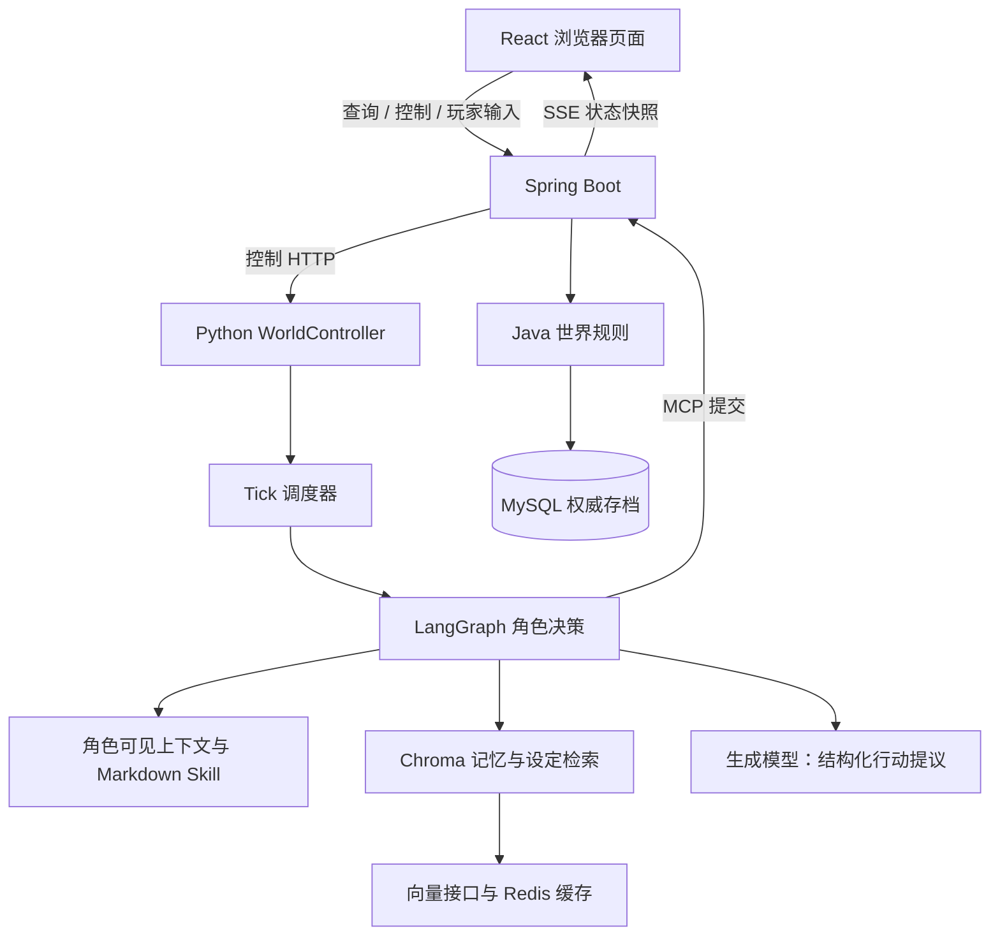
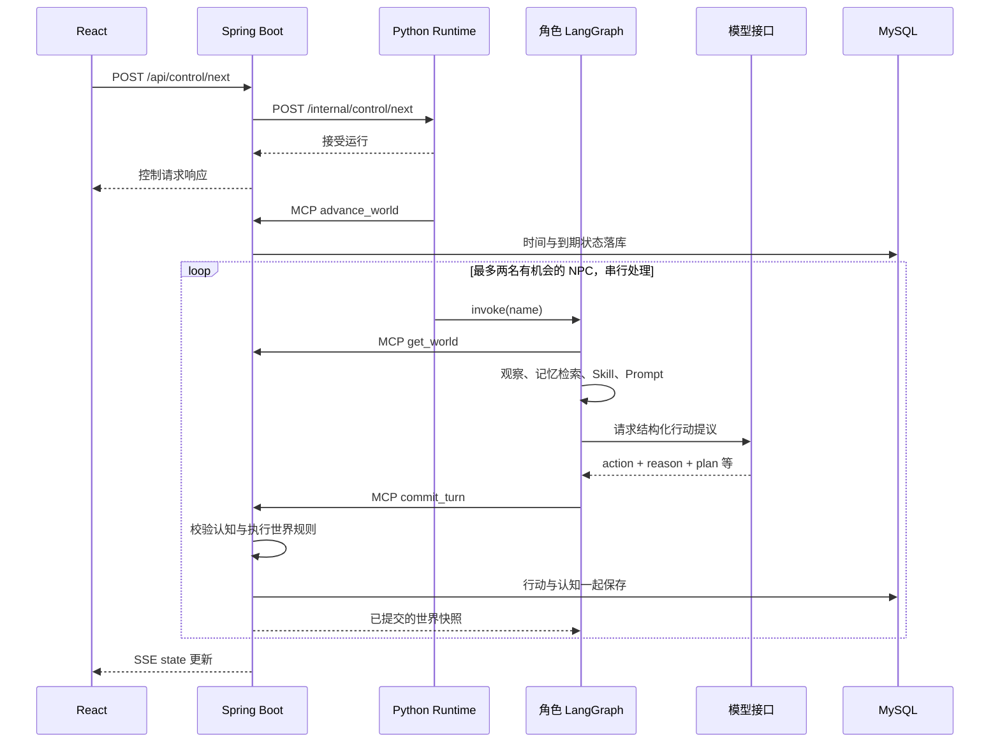

# NovelWorld 开发者入门与接手指南

这份文档面向第一次接触仓库、准备自己修改功能的开发者。阅读时建议打开相应文件：先理解一次运行如何跨越前端、Python 与 Java，再选择需要修改的层。本文描述当前代码，不把未来功能当作已经实现的能力。

快速导航：[启动与配置](#4-第一次启动与开发方式) · [目录与阅读顺序](#5-目录说明与建议阅读顺序) · [Tick 调用链](#7-一次-tick-的完整调用链) · [角色决策](#8-langgraph-如何组织角色决策) · [记忆检索](#10-记忆rag-和-redis-各负责什么) · [Skill](#11-skill-的当前实现与修改方法) · [Java 规则](#12-java-如何守住世界规则) · [扩展功能](#15-自己扩展功能从小改动开始) · [排查与验证](#16-如何排查问题与完成最小验证)。

## 1. 项目到底做什么

NovelWorld 是一个小型、可保存进度的 AI 社会沙盒。默认世界里有四位镇民：经营茶馆的苏晚、处理镇务的林默、做木工的陈禾，以及自由撰稿人许宁。他们在四个地点生活，依据自己的身份、目标、记忆和计划选择行动。观察者可以阅读实际事件，也可以查看角色表达的动机、计划和关系印象。

项目的核心不是让大模型连续写小说，而是让角色提出行动，由世界程序检查行动是否成立，再把真实结果交给后续角色。角色说“我已经帮你修好了桌子”，并不因此产生修好的桌子；当前规则没有修理物品的结算，就不能把这句话当作世界事实。

你可以从上帝视角观察，也可以在同一个世界中加入一位旅人。玩家与 NPC 使用相同的行动规则。观察页面知道的秘密不会自动成为旅人或 NPC 的知识，收起参与面板也不会删除玩家或创建另一个世界。

当前实现面向单机、小规模、单玩家的演示和学习。它保留 Java、Spring Boot、Python、LangGraph、React、MySQL、Redis、Chroma、MCP、SSE 和 Markdown Skill 的完整职责链，没有生命、体力、战斗、库存交易或 Director 系统。

## 2. 先建立三个概念

**世界事实（World Truth）**是 Java 已经结算并保存的结果，例如位置变化、开始活动、发出邀请和真实发言。MySQL 保存这些结果，是重启后恢复世界的依据。

**角色知识（Character Knowledge）**是某个角色有权限接触的内容。角色附近发生的事件、本人参加的交谈和本人可见的设定可以进入其上下文，其他角色的私密目标、秘密和内心不会一起传给它。

**角色信念（Character Belief）**是角色对经历的解释，例如“林默可能不喜欢我的提议”。信念可以错。模型产生的反思、计划和关系印象属于这个层次，不能凭一句解释改变世界事实。

阅读代码时始终区分四件事：程序调度决定谁获得决策机会；模型选择目标、计划和行动；Java 校验行动是否合法；Java 写入世界状态。World Agent 在这里是围绕共享模型接口组织的角色决策程序，并不是每个角色各自拥有一套独立大模型。

## 3. 总体架构与数据方向



浏览器只访问 Spring Boot。Python 的 FastAPI 端口是本机内部控制入口，不作为正式浏览器后端。Spring Boot 接到“运行 12 Tick”后通知 Python 开始工作；Python 通过 MCP 读取世界、推进时间和提交行动；Java 再校验和保存。前端通过 SSE 获取更新。

MySQL、Chroma 和 Redis 不保存三份同等地位的世界。MySQL 是权威数据；Chroma 是从角色记忆和设定生成的可重建检索索引；Redis 是向量缓存。Python 的 `RemoteWorld.snapshot` 是工作过程中的临时快照，`data/runtime.json` 只记录当前世界 ID，不能代替数据库存档。

## 4. 第一次启动与开发方式

### 4.1 准备环境

需要 JDK 17、Maven、Python 3.11 或以上、支持 Vite 7 的 Node.js 和 Docker Desktop。所有下面的命令都在仓库根目录执行。两个服务终端也保持在根目录，避免相对路径指向不同的数据或前端目录。

```powershell
python -m venv .venv
.\.venv\Scripts\python.exe -m pip install -r requirements.txt
npm.cmd --prefix web ci
npm.cmd --prefix web run build
docker compose up -d
```

已有 `.venv` 时跳过创建步骤。`compose.yaml` 启动 MySQL 和 Redis，本机端口分别是 3307 和 6380。MySQL 使用持久数据卷，Redis 作为缓存运行。不要用删除数据卷来解决普通连接错误。

终端一先启动 Java，等待应用启动完成：

```powershell
mvn.cmd -f world-service/pom.xml spring-boot:run
```

终端二配置好模型密钥后启动 Python：

```powershell
.\.venv\Scripts\python.exe -m uvicorn web_api:app --host 127.0.0.1 --port 8001
```

打开 <http://127.0.0.1:8080>。Python 启动时需要访问 Java 的 MCP，所以先启动 Java。单独打开 Java 页面不表示 Python 已经可用。启动不会自动让 NPC 调用生成模型；点击运行后才进入角色决策。首次没有世界指针时创建默认世界，已有指针时恢复对应数据库世界，恢复失败会报错，不偷偷换一个新存档。

### 4.2 配置在哪里生效

| 配置 | 默认值或用途 | 读取方 |
| --- | --- | --- |
| `DASHSCOPE_API_KEY` | 模型接口密钥，无默认密钥 | Python 模型客户端 |
| `NOVELWORLD_MODEL_TIMEOUT_SECONDS` | `180`，正数秒数 | Python 生成与向量客户端 |
| `NOVELWORLD_MCP_URL` | `http://127.0.0.1:8080/mcp` | Python |
| `NOVELWORLD_REDIS_URL` | `redis://127.0.0.1:6380/0` | Python |
| `NOVELWORLD_REDIS_PORT` | `6380`，容器宿主端口 | Docker Compose |
| `NOVELWORLD_JDBC_URL` | 本机 3307 的 `novelworld` 数据库 | Java |
| `NOVELWORLD_DB_USER` / `NOVELWORLD_DB_PASSWORD` | Compose 对应的本地开发账号 | Java |
| `NOVELWORLD_AGENT_URL` | `http://127.0.0.1:8001` | Java |
| `NOVELWORLD_WEB_DIST` | 自动定位 `web/dist` | Java |
| `NOVELWORLD_WEB_USER` / `NOVELWORLD_WEB_PASSWORD` | 可选浏览器 Basic 认证；密码默认空 | Java |

Python 的模型客户端在首次使用时加载 `.env`。这不表示所有组件都会自动读取同一份 `.env`：Java 使用环境变量和 `application.properties`；Docker Compose 有自己的变量插值；Python 的 MCP 和 Redis 配置应在启动进程前通过环境变量设置。不要把密钥写入源码、文档或提交记录。

生成模型当前是 `qwen3.8-flash`，向量模型是 `qwen3.7-text-embedding`，维度为 1024。修改接口、模型或维度时需要考虑兼容性和费用，不能只改一个名字就假定旧索引可继续使用。超时参数是底层 HTTP 请求等待配置，不是整轮 NPC 思考的严格总时长限制；一轮还可能包含向量请求和改选行动。

### 4.3 平时如何修改

改 React 时可用开发服务器：

```powershell
npm.cmd --prefix web run dev
```

Vite 开发页面使用 5173 端口，`/api` 代理到 Java 的 8080，仍然不直接访问 Python。演示使用 8080 页面时，前端修改后重新执行 `npm.cmd --prefix web run build` 并刷新。Java 从文件系统提供构建产物，一般不需要为纯前端修改重启 Java。

改 Python 后重启 Python Runtime；改 Java 或默认模板资源后重启 Java。当前运行使用单个 Python 进程和内存中的运行锁，不要通过 `--workers` 启动多个 Runtime 来扩容。调试运行中的世界时也不要依赖自动重载保留后台任务。

停止自己启动的服务，在相应终端按 Ctrl+C。暂停世界只停止继续调度，不会关闭服务；关闭服务也不会删除 MySQL 存档。

## 5. 目录说明与建议阅读顺序

| 位置 | 主要责任 |
| --- | --- |
| [`web_api.py`](../web_api.py) | Python 启停控制、运行状态、玩家输入排队 |
| [`agent/tick.py`](../agent/tick.py) | 推进一轮与挑选 NPC |
| [`agent/graph.py`](../agent/graph.py) | LangGraph 决策流程与模型提议校验 |
| [`characters/prompt.py`](../characters/prompt.py) | 构建单个角色的 Prompt |
| [`memory/stream.py`](../memory/stream.py) | 事件转记忆与反思来源校验 |
| [`memory/retrieval.py`](../memory/retrieval.py) | 长期记忆候选排序 |
| [`retrieval/`](../retrieval/) | Chroma 索引、向量调用、Redis 缓存 |
| [`skills/`](../skills/) | Skill 选择和 Markdown 内容 |
| [`tools/remote_world.py`](../tools/remote_world.py) | Python 的 Java MCP 客户端 |
| [`world/persistence.py`](../world/persistence.py) | 当前世界指针的读写 |
| [`llm_client.py`](../llm_client.py) | 生成客户端、模型配置、JSON 响应解析 |
| [`world-service/`](../world-service/) | Spring Boot、世界规则、存档和浏览器 API |
| [`web/src/`](../web/src/) | React 页面、玩家面板、开局编辑和样式 |
| [`compose.yaml`](../compose.yaml) | MySQL、Redis 的本机开发环境 |

第一遍先读 `tick.py → graph.py → prompt.py → remote_world.py → WorldMcpTools.java → WorldRules.java`，建立决策到结算的主链路。第二遍读记忆、Skill 和存档。第三遍再看 `web_api.py`、Java Web Controller 和 React 的控制状态。空的 `__init__.py` 主要用于 Python 包组织，不是隐藏的业务模块。

Java 文件集中在 `world-service/src/main/java/org/novelworld/world/`，下面提到的 Java 类均在这个目录。它们有意保持规模较小，部分数据使用 `Map` 和 `List` 组织，字段约束依靠显式校验。新增字段时要沿读写链检查，不能期待编译器自动找到所有 JSON 字段引用。

| Java 类或资源 | 阅读时关注什么 |
| --- | --- |
| `WorldServiceApplication` | Spring Boot 启动入口 |
| `WorldTemplateService` | 模板字段和引用校验、创建运行快照 |
| `WorldRules` | 时间结算、行动规则、真实事件与感知范围 |
| `WorldMcpTools` | MCP 注册、提交认知校验、防重与保存入口 |
| `WorldStore` | 数据库加载、插入与修订号更新 |
| `WorldWebController` | 两种视角的数据投影、控制转发、历史和 SSE |
| `WorldSetupController` | 模板、世界列表、创建、导出与激活 |
| `AgentRuntimeClient` | Java 到 Python 的内部 HTTP 调用与连接错误 |
| `WebAssetsConfig` / `WebAccessFilter` | 前端产物服务与可选浏览器认证 |
| `ApiErrors` | 将参数错误和内部服务错误转换为浏览器可读的 `detail` |
| `application.properties` / `schema.sql` | 服务配置与数据库表结构 |

## 6. 世界数据怎么组织

[`WorldTemplateService.java`](../world-service/src/main/java/org/novelworld/world/WorldTemplateService.java) 校验开局模板并创建世界。默认模板在 [`default-world-template.json`](../world-service/src/main/resources/default-world-template.json)。模板包含七个顶层字段：`title`、`premise`、`locations`、`characters`、`activities`、`objects`、`lore`，不能随意增加未知字段。

`locations` 是地点名到描述的映射。`characters` 是 NPC 名到角色设定的映射，包含身份、背景、性格、目标、秘密、初始关系、起始地点和 Skill 名称。`activities` 是活动 ID 到活动规则的映射，声明名称、可用地点、可用身份和持续分钟数。`objects` 是可检查物件，当前只提供名称、地点与检查描述，不是带库存和所有权的物品系统。`lore` 是可检索设定，每条有 ID、文本和可见范围。

模板目前允许 1–8 个地点、2–6 名 NPC，活动持续时间为 5–120 分钟，Skill 只能使用已有白名单。Lore 的可见范围是 `public` 或一位 NPC 的名字，不支持任意权限组。创建时检查地点、关系对象等引用，出错优先查看 Java 返回的字段提示。

运行快照会在模板基础上增加 `version=3`、`world_id`、`revision`、`minute`、`time`、`tick_count`、事件、邀请、会话、决策记录等数据。NPC 还会增加 `actor_type`、当前活动、`mind` 和 `memories`。玩家由加入接口创建，不应手动塞进 NPC 模板。

`minute` 是从第 1 天零点开始累计的世界分钟数，不是 Unix 时间。默认从 480，即第 1 天 08:00 开始。一天之后它继续增长，不归零；计划中的 `at` 也使用这个绝对分钟数。

角色认知的主要字段如下。这个片段只解释结构，不是一份可直接提交的完整世界：

```json
{
  "goal": "了解街坊对茶馆聚会的想法",
  "intention": "先询问眼前的熟人",
  "plan": [{"at": 540, "location": "晚风茶馆", "purpose": "考虑是否安排聚会"}],
  "reflection": "大家更愿意先谈具体安排",
  "relationship_notes": {"林默": "表达谨慎，需要先说明细节"},
  "last_decision": 510,
  "next_decision": 525,
  "event_cursor": 12,
  "reflection_cursor": 5
}
```

`event_cursor` 表示处理到事件列表的哪个位置，避免每轮重复读取全部历史；`reflection_cursor` 表示上次反思已覆盖到记忆流的哪里。它们是处理游标，不是事件 UUID。初始空认知由 Python 观察阶段补出默认值。

## 7. 一次 Tick 的完整调用链

假设你点击“走过 5 分钟”。React 通过 `api.js` 请求 Java `/api/control/next`，Java 的 `WorldWebController` 再通过 `AgentRuntimeClient` 请求 Python `/internal/control/next`。Python 返回已接受，并在后台线程开始一轮工作；浏览器不需要等模型完成后才收到控制请求响应。



[`WorldSession.next_tick`](../agent/tick.py) 先读取最新快照，通过 MCP 让 Java 推进 5 分钟，再最多选择两名 NPC 串行决策。每处理完一名角色，基于更新后的状态重新计算下一名候选，避免第二名继续使用第一名行动前的世界。

时间推进和每次角色提交分别保存，因此整轮 Tick 不是一个大事务。第一名已经成功、第二名超时，第一名的结果仍然存在。排查错误时先看世界事实，而不是假定“报错的一轮什么都没发生”。

### 7.1 调度器怎么选角色

候选逻辑在 `opportunities()`。它先排除玩家、这一轮已经处理过的 NPC、正在会话中但还没轮到发言的人，以及正在持续活动且没有收到邀请的人。没有邀请、不是当前发言者、没有到期计划，而且还没到 `next_decision` 的 NPC，也不会被选中。

排序先考虑距上次决策是否已经至少 20 分钟，再考虑收到邀请或轮到发言，随后按更早的上次决策时间和角色顺序排列。这里的“久未行动”只对已经满足条件的候选有效，不会无条件打断所有工作者。每 Tick 最多两个机会，属于简单优先级调度，不是严格公平或高并发调度器。

计划到期会使角色更容易获得机会，但计划不是定时执行脚本。模型需要自行删除已完成计划、调整后续安排。当前没有逐任务完成状态；遗留的过期计划可能让角色持续满足候选条件，这是可以进一步改进的地方。

### 7.2 时间推进时 Java 做什么

`WorldRules.advance()` 增加时钟与 Tick 计数，结束已到期活动，处理过期邀请与超时会话。这部分不依赖 LLM，所以即便某个 NPC 本轮没有思考，其活动仍能按世界时间完成。

活动具有开始时间和结束时间，而不是每 Tick 都请求模型重新说一遍“我在工作”。`wait` 会形成 10 分钟等待；其他活动采用模板中的持续时间。不是 5 的倍数的持续时间会在下一次 Tick 检查到期时结算。

## 8. LangGraph 如何组织角色决策

[`build_graph()`](../agent/graph.py) 把一次角色机会拆成观察、回忆、决策、行动、记录五个阶段。LangGraph 的作用是明确阶段和失败回路，不是自动赋予模型世界规则，也不是一个独立模型。

**观察（perception）**重新读取 Java 世界，使用 `memory.stream.observe()` 获取自己的认知，并把新增且本人可见的事件转成记忆。其他人的秘密不会因为内部快照完整就自动进入该角色 Prompt。

**回忆（recall）**用当前目标或初始目标、意图和地点构造检索问题，从 Chroma 找旧记忆与可见设定。近期记忆直接放入 Prompt，长期记忆先检索再排序。

**决策（decide）**构建角色 Prompt 并请求模型。模型返回 JSON，包含 `action`、`arguments`、`reason`、`goal`、`intention`、`plan`、`reflection`、`relationship_notes`、`next_review_minutes`。Python 校验字段、长度、地点和认知来源等约束。计划最多 6 条，下一次复查间隔为 5–30 分钟。Prompt 建议给出粗粒度计划，程序并不强制一定有两条计划。

**行动（act）**整理新认知和记忆，通过 MCP `commit_turn` 一起提交给 Java。Python 的校验不能代替 Java 的规则。模型选择去不存在的地点、越过发言顺序或冒用角色身份，必须在结算入口拒绝。

**记录（remember）**返回已经提交后的决策结果。这个节点没有额外调用总结模型，也没有自行写另一份持久世界。真正的行动与认知已经由 Java 保存。

格式错误或 Java 规则拒绝后，当前机会最多再生成一次改选。规则拒绝会携带错误并重新读取世界，但不会完整重跑观察和检索阶段。网络超时不属于格式校验失败，客户端没有自动无限重试；运行会停下并显示原因。这种设计控制了失败时的调用量，也留下了未来改善错误恢复上下文的空间。

模型的 `reason` 是其表达的简短行动理由，界面可以展示；它不等于模型内部完整思维过程，也不能证明角色所有行为都有唯一可解释原因。

## 9. 生成 Prompt 前究竟准备什么

[`build_prompt()`](../characters/prompt.py) 在模型调用之前汇总信息。理解这个函数，比直接改一段提示词更有用，因为角色能看到什么主要在这里决定。

自己的身份、背景、性格、初始目标、秘密、初始关系和当前认知可以进入上下文。附近其他角色只提供公开的名字、身份和当前活动，不提供他们的目标、秘密、记忆或内心。公共地点描述和世界背景也会加入。

邀请和会话按本人过滤。本人参与的会话包含持续的消息记录，因此下一次发言可以延续上一句。可选活动按角色身份筛选；现场物件只提供名字，检查描述需要经过 `inspect` 行动才能形成本人经历。

记忆部分包含最近 8 条记忆、检索到的长期记忆以及本人可见的设定。然后加载适用 Skill，附上是否应进行反思以及上次规则拒绝的原因。最后声明行动和 JSON 输出约束，才调用模型。

因此新增一个“秘密设定”时，应先决定它是本人初始秘密还是带 audience 的 Lore，不能为了方便直接把全世界存档序列化到 Prompt。新增前端展示字段也不会自动改变 NPC 的知识边界。

## 10. 记忆、RAG 和 Redis 各负责什么

### 10.1 从事件生成记忆

事件由 Java 创建，包含 ID、时间、类型、行动者、目标、地点、描述、payload 与 `perceived_by`。`perceived_by` 是允许感知该事件的人，不是浏览器当前选择的视角。移动、活动和交谈在规则中各自决定感知范围。

[`observe()`](../memory/stream.py) 只处理本人出现在 `perceived_by` 的新增事件。别人说的话或发来的邀请形成 `reported` 记忆，带有“未核实”的性质；其他直接经历形成 `observation`。同一事件可以被多人各自记住，但他们仍然有独立的记忆流。

角色提交行动时，Java 也会补入本人可见的本次行动记忆并更新游标，避免刚发生的行动因后续中断而漏记。记忆有 `source_event_ids`，Java 拒绝引用本人不可见或不存在事件的记忆。来源合法不代表角色解释绝对正确。

新增非反思记忆累计达到 5 条时，允许模型生成反思。反思必须引用已有记忆，并最终追溯到真实可见事件。反思是带来源的主观总结，不是改写原始事实。当前反思阈值和事件重要性由程序规则决定，没有另外使用一个模型给每条事件打分。

### 10.2 Chroma 怎么检索

[`ChromaIndex.recall()`](../retrieval/chroma_index.py) 把最近 8 条之外的记忆同步到长期索引。记忆索引 ID 包含角色名字和记忆 ID，避免两个人感知同一事件时互相覆盖。检索先使用 `owner` 过滤，再做向量相似度查询，最多取 16 个候选。

[`rank()`](../memory/retrieval.py) 综合相关性、重要性和新近性，取最多 4 条旧记忆。当前权重是相关性 0.55、重要性 0.25、新近性 0.20。新近性按记忆产生时间计算，不是最后一次被检索的时间。

Lore 单独索引，只查 `public` 或当前角色名字的条目，最多取 3 条。记忆和 Lore 使用同一个查询意图，但权限条件不同。索引目录按世界 ID、模型和维度分开，避免不同世界与向量空间混用。

Chroma 不是权威记忆存档。`_sync()` 只对内容或元数据变化的条目重新索引；删除不再存在的索引条目也不会删除 MySQL 中的世界。需要重建索引时，应先停止 Python、备份并只处理对应世界的索引目录，保留数据库和世界指针；重建可能产生向量调用费用。

### 10.3 向量调用与 Redis

[`DashScopeEmbedder.embed()`](../retrieval/embedding.py) 先查询缓存，对缺失文本分批请求向量接口，检查返回序号、维度与有限数值，再写缓存。当前每批最多 20 条。相同查询还使用 Python 进程内的小缓存，避免同一进程反复计算相同向量。

[`EmbeddingCache`](../retrieval/cache.py) 按模型、维度和文本摘要生成 Redis Key，保存 7 天。Redis 连接失败时退化为直接请求向量服务，并短时间避免反复连接。世界可以继续运行，但重复调用和费用可能增加。Redis 不负责 Tick 调度、玩家队列、会话状态或分布式锁。

## 11. Skill 的当前实现与修改方法

Skill 是在决策时提供专业知识、判断策略和约束的 Markdown 文档。它影响角色如何理解场景，不应指定“下一步必须去某地点并调用某工具”。活动是否合法仍由 Java 决定。

[`skills/router.py`](../skills/router.py) 当前使用简单、确定性的规则：先加载角色模板声明的 Skill；如果当前目标和意图包含“朋友、交流、误会、聚会”等关键词，再补入 `social`。不会额外调用模型选择 Skill，也没有把 Skill 放入 Chroma 做语义检索。

四个现有 Skill 分别是 `hospitality`、`community`、`craft` 和 `social`，内容在对应目录的 `SKILL.md`。它们适合当前少量角色，直接注入 Prompt 便于检查，也避免为了检索短文本增加一轮复杂度。文档内容有进程内缓存，编辑后重启 Python 才能可靠读到新内容。

如果新增 `journalism` Skill，需要建立 `skills/journalism/SKILL.md`，更新 Python Router 的白名单，同时更新 Java `WorldTemplateService` 的 Skill 白名单，然后在新世界的角色 `skills` 列表中配置名称。检查读取缓存容量是否仍合适。只创建文件或只改角色模板都会漏掉校验环节。

Skill 不等于 Tool。新增 Skill 不会自动得到新的世界能力；若角色需要真实发布公告、交付物品或修改设施，还必须实现 Java 结算规则。

## 12. Java 如何守住世界规则

### 12.1 MCP 是服务入口，行动是业务能力

[`WorldMcpTools`](../world-service/src/main/java/org/novelworld/world/WorldMcpTools.java) 暴露五个 MCP 工具：

| MCP 工具 | 用途 |
| --- | --- |
| `get_world` | 内部读取完整世界快照 |
| `initialize_world` | 创建默认世界 |
| `advance_world` | 依据预期 Tick 推进时间 |
| `commit_turn` | 提交一名角色的行动、认知和记忆 |
| `join_player` | 加入唯一玩家，不允许冒用 NPC 名字 |

模型通常返回 `action + arguments`，并不是直接从上述五个服务入口中随意挑一个调用。Python 图通过 `commit_turn` 把行动提议交给 Java；Java 再调用 `WorldRules.apply()`。新增一般世界行动可以扩展这个业务分派，不必每次新增一个独立 MCP Tool。

### 12.2 当前可用行动

| 行动 | arguments | 核心规则与结果 |
| --- | --- | --- |
| `move` | `location` | 空闲、地点存在、不是当前位置；立即移动 |
| `start_activity` | `activity_id` | 空闲，身份和地点符合活动定义；建立持续活动 |
| `stop_activity` | 空对象 | 必须正在活动；结束并产生中断事件 |
| `wait` | 空对象 | 空闲；建立 10 分钟等待 |
| `invite` | `target`、`message` | 邀请者空闲、双方同地，不能重复待处理邀请或占用会话 |
| `respond_invitation` | `invitation_id`、`accept` | 收件人回应自己的邀请；接受时重新检查状态 |
| `say` | `message` | 必须在会话中且轮到本人发言 |
| `leave_conversation` | 空对象 | 结束本人所在会话 |
| `inspect` | `object_id` | 物件与角色同地；产生本人可见的检查结果 |

每个行动的参数字段集合都受校验，不能顺便多塞一个模型发明的参数。“空闲”指没有持续活动和进行中的会话。检查物件不要求空闲，可以与当前活动并存；不要在前端把所有按钮一律按照同一种空闲条件处理。

接受邀请可以中断接受者的活动，邀请者必须仍满足可交谈条件。邀请 30 分钟后过期。接受后建立双人会话，先由接受者发言，之后轮流说话；会话最多 12 条消息，45 分钟无回应会结束。发言是连续交互过程，不依赖普通事件层层唤醒，也不使用旧的 reaction depth 截断。

活动完成目前只确认过程结束，没有收入、产物、任务奖励或物理效果。计划也不被 Java 当作已经获得双方认可的共同约定。若要增加“完成木工活动后得到椅子”，必须先设计产物与物品的通用规则，再在活动完成逻辑中真实结算。

### 12.3 存档、版本和防重

[`WorldStore`](../world-service/src/main/java/org/novelworld/world/WorldStore.java) 使用 JDBC 将整个世界快照作为 JSON 保存在 MySQL `world_saves` 表中。表只有世界 ID、快照文本和修订号等字段，不是按每个角色和事件拆分的复杂关系表。这样容易理解、导出和保持一次提交内部的一致性，代价是世界增大后每次读写成本增加。

`revision` 是乐观并发控制的修订号：更新时要求数据库仍处于读取时的版本，避免旧快照覆盖新状态。Java MCP 修改方法使用 `synchronized` 在当前进程串行执行；这不等于跨机器互斥。Python 自己也用锁组织 NPC 与玩家输入。

`commit_turn` 用请求 ID 查最近决策记录，同一个 ID 重复提交时返回已有结果，减少“接口响应丢了，但数据库已经写入”造成的重复行动。决策只保留最近 120 条，因此是有限窗口防重，不是无限期 exactly-once。`advance_world` 使用预期 Tick 识别已经推进的请求。不要把这些保护描述成生产集群的分布式事务。

新版世界 `version=3`。旧版本可以导出，不能激活运行；目前没有自动迁移。改变运行数据结构时，应明确选择兼容读取、提供迁移，或者升级版本并要求新建世界，不能仅改字段后让旧快照随机报错。

## 13. 运行控制与玩家输入

[`WorldController`](../web_api.py) 维护一个后台运行线程、运行锁、暂停信号和状态。运行支持 1–100 Tick，阅读间隔支持 0–30 秒。每 Tick 都推进 5 分钟；100 Tick 是 500 分钟世界时间，实际等待取决于模型响应和阅读间隔。

暂停是协作式暂停：设置暂停信号，在当前轮次结束后停止，不强行取消已经在途的模型请求。界面的“暂停中”不表示 Java 或 Python 卡死。失败会写入 Runtime 的错误状态并结束当前运行，已经保存的事实不回滚。

玩家运行中也能加入或提交行动。当前只有一条未完成玩家输入，Python 接受后在后台等待当前 NPC 轮次退出运行锁，再按 Java 规则结算；下一 Tick 会先等待已接受的玩家输入完成。这避免在一名 NPC 提交过程中直接插入另一份旧快照。

接口返回 `accepted` 和 `queued` 只表示输入已接收，不表示行动已经成功。成功后的世界变化通过 SSE 显示；规则失败通过独立的 `player_error` 显示，不混作 NPC 模型故障。等待期间世界可能变化，因此结算时仍然检查位置、会话和玩家所属世界。

队列是当前进程中的线程与锁，不是持久消息队列。进程关闭时，尚未执行的输入可能丢失。当前没有输入任务票据、多人队列或分布式工作进程。

玩家不参与 NPC 调度，也没有由模型维护的自主认知。玩家参与会话时需要自己发言；NPC 等待轮到玩家的回合，其他角色仍可继续生活。收起面板不是离开会话，想结束交流应使用离开会话行动。

## 14. 前端、HTTP 与 SSE

### 14.1 文件责任

[`main.jsx`](../web/src/main.jsx) 组织观察页面、世界场景、人物手记、群像纪事、运行控制与参与面板。人物手记展示目标、意图、计划、关系印象、反思和近期记忆；纪事展示 Java 事件，并关联仍保留的简短行动理由。

[`PlayMode.jsx`](../web/src/PlayMode.jsx) 负责玩家加入、移动、活动、邀请、发言和检查按钮，订阅受限的玩家视图。主页面仍可保留上帝视角，但参与面板不能用上帝视角数据替玩家构造全知现场。

[`WorldSetup.jsx`](../web/src/WorldSetup.jsx) 展示默认模板 JSON、创建独立新世界、查看世界列表、导出和切换世界。创建不会覆盖当前世界，界面随后发起激活。创建与切换都应先停止运行，并等待未完成输入结束。

[`api.js`](../web/src/api.js) 统一 HTTP 请求和错误处理，[`style.css`](../web/src/style.css) 提供布局与样式。[`vite.config.js`](../web/vite.config.js) 负责开发代理；Java `WebAssetsConfig` 负责正式入口的 `web/dist` 文件。

### 14.2 浏览器接口

| 方法与路径 | 说明 |
| --- | --- |
| `GET /api/world?mode=observe` | 上帝视角状态 |
| `GET /api/world?mode=play` | 当前玩家的受限状态 |
| `GET /api/events?mode=observe\|play` | SSE 状态订阅；mode 实际填其中一个值 |
| `GET /api/history?mode=observe&before=事件ID` | 向前分页读取更早事件，游标可省略 |
| `POST /api/control/next` | 运行 1 Tick |
| `POST /api/control/run` | 请求体包含 `count`、`delay_seconds` |
| `POST /api/control/pause` | 请求暂停 |
| `POST /api/play/join` | `world_id`、`name`、`location` |
| `POST /api/play/action` | `world_id`、`action`、`arguments` |
| `GET /api/world-template/default` | 默认开局模板 |
| `GET /api/worlds` | 世界列表和当前世界 ID |
| `POST /api/worlds` | 提交完整模板，创建新世界 |
| `GET /api/worlds/{worldId}/export` | 导出原始世界快照 |
| `POST /api/worlds/{worldId}/activate` | 激活兼容版本的世界 |

接口实现主要在 [`WorldWebController`](../world-service/src/main/java/org/novelworld/world/WorldWebController.java) 和 [`WorldSetupController`](../world-service/src/main/java/org/novelworld/world/WorldSetupController.java)。不要让新页面绕过它们直连 8001，尤其不要为了省事从浏览器直接提交 NPC 的 `mind` 或私有记忆。

服务已经由你启动时，可以在 PowerShell 用下面的只读请求查看状态，它本身不会触发 NPC 决策：

```powershell
$worldView = Invoke-RestMethod 'http://127.0.0.1:8080/api/world?mode=observe'
$worldView | Select-Object world_id, time, tick_count, running, acting, phase
$worldView.characters.'苏晚'.mind | ConvertTo-Json -Depth 10
```

玩家提交的请求体示例是 `{"world_id":"当前世界ID","action":"inspect","arguments":{"object_id":"bookshelf"}}`。执行它需要已加入玩家且玩家位于茶馆；提交返回后还要等 `player_pending` 消失，并检查真实事件或 `player_error`。需要身份的接口若开启了 Basic 认证，还应携带相应凭据。这里的示例用于你自己调试，不是文档编写过程自动执行的操作。

观察视图返回完整人物信息、最近事件与最近决策；玩家视图只返回附近角色公开状态、本人可见事件、本人邀请与会话，不返回 NPC 内心和决策理由。物件列表不直接暴露检查描述。

### 14.3 SSE 实际怎么工作

SSE，即服务器发送事件，是一条由服务器持续向浏览器发送消息的 HTTP 连接。当前实现按秒读取状态，比较序列化快照，有变化就发送名为 `state` 的事件，空闲时发送保活注释。浏览器通过 `EventSource` 订阅并自动重连。

它不是模型逐 Token 输出，也不是数据库事务日志驱动的事件总线。每个 SSE 连接都有自己的查询工作，适合少量演示客户端，不能据此声称高并发推送能力。Runtime 的状态读取不等待慢模型持有的运行锁，避免页面刷新状态被模型请求一起堵住。

默认状态窗口包含最新 120 条事件，历史接口每页最多 120 条，并按视角过滤。前端可加载更早纪事；切换世界时清空本地纪事缓存。MySQL 事件历史没有因这个窗口而被删除，但短动机对应的决策只保留最近 120 次，因此非常早的事件可能没有可关联的动机。

## 15. 自己扩展功能：从小改动开始

### 15.1 新增活动：最适合第一次练手

比如让自由撰稿人可以在青石街“观察街坊”。在模板 `activities` 中增加一个活动定义，沿用现有结构：

```json
"observe_neighbors": {
  "name": "观察街坊",
  "locations": ["青石街"],
  "roles": ["自由撰稿人"],
  "duration": 15
}
```

这是插入 `activities` 对象的片段，不是完整模板。身份字符串必须和角色 `role` 一致；`roles` 为空数组表示不限制身份。地点必须已经定义。

只要仍是“开始一段有持续时间的活动”，Java、Python Prompt 和玩家活动选项都能复用现有通用逻辑，不需要新增 Tool。修改默认资源会影响之后创建的世界，不会更新当前数据库世界。更方便的试验方式是暂停，在“世界与开局”复制默认模板、编辑并创建一个新世界。

验收只需确认角色或玩家在正确地点能开始活动、错误地点不能开始、推进时间后真实出现完成事件。不要把活动名写成“找到线索”就认为一定获得了线索；产出事实需要额外规则。

### 15.2 新增地点、角色或设定

新增地点时，在 `locations` 写名称与描述，并按需要把该地点加入活动允许地点或物件位置。移动规则会复用地点表；当前移动是离散地点切换，没有路径、距离与行走耗时。

新增 NPC 时，参考现有角色填写全部模板字段，检查起始地点、关系对象、Skill 白名单和最多 6 名 NPC 的限制。模型对每名角色仍分别调用同一个决策图。增加角色不意味着每 Tick 自动增加决策数量；调度器仍最多选择两个。

新增 Lore 时，选择唯一 ID、正文和 `audience`。公共设定用 `public`，只对苏晚可见的设定用 `苏晚`。下次检索会按可见范围索引与查询，不需要手写 SQL 或直接操作 Chroma。不要用对象检查描述来假装已经实现了任意私密 Lore 权限。

### 15.3 修改角色行为倾向

先改角色设定和适用 Skill，再考虑调整公共 Prompt。例如让木匠更看重承诺，可以在 `craft/SKILL.md` 中加入“接受工作前确认条件；未完成前不要声称已经交付”的判断准则，不必硬编码其下一轮去茶馆。

如果所有角色都在重复工作、很少交流，检查其目标、活动持续时间、调度机会、社交 Skill 和 Prompt，而不是直接让程序每三轮强迫聊天。程序可以提供机会，角色意图仍应由模型形成。

只改语言偏好通常不需要动 Java。要让一句话产生真实后果，例如正式达成协议，则必须定义 Java 能验证的参与者、同意过程和结果，不能只加强“请认真遵守承诺”的提示词。

### 15.4 新增世界行动：以“发布公告”为例

这是未来扩展示例，当前代码没有 `publish_notice`。先写清规则：谁能发布、在哪发布、文字长度、谁能感知、是否修改一个已有公告物件，以及失败时是否应保持原状态。把公告内容当作发布者的说法，不能自动认定其中每个声明为真。

第一步在 `WorldRules.apply()` 增加行动分支和精确参数校验，验证角色、地点、权限和目标对象后修改快照，调用统一事件构造逻辑设置感知范围。若会产生新状态字段，同时考虑模板初始化和旧快照兼容。

第二步在 `characters/prompt.py` 的行动说明中添加这项能力，说明参数与限制。沿 `agent/graph.py` 检查是否存在需要同步的提议校验。`commit_turn` 仍可作为统一提交入口，通常不用再增加一个只转发该行动的 MCP 工具。

第三步在 `PlayMode.jsx` 增加合法的玩家输入方式，在 `main.jsx` 对应事件展示中增加可读标签。若玩家无此权限，也要由 Java 拒绝，不能只通过隐藏按钮控制权限。

最后在独立演示世界进行少量实际检查：合法发布产生事件和真实状态，越权发布被拒绝，离开地点不能发布，未感知的 NPC 不会直接得到公告全文，重新打开世界后结果仍存在。先直接用玩家提交验证规则，不需要为验证按钮而调用付费模型。

### 15.5 调整调度或计划系统

调整每 Tick 可行动人数主要在 `WorldSession.next_tick()`，但人数增加会直接增加模型调用和总耗时。调整候选优先级在 `opportunities()`。两者都要观察对持续活动、邀请和轮流发言的影响，不要把“更主动”简单等同于“每人每轮都思考”。

若想引入计划完成状态，改动不止 Prompt：计划字段校验、Python 提议结构、Java 认知校验、模板或恢复兼容、前端计划展示以及调度中的到期条件都要同步。建议先把数据结构画出来，再改调用链，避免旧的过期计划永久唤醒角色。

### 15.6 修改界面展示

纯展示优先改 `web/src`。需要新数据时先看 Java `view` 是否已有该字段；确实没有再添加 API 投影。观察模式和玩家模式分别检查，不能将完整观察字段原样加到玩家响应中。

例如给活动增加剩余分钟展示，可以直接利用 `started`、`until` 和世界 `minute` 计算，不应再建立一个独立计时事实。UI 上的现实秒数也不能自行结束世界活动，活动完成由 Java Tick 推进结算。

## 16. 如何排查问题与完成最小验证

### 16.1 常见现象对应检查点

| 现象 | 首先检查 |
| --- | --- |
| 8080 页面提示前端缺失 | 是否构建 `web/dist`，Java 启动目录或 `NOVELWORLD_WEB_DIST` 是否正确 |
| 页面能打开，但控制接口失败 | Python 8001 是否启动，Java 的 Agent URL 是否正确 |
| Python 启动无法连接 MCP | Java 是否先启动，MCP URL 与数据库是否可用 |
| `Request timed out` 后运行暂停 | 生成或向量请求错误；Python 日志、网络与超时配置 |
| 暂停后仍显示角色思考 | 当前轮次尚未结束，暂停不取消在途请求 |
| 玩家请求已接受但看不到结果 | `player_pending`、当前轮次、后续 `player_error` 和事件 |
| 某角色一直工作不交流 | 活动状态、邀请、计划和 `next_decision`，然后看 Skill 与 Prompt |
| 新活动或新角色没出现 | 是否只改了默认模板，却仍在使用已有世界 |
| 新 Skill 不生效 | 两侧白名单、角色配置、关键词规则，以及 Python 是否重启 |
| 纪事有发言，另一人不知道 | 是否同地、参加会话、列入 `perceived_by`；不要直接扩大 Prompt |
| Redis 报错但仍能运行 | 缓存降级，检查端口与 URL；留意额外向量调用 |
| Maven 本地仓库路径报错 | JDK/Maven 配置和本地仓库路径；必要时显式设置 `-Dmaven.repo.local` |

先区分错误发生在模型请求、Python 格式校验、Java 规则还是数据库写入。看一次请求的角色、行动、当前时间和状态，不要一遇到拒绝就改提示词绕过规则。`world_id` 能帮助确认你是否在检查同一个世界。

### 16.2 不调用模型也能检查什么

构建前端可检查 JSX 和资源构建；Java 编译可检查接口与类型；Python 语法编译可发现基本语法错误。它们不证明故事有趣，也不替代行动规则实际执行。

```powershell
npm.cmd --prefix web run build
mvn.cmd -f world-service/pom.xml package '-Dmaven.test.skip=true'
.\.venv\Scripts\python.exe -m compileall -q agent characters memory retrieval skills tools world web_api.py llm_client.py
git diff --check
```

选择与改动相关的命令即可。纯文档改动不需要再次运行整套构建。Java 打包前若已有进程锁住产物，应先停止自己启动的相关进程。默认不新增测试文件；使用现有构建和独立世界中的短实际检查完成验证。

活动、移动、邀请、检查和非法行动可以先用玩家路径验证，不必调用模型。真正要观察自主行为时，再明确运行少量 Tick；每个机会通常一次生成，格式或规则失败可能再生成一次，检索还可能调用向量接口，因此 Tick 数不等于模型调用数。

## 17. 存档与已知边界

MySQL 数据卷保存世界，`data/runtime.json` 指向当前世界，`data/chroma` 保存可重建索引。数据库存档和索引应分开理解。备份时优先导出世界 JSON 或备份数据库；导出文件可能包含人物秘密和私有记忆，不是玩家视角的公开纪事。

世界列表允许查看和导出旧版本，但旧结构不能直接运行。当前没有把导出 JSON 导入为运行快照的接口，也没有删除世界接口。创建接口接收开局模板，不接收包含历史事件的存档，把导出内容原样贴回开局编辑器不是恢复方案。

当前好感关系用初始关系文字和后续 `relationship_notes` 表达，没有数值好感度或信任分。世界事件和人物记忆持续增长；一次保存仍写整份快照。双人会话、简单地点、有限 NPC 和单进程运行是明确的规模取舍。

默认服务绑定本机地址，可选 Basic 认证主要保护浏览器入口，MCP 通道并不因此自动获得同样认证。项目没有完整公网认证、多人授权、分布式调度或生产运行保障；若准备部署到公网，需要单独设计这些能力。

## 18. 推荐上手路线与面试表述

第一次动手，先创建一个独立演示世界，新增一项活动，用玩家开始并等待完成，然后打开 `WorldRules` 看事件是如何生成的。这能把模板、UI、MCP、规则和存档连起来，又不需要先理解所有提示词。

第二次修改一个已有 Skill，运行少量 Tick，对照人物手记观察其行动倾向。第三次再新增一个需要真实状态结算的行动，沿前面的发布公告例子修改各层。别一开始就同时重写调度、计划和持久化。

可以这样口述项目：“我做了一个小型持久 AI 社会沙盒。Python 用 LangGraph 组织角色的观察、记忆检索、规划和行动选择，按身份加载 Markdown Skill；Java 通过 MCP 接收提议，校验规则并把行动与认知保存到 MySQL。React 通过 Spring Boot 和 SSE 观察世界，也能让玩家在同一世界参与。角色知识按可见事件和记忆范围隔离，Chroma 做检索，Redis 缓存向量。”

谈取舍时说明：当前是少量角色、串行机会、整份 JSON 存档、规则式 Skill 选择和双人会话，没有声称大规模并发、完整经济系统或模型自主创造世界规则。具体调用链、限制和验证比堆技术名词更有说服力。

继续阅读：[架构与面试调用链](architecture.md)、[演示与验收](demo.md)、[重构复盘与面试介绍](refactor-interview.md)。
